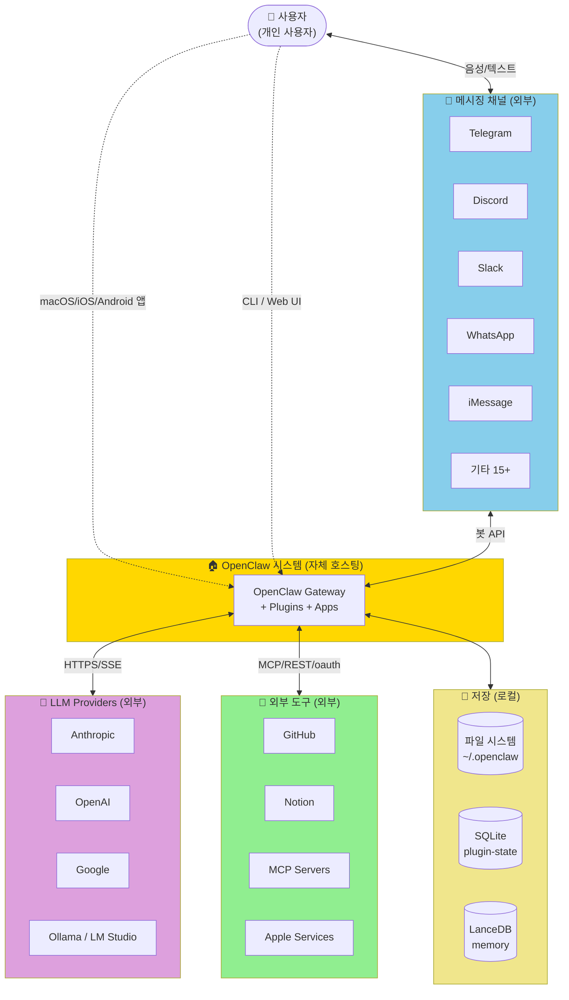
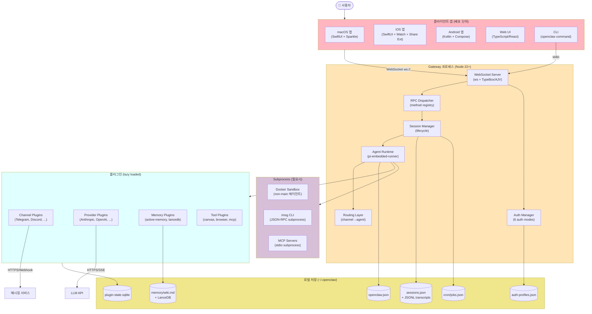
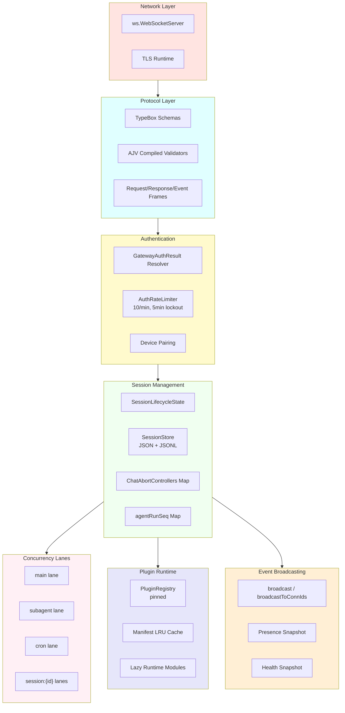
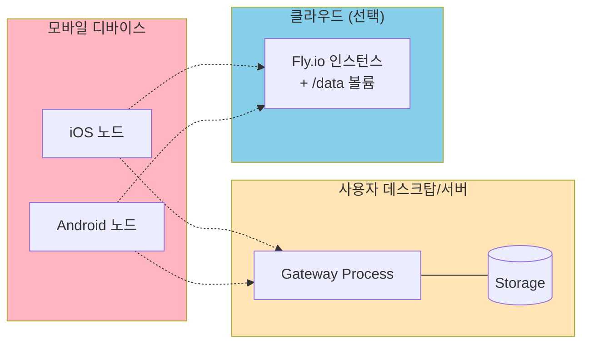

# 00. System Context & Container Diagram (C4)

## C4 Level 1 — System Context

OpenClaw가 어떤 외부 시스템과 상호작용하는지 보여주는 최상위 뷰.

### 액터 정의

| 액터 | 역할 |
|------|------|
| **사용자** | 단일 개인 사용자 (멀티 테넌트 X). 자기 채널/모델/데이터 모두 소유 |
| **메시징 채널** | Telegram, Discord 등 20+ 외부 메시징 서비스 |
| **LLM Providers** | Anthropic/OpenAI/Google 등 모델 API |
| **외부 도구** | 스킬이 호출하는 SaaS (GitHub, Notion, ...) |
| **저장** | 모두 로컬 파일 시스템 (멀티 머신 동기화 X) |

### 핵심 제약

- **단일 사용자**: 멀티 테넌트 아님
- **자체 호스팅**: 모든 데이터/credentials 사용자 머신
- **로컬 우선**: 외부 클라우드 의존 없이 동작 가능 (로컬 LLM 사용 시)

---

## C4 Level 2 — Container Diagram

OpenClaw 내부 주요 컨테이너(프로세스/배포 단위).

### 컨테이너별 책임

| 컨테이너 | 책임 | 기술 |
|---------|------|------|
| **macOS 앱** | 메뉴바, voice wake, push-to-talk, 자동 업데이트 | SwiftUI 5.9, Sparkle |
| **iOS 앱** | 모바일 노드, 음성, Canvas, Watch, Share Ext | SwiftUI, Xcode |
| **Android 앱** | 모바일 노드, talk mode, foreground service | Kotlin, Compose |
| **Web UI** | WebChat, 설정 대시보드, 로그/진단 | TypeScript/React |
| **CLI** | `openclaw` 명령, onboard/doctor/agent | Node.js |
| **Gateway 프로세스** | WebSocket RPC, 모든 비즈니스 로직 호스팅 | Node 22+, ws, AJV, TypeBox |
| **Channel Plugins** | 메시징 서비스 통합 (인바운드/아웃바운드 정규화) | grammy, discord-api-types, imsg, ... |
| **Provider Plugins** | LLM 호출 (auth/catalog/runtime) | `@mariozechner/pi-ai` (공통) |
| **Docker Sandbox** | non-main 에이전트 격리 실행 | Docker daemon |
| **MCP Servers** | 외부 도구 통합 | stdio / HTTP+SSE |

---

## C4 Level 3 — Component Diagram (Gateway)

Gateway 프로세스 내부 주요 컴포넌트. (자세한 컴포넌트 다이어그램은 [01-component-diagram.md](./01-component-diagram.md) 참고)

---

## 핵심 외부 의존성

| 카테고리 | 라이브러리 | 용도 |
|---------|----------|------|
| **HTTP / WS** | `ws` | WebSocket 서버 |
| | `undici` | HTTP 클라이언트 (Node 표준) |
| **스키마 / 검증** | `typebox` | JSON Schema 생성 |
| | `ajv` | 컴파일된 검증 |
| **저장** | `@lancedb/lancedb` | 벡터 DB (memory) |
| | `better-sqlite3` (추정) | plugin-state |
| **LLM 추상화** | `@mariozechner/pi-ai` | OpenAI/Anthropic/Google 통합 |
| **채널** | `grammy` | Telegram |
| | `@buape/carbon` 미사용 → `discord-api-types` + `ws` | Discord |
| | `@discordjs/voice`, `opusscript` | Discord 음성 |
| **번들** | `rolldown` | A2UI bundle |
| **UI** | `lit`, `@a2ui/lit` | Canvas |
| **Dev tools** | `tsgo` (typecheck), `oxlint` (lint), `oxfmt` (format), `vitest` (test) | Rust/Go 기반 (성능) |

---

## 배포 단위

자세한 배포 토폴로지는 [09-deployment.md](./09-deployment.md) 참조.
