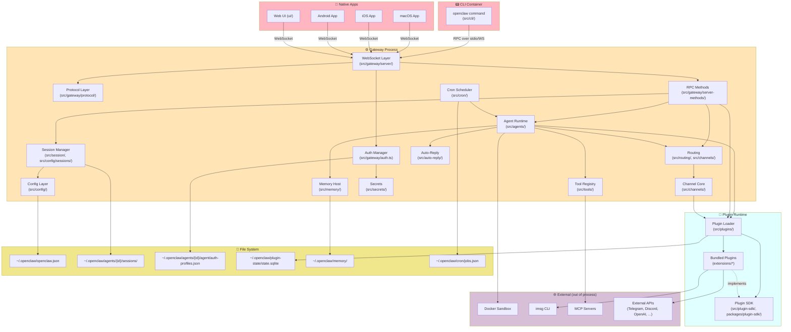
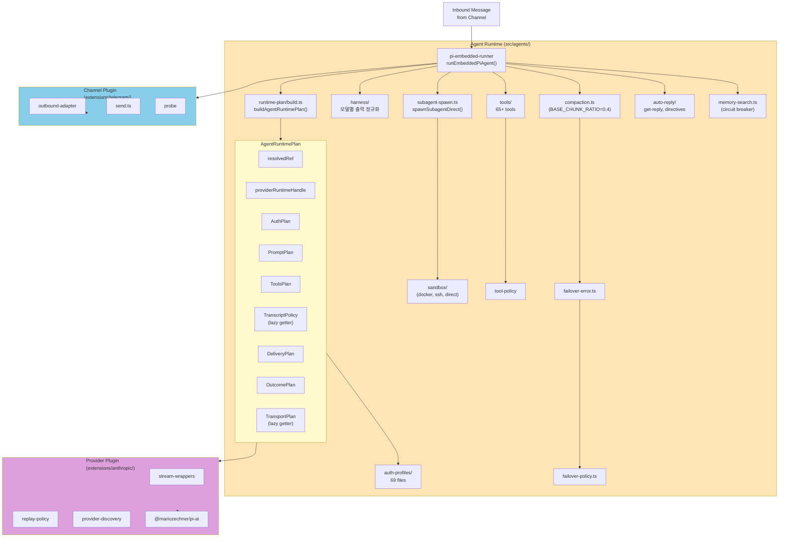
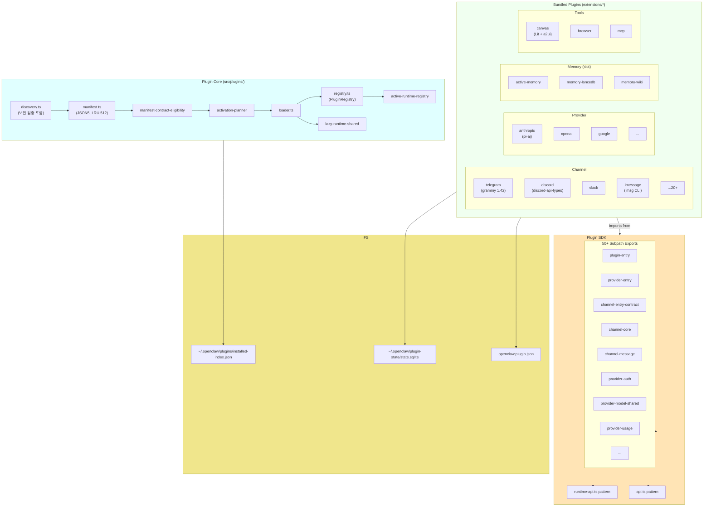
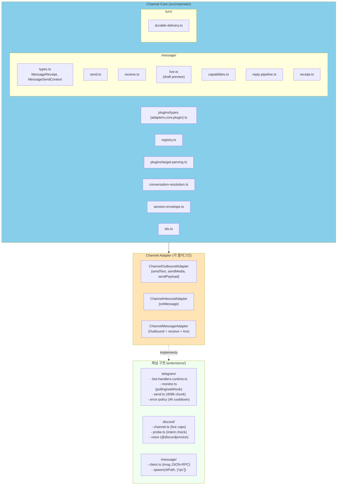
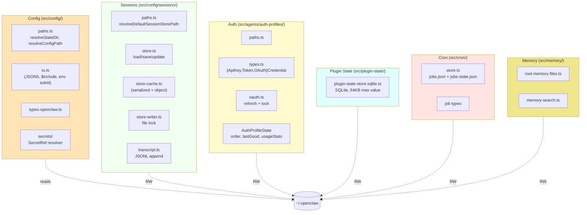
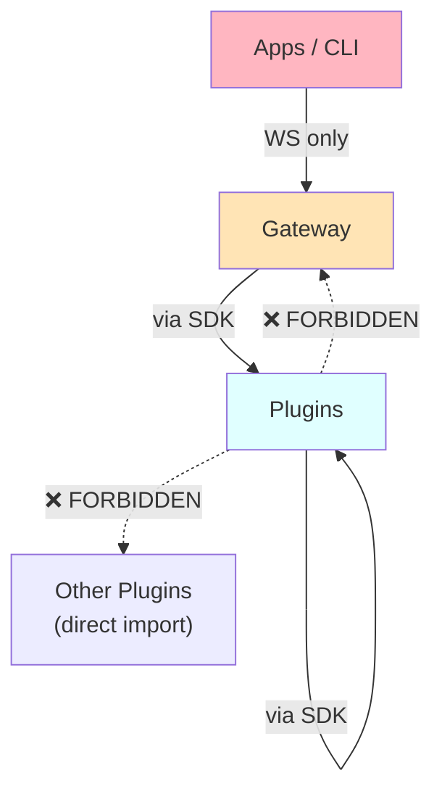

# 01. UML Component Diagram

OpenClaw 시스템의 컴포넌트 의존 관계. UML Component Diagram 형식.

## 1. Top-level Component Diagram



---

## 2. Gateway 내부 컴포넌트 (확대)

```mermaid
flowchart LR
    subgraph TransportL["🌐 Transport"]
        WSS["WSS<br/>(ws lib)"]
        TLS["TLS Runtime"]
        Pair["Pairing"]
    end
    
    subgraph ProtoL["📋 Protocol"]
        TyBox["TypeBox Schemas"]
        AJV["AJV Validators"]
        Frames["Request/Response/Event"]
        Ver["Protocol Version"]
    end
    
    subgraph AuthC["🔐 Auth"]
        AuthRes["authorizeGatewayConnect"]
        RateL["AuthRateLimiter<br/>10/min, 5min lockout"]
        DevTok["DeviceToken Verify"]
        Boot["BootstrapToken Verify"]
        TS["Tailscale Whois"]
        Proxy["Trusted Proxy Check"]
    end
    
    subgraph SessMgmt["📝 Session"]
        Lifecycle["session-lifecycle-state"]
        Store["SessionStore<br/>(JSON + JSONL)"]
        Envelope["session-envelope"]
        Compact["compaction"]
        Resolution["conversation-resolution"]
    end
    
    subgraph LaneSys["🚦 Lane / Queue"]
        Main["main lane"]
        Sub["subagent lane"]
        Cron["cron / cron-nested"]
        SessLane["session:{id}"]
        Q["enqueueCommandInLane"]
        Concurrent["maxConcurrent"]
    end
    
    subgraph Abort["⏹️ Abort"]
        AbortMap["chatAbortControllers Map"]
        AbortCtl["AbortController"]
        RunSeq["agentRunSeq"]
    end
    
    subgraph RPC["📞 RPC"]
        Reg["MethodRegistry"]
        Handlers["Handlers<br/>(agent.*, chat.*, channels.*)"]
        Approval["ExecApprovalManager"]
    end
    
    subgraph PluginIntegr["🔌 Plugin"]
        Pin["pinned PluginRegistry"]
        Discovery["plugin discovery"]
        Manifest["manifest LRU 512"]
        Lazy["createLazyRuntimeModule"]
    end
    
    subgraph Bcast["📡 Broadcast"]
        BcastFn["broadcast"]
        Connds["broadcastToConnIds"]
        Slow["dropIfSlow"]
        StateVer["stateVersion"]
    end
    
    TransportL --> ProtoL
    ProtoL --> AuthC
    AuthC --> SessMgmt
    SessMgmt --> LaneSys
    SessMgmt --> Abort
    SessMgmt --> RPC
    RPC --> PluginIntegr
    LaneSys --> Bcast
    Abort --> Bcast
    
    style TransportL fill:#FFE4E1
    style ProtoL fill:#E0FFFF
    style AuthC fill:#FFFACD
    style SessMgmt fill:#F0FFF0
    style LaneSys fill:#FFF0F5
    style Abort fill:#FFB6C1
    style RPC fill:#FFEFD5
    style PluginIntegr fill:#E6E6FA
    style Bcast fill:#FFE4B5
```



---

## 3. Agent Runtime 내부 컴포넌트



---

## 4. Plugin System 컴포넌트



---

## 5. Channels 컴포넌트



---

## 6. Storage Components



---

## 7. 의존성 방향 규칙

UML 컴포넌트 다이어그램의 핵심 원칙은 **의존성이 한 방향**이라는 것. OpenClaw는 다음 규칙 강제:



`pnpm check:architecture` + `pnpm check:import-cycles` + madge로 강제 검증.

### 금지된 import (실패 시 빌드 실패)

```
extensions/foo/src/* 
  → import "src/internals/*"           ❌
  → import "../../bar/src/*"           ❌  
  → import "../../../src/something"    ❌
  → import "openclaw/plugin-sdk/*"     ✅

src/* 
  → import "extensions/foo/src/*"      ❌
  → import "extensions/foo/api"         ✅
  → import "extensions/foo/runtime-api" ✅ (lazy)
```
