# 02. UML Class Diagrams

OpenClaw 핵심 도메인 모델의 UML class diagram. TypeScript의 type/interface를 UML class로 표현.

## 1. Agent Runtime — `AgentRuntimePlan` 계열

`src/agents/runtime-plan/types.ts:342-368`

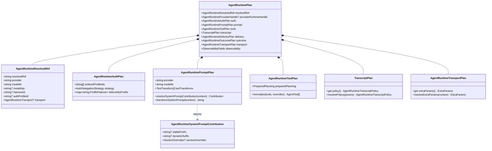
```mermaid
classDiagram
    class AgentRuntimePlan {
        +AgentRuntimeResolvedRef resolvedRef
        +AgentRuntimeProviderHandle? providerRuntimeHandle
        +AgentRuntimeAuthPlan auth
        +AgentRuntimePromptPlan prompt
        +AgentRuntimeToolPlan tools
        +TranscriptPlan transcript
        +AgentRuntimeDeliveryPlan delivery
        +AgentRuntimeOutcomePlan outcome
        +AgentRuntimeTransportPlan transport
        +ObservabilityFields observability
    }
    
    class AgentRuntimeResolvedRef {
        +string resolvedRef
        +string provider
        +string modelId
        +string? modelApi
        +string? harnessId
        +string? authProfileId
        +AgentRuntimeTransport? transport
    }
    
    class AgentRuntimeAuthPlan {
        +string[] orderedProfileIds
        +AuthDelegationStrategy strategy
        +map~string,ProfileFailover~ failoverByProfile
    }
    
    class AgentRuntimePromptPlan {
        +string provider
        +string modelId
        +TextTransform[] textTransforms
        +resolveSystemPromptContribution(context) Contribution
        +transformSystemPrompt(context) string
    }
    
    class AgentRuntimeSystemPromptContribution {
        +string? stablePrefix
        +string? dynamicSuffix
        +SectionOverrides? sectionOverrides
    }
    
    class AgentRuntimeToolPlan {
        +PreparedPlanning preparedPlanning
        +normalize(tools, overrides) AgentTool[]
    }
    
    class TranscriptPlan {
        +get policy() AgentRuntimeTranscriptPolicy
        +resolvePolicy(params) AgentRuntimeTranscriptPolicy
    }
    
    class AgentRuntimeTransportPlan {
        +get extraParams() ExtraParams
        +resolveExtraParams(context) ExtraParams
    }
    
    AgentRuntimePlan *-- AgentRuntimeResolvedRef
    AgentRuntimePlan *-- AgentRuntimeAuthPlan
    AgentRuntimePlan *-- AgentRuntimePromptPlan
    AgentRuntimePlan *-- AgentRuntimeToolPlan
    AgentRuntimePlan *-- TranscriptPlan
    AgentRuntimePlan *-- AgentRuntimeTransportPlan
    AgentRuntimePromptPlan ..> AgentRuntimeSystemPromptContribution : returns
```

### Think Level Enum

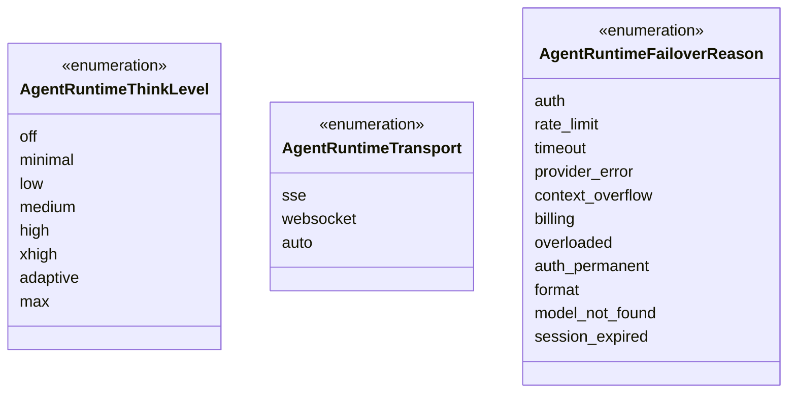
```mermaid
classDiagram
    class AgentRuntimeThinkLevel {
        <<enumeration>>
        off
        minimal
        low
        medium
        high
        xhigh
        adaptive
        max
    }
    
    class AgentRuntimeTransport {
        <<enumeration>>
        sse
        websocket
        auto
    }
    
    class AgentRuntimeFailoverReason {
        <<enumeration>>
        auth
        rate_limit
        timeout
        provider_error
        context_overflow
        billing
        overloaded
        auth_permanent
        format
        model_not_found
        session_expired
    }
```

---

## 2. Channel Message — `MessageReceipt` 계열

`src/channels/message/types.ts:61-136`

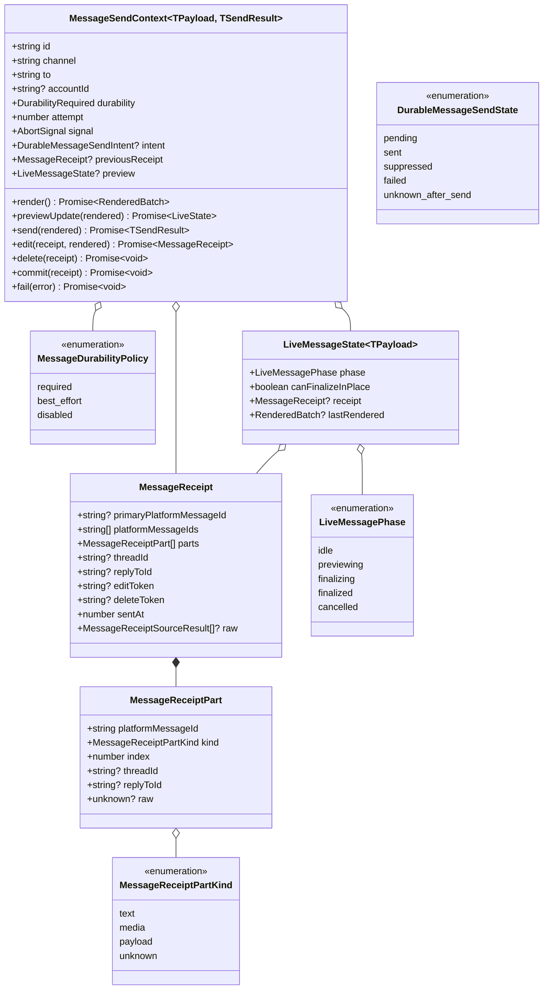
```mermaid
classDiagram
    class MessageReceipt {
        +string? primaryPlatformMessageId
        +string[] platformMessageIds
        +MessageReceiptPart[] parts
        +string? threadId
        +string? replyToId
        +string? editToken
        +string? deleteToken
        +number sentAt
        +MessageReceiptSourceResult[]? raw
    }
    
    class MessageReceiptPart {
        +string platformMessageId
        +MessageReceiptPartKind kind
        +number index
        +string? threadId
        +string? replyToId
        +unknown? raw
    }
    
    class MessageReceiptPartKind {
        <<enumeration>>
        text
        media
        payload
        unknown
    }
    
    class MessageSendContext~TPayload, TSendResult~ {
        +string id
        +string channel
        +string to
        +string? accountId
        +DurabilityRequired durability
        +number attempt
        +AbortSignal signal
        +DurableMessageSendIntent? intent
        +MessageReceipt? previousReceipt
        +LiveMessageState? preview
        +render() Promise~RenderedBatch~
        +previewUpdate(rendered) Promise~LiveState~
        +send(rendered) Promise~TSendResult~
        +edit(receipt, rendered) Promise~MessageReceipt~
        +delete(receipt) Promise~void~
        +commit(receipt) Promise~void~
        +fail(error) Promise~void~
    }
    
    class MessageDurabilityPolicy {
        <<enumeration>>
        required
        best_effort
        disabled
    }
    
    class LiveMessageState~TPayload~ {
        +LiveMessagePhase phase
        +boolean canFinalizeInPlace
        +MessageReceipt? receipt
        +RenderedBatch? lastRendered
    }
    
    class LiveMessagePhase {
        <<enumeration>>
        idle
        previewing
        finalizing
        finalized
        cancelled
    }
    
    class DurableMessageSendState {
        <<enumeration>>
        pending
        sent
        suppressed
        failed
        unknown_after_send
    }
    
    MessageReceipt *-- MessageReceiptPart
    MessageReceiptPart o-- MessageReceiptPartKind
    MessageSendContext o-- MessageReceipt
    MessageSendContext o-- LiveMessageState
    MessageSendContext o-- MessageDurabilityPolicy
    LiveMessageState o-- LiveMessagePhase
    LiveMessageState o-- MessageReceipt
```

---

## 3. Channel Adapter Interface

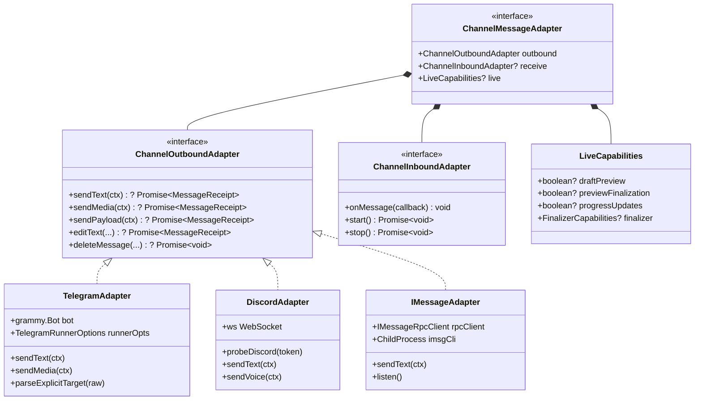
```mermaid
classDiagram
    class ChannelOutboundAdapter {
        <<interface>>
        +sendText(ctx)? Promise~MessageReceipt~
        +sendMedia(ctx)? Promise~MessageReceipt~
        +sendPayload(ctx)? Promise~MessageReceipt~
        +editText(...)? Promise~MessageReceipt~
        +deleteMessage(...)? Promise~void~
    }
    
    class ChannelInboundAdapter {
        <<interface>>
        +onMessage(callback) void
        +start() Promise~void~
        +stop() Promise~void~
    }
    
    class ChannelMessageAdapter {
        <<interface>>
        +ChannelOutboundAdapter outbound
        +ChannelInboundAdapter? receive
        +LiveCapabilities? live
    }
    
    class LiveCapabilities {
        +boolean? draftPreview
        +boolean? previewFinalization
        +boolean? progressUpdates
        +FinalizerCapabilities? finalizer
    }
    
    class TelegramAdapter {
        +grammy.Bot bot
        +TelegramRunnerOptions runnerOpts
        +sendText(ctx)
        +sendMedia(ctx)
        +parseExplicitTarget(raw)
    }
    
    class DiscordAdapter {
        +ws WebSocket
        +probeDiscord(token)
        +sendText(ctx)
        +sendVoice(ctx)
    }
    
    class IMessageAdapter {
        +IMessageRpcClient rpcClient
        +ChildProcess imsgCli
        +sendText(ctx)
        +listen()
    }
    
    ChannelMessageAdapter *-- ChannelOutboundAdapter
    ChannelMessageAdapter *-- ChannelInboundAdapter
    ChannelMessageAdapter *-- LiveCapabilities
    ChannelOutboundAdapter <|.. TelegramAdapter
    ChannelOutboundAdapter <|.. DiscordAdapter
    ChannelOutboundAdapter <|.. IMessageAdapter
```

---

## 4. Session Storage — `SessionEntry` 계열

`src/config/sessions/types.ts:174-362`

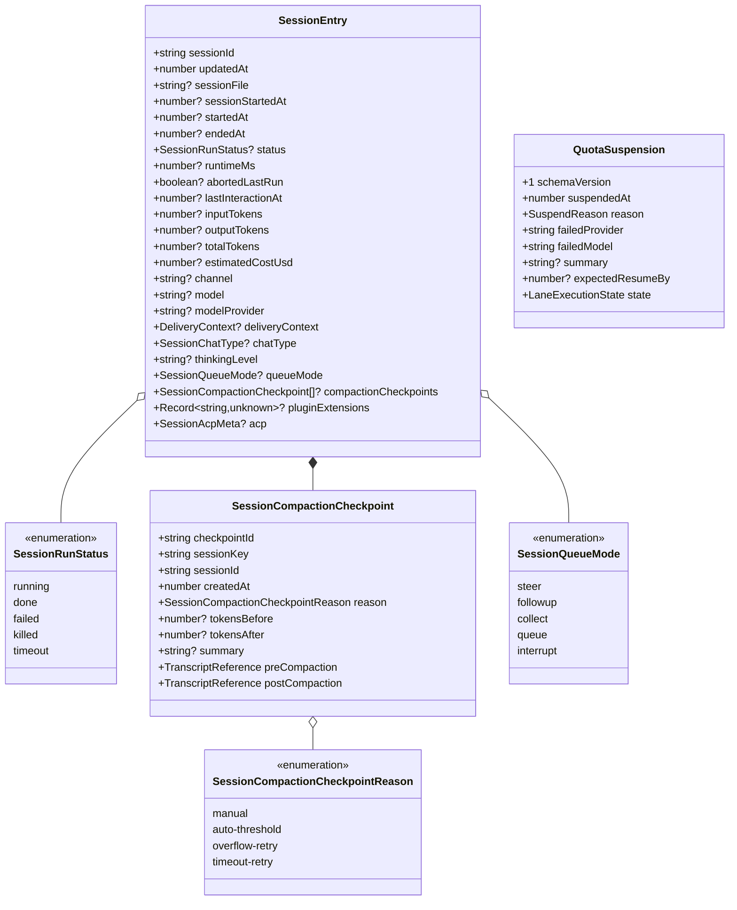
```mermaid
classDiagram
    class SessionEntry {
        +string sessionId
        +number updatedAt
        +string? sessionFile
        +number? sessionStartedAt
        +number? startedAt
        +number? endedAt
        +SessionRunStatus? status
        +number? runtimeMs
        +boolean? abortedLastRun
        +number? lastInteractionAt
        +number? inputTokens
        +number? outputTokens
        +number? totalTokens
        +number? estimatedCostUsd
        +string? channel
        +string? model
        +string? modelProvider
        +DeliveryContext? deliveryContext
        +SessionChatType? chatType
        +string? thinkingLevel
        +SessionQueueMode? queueMode
        +SessionCompactionCheckpoint[]? compactionCheckpoints
        +Record~string,unknown~? pluginExtensions
        +SessionAcpMeta? acp
    }
    
    class SessionRunStatus {
        <<enumeration>>
        running
        done
        failed
        killed
        timeout
    }
    
    class SessionCompactionCheckpoint {
        +string checkpointId
        +string sessionKey
        +string sessionId
        +number createdAt
        +SessionCompactionCheckpointReason reason
        +number? tokensBefore
        +number? tokensAfter
        +string? summary
        +TranscriptReference preCompaction
        +TranscriptReference postCompaction
    }
    
    class SessionCompactionCheckpointReason {
        <<enumeration>>
        manual
        auto-threshold
        overflow-retry
        timeout-retry
    }
    
    class QuotaSuspension {
        +1 schemaVersion
        +number suspendedAt
        +SuspendReason reason
        +string failedProvider
        +string failedModel
        +string? summary
        +number? expectedResumeBy
        +LaneExecutionState state
    }
    
    class SessionQueueMode {
        <<enumeration>>
        steer
        followup
        collect
        queue
        interrupt
    }
    
    SessionEntry o-- SessionRunStatus
    SessionEntry o-- SessionQueueMode
    SessionEntry *-- SessionCompactionCheckpoint
    SessionCompactionCheckpoint o-- SessionCompactionCheckpointReason
```

---

## 5. Auth Profiles — `AuthProfileCredential`

`src/agents/auth-profiles/types.ts`

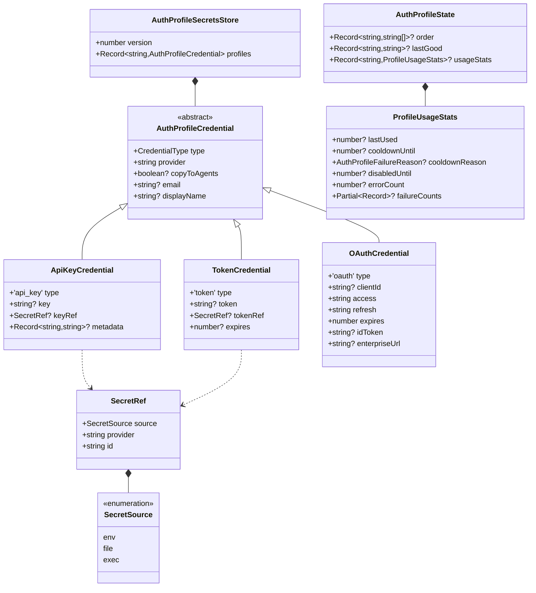
```mermaid
classDiagram
    class AuthProfileSecretsStore {
        +number version
        +Record~string,AuthProfileCredential~ profiles
    }
    
    class AuthProfileCredential {
        <<abstract>>
        +CredentialType type
        +string provider
        +boolean? copyToAgents
        +string? email
        +string? displayName
    }
    
    class ApiKeyCredential {
        +'api_key' type
        +string? key
        +SecretRef? keyRef
        +Record~string,string~? metadata
    }
    
    class TokenCredential {
        +'token' type
        +string? token
        +SecretRef? tokenRef
        +number? expires
    }
    
    class OAuthCredential {
        +'oauth' type
        +string? clientId
        +string access
        +string refresh
        +number expires
        +string? idToken
        +string? enterpriseUrl
    }
    
    class SecretRef {
        +SecretSource source
        +string provider
        +string id
    }
    
    class SecretSource {
        <<enumeration>>
        env
        file
        exec
    }
    
    class AuthProfileState {
        +Record~string,string[]~? order
        +Record~string,string~? lastGood
        +Record~string,ProfileUsageStats~? usageStats
    }
    
    class ProfileUsageStats {
        +number? lastUsed
        +number? cooldownUntil
        +AuthProfileFailureReason? cooldownReason
        +number? disabledUntil
        +number? errorCount
        +Partial~Record~? failureCounts
    }
    
    AuthProfileSecretsStore *-- AuthProfileCredential
    AuthProfileCredential <|-- ApiKeyCredential
    AuthProfileCredential <|-- TokenCredential
    AuthProfileCredential <|-- OAuthCredential
    ApiKeyCredential ..> SecretRef
    TokenCredential ..> SecretRef
    SecretRef *-- SecretSource
    AuthProfileState *-- ProfileUsageStats
```

---

## 6. Gateway Protocol — Frame 계열

`src/gateway/protocol/schema/frames.ts`

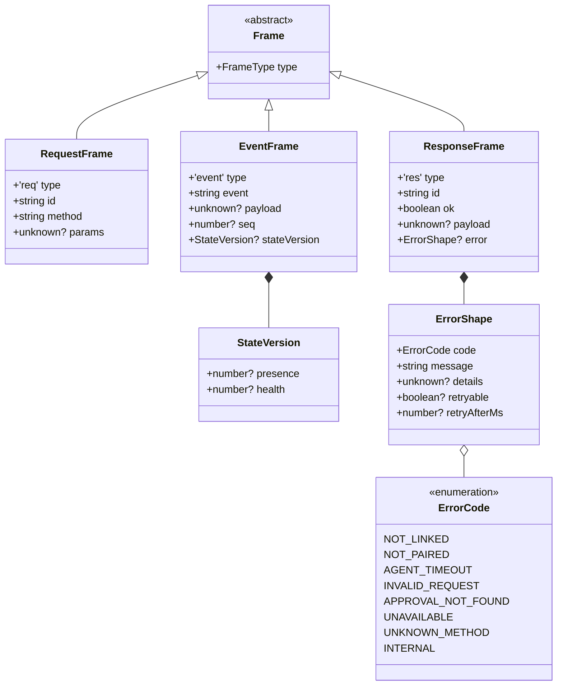
```mermaid
classDiagram
    class Frame {
        <<abstract>>
        +FrameType type
    }
    
    class RequestFrame {
        +'req' type
        +string id
        +string method
        +unknown? params
    }
    
    class ResponseFrame {
        +'res' type
        +string id
        +boolean ok
        +unknown? payload
        +ErrorShape? error
    }
    
    class EventFrame {
        +'event' type
        +string event
        +unknown? payload
        +number? seq
        +StateVersion? stateVersion
    }
    
    class StateVersion {
        +number? presence
        +number? health
    }
    
    class ErrorShape {
        +ErrorCode code
        +string message
        +unknown? details
        +boolean? retryable
        +number? retryAfterMs
    }
    
    class ErrorCode {
        <<enumeration>>
        NOT_LINKED
        NOT_PAIRED
        AGENT_TIMEOUT
        INVALID_REQUEST
        APPROVAL_NOT_FOUND
        UNAVAILABLE
        UNKNOWN_METHOD
        INTERNAL
    }
    
    Frame <|-- RequestFrame
    Frame <|-- ResponseFrame
    Frame <|-- EventFrame
    EventFrame *-- StateVersion
    ResponseFrame *-- ErrorShape
    ErrorShape o-- ErrorCode
```

---

## 7. Gateway Auth & Connection

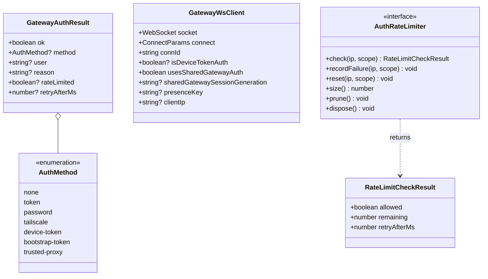
```mermaid
classDiagram
    class GatewayAuthResult {
        +boolean ok
        +AuthMethod? method
        +string? user
        +string? reason
        +boolean? rateLimited
        +number? retryAfterMs
    }
    
    class AuthMethod {
        <<enumeration>>
        none
        token
        password
        tailscale
        device-token
        bootstrap-token
        trusted-proxy
    }
    
    class GatewayWsClient {
        +WebSocket socket
        +ConnectParams connect
        +string connId
        +boolean? isDeviceTokenAuth
        +boolean usesSharedGatewayAuth
        +string? sharedGatewaySessionGeneration
        +string? presenceKey
        +string? clientIp
    }
    
    class AuthRateLimiter {
        <<interface>>
        +check(ip, scope) RateLimitCheckResult
        +recordFailure(ip, scope) void
        +reset(ip, scope) void
        +size() number
        +prune() void
        +dispose() void
    }
    
    class RateLimitCheckResult {
        +boolean allowed
        +number remaining
        +number retryAfterMs
    }
    
    GatewayAuthResult o-- AuthMethod
    AuthRateLimiter ..> RateLimitCheckResult : returns
```

---

## 8. Plugin System

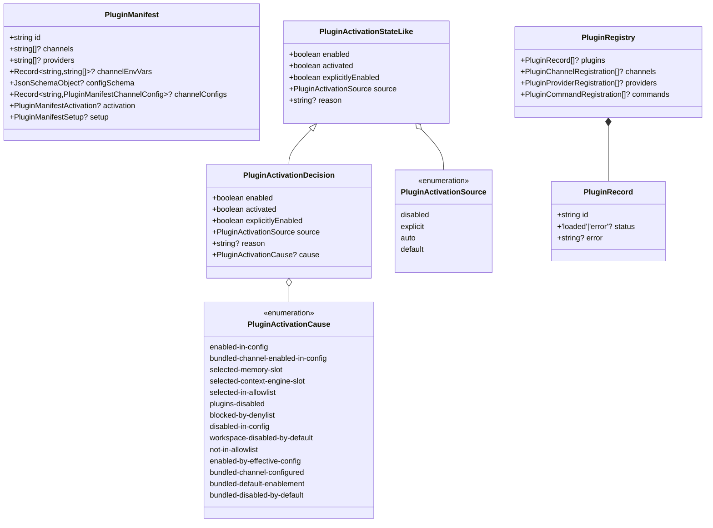
```mermaid
classDiagram
    class PluginManifest {
        +string id
        +string[]? channels
        +string[]? providers
        +Record~string,string[]~? channelEnvVars
        +JsonSchemaObject? configSchema
        +Record~string,PluginManifestChannelConfig~? channelConfigs
        +PluginManifestActivation? activation
        +PluginManifestSetup? setup
    }
    
    class PluginActivationStateLike {
        +boolean enabled
        +boolean activated
        +boolean explicitlyEnabled
        +PluginActivationSource source
        +string? reason
    }
    
    class PluginActivationDecision {
        +boolean enabled
        +boolean activated
        +boolean explicitlyEnabled
        +PluginActivationSource source
        +string? reason
        +PluginActivationCause? cause
    }
    
    class PluginActivationSource {
        <<enumeration>>
        disabled
        explicit
        auto
        default
    }
    
    class PluginActivationCause {
        <<enumeration>>
        enabled-in-config
        bundled-channel-enabled-in-config
        selected-memory-slot
        selected-context-engine-slot
        selected-in-allowlist
        plugins-disabled
        blocked-by-denylist
        disabled-in-config
        workspace-disabled-by-default
        not-in-allowlist
        enabled-by-effective-config
        bundled-channel-configured
        bundled-default-enablement
        bundled-disabled-by-default
    }
    
    class PluginRegistry {
        +PluginRecord[]? plugins
        +PluginChannelRegistration[]? channels
        +PluginProviderRegistration[]? providers
        +PluginCommandRegistration[]? commands
    }
    
    class PluginRecord {
        +string id
        +'loaded'|'error'? status
        +string? error
    }
    
    PluginActivationStateLike <|-- PluginActivationDecision
    PluginActivationDecision o-- PluginActivationCause
    PluginActivationStateLike o-- PluginActivationSource
    PluginRegistry *-- PluginRecord
```

---

## 9. Concurrency / Lane

`src/process/lanes.ts`, `src/process/command-queue.ts`

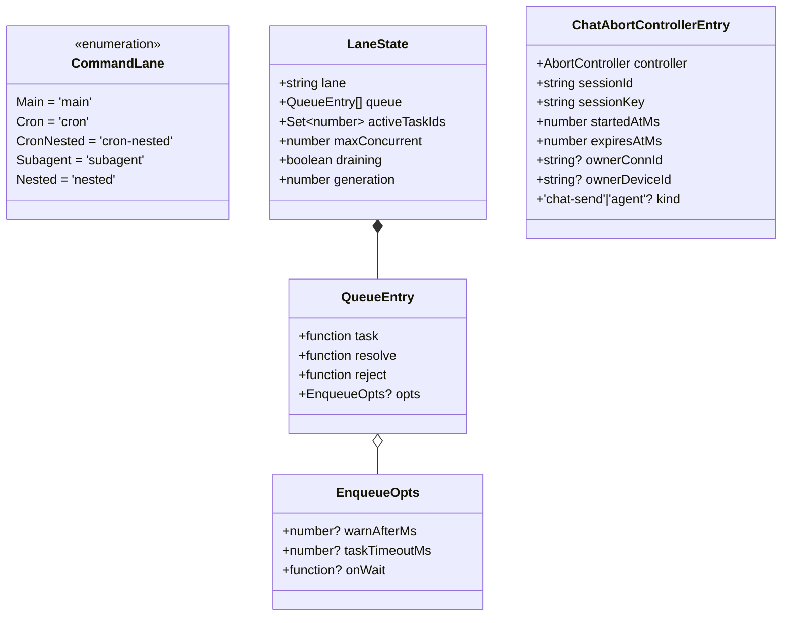
```mermaid
classDiagram
    class CommandLane {
        <<enumeration>>
        Main = 'main'
        Cron = 'cron'
        CronNested = 'cron-nested'
        Subagent = 'subagent'
        Nested = 'nested'
    }
    
    class LaneState {
        +string lane
        +QueueEntry[] queue
        +Set~number~ activeTaskIds
        +number maxConcurrent
        +boolean draining
        +number generation
    }
    
    class QueueEntry {
        +function task
        +function resolve
        +function reject
        +EnqueueOpts? opts
    }
    
    class EnqueueOpts {
        +number? warnAfterMs
        +number? taskTimeoutMs
        +function? onWait
    }
    
    class ChatAbortControllerEntry {
        +AbortController controller
        +string sessionId
        +string sessionKey
        +number startedAtMs
        +number expiresAtMs
        +string? ownerConnId
        +string? ownerDeviceId
        +'chat-send'|'agent'? kind
    }
    
    LaneState *-- QueueEntry
    QueueEntry o-- EnqueueOpts
```

---

## 10. Cron / Schedule

`src/cron/types.ts` (개념적)

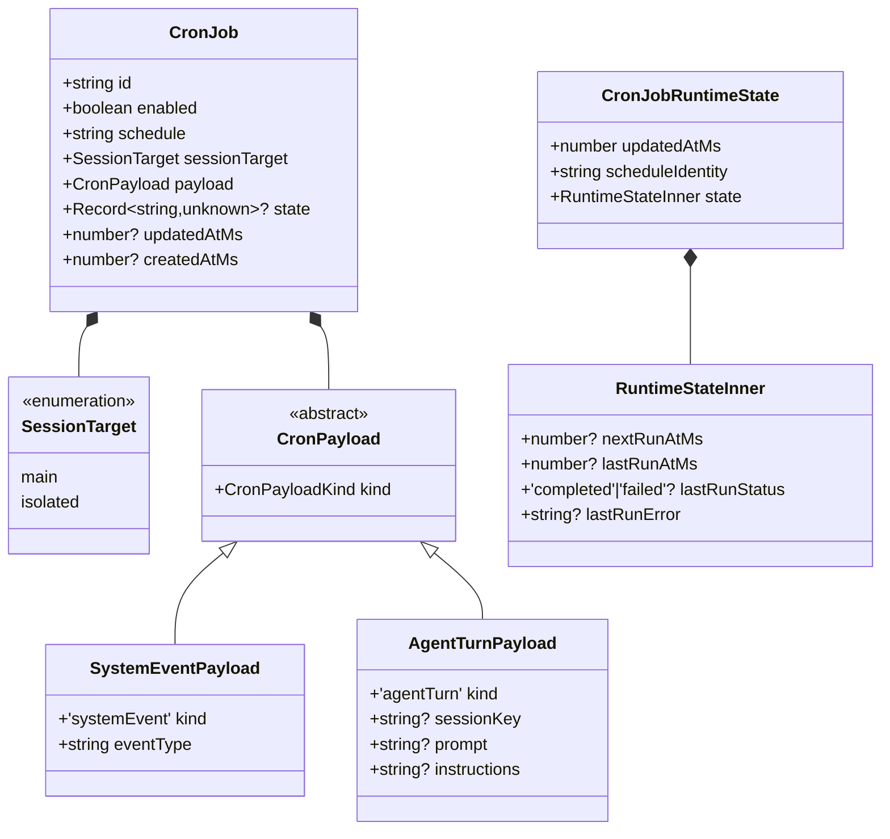
```mermaid
classDiagram
    class CronJob {
        +string id
        +boolean enabled
        +string schedule
        +SessionTarget sessionTarget
        +CronPayload payload
        +Record~string,unknown~? state
        +number? updatedAtMs
        +number? createdAtMs
    }
    
    class SessionTarget {
        <<enumeration>>
        main
        isolated
    }
    
    class CronPayload {
        <<abstract>>
        +CronPayloadKind kind
    }
    
    class SystemEventPayload {
        +'systemEvent' kind
        +string eventType
    }
    
    class AgentTurnPayload {
        +'agentTurn' kind
        +string? sessionKey
        +string? prompt
        +string? instructions
    }
    
    class CronJobRuntimeState {
        +number updatedAtMs
        +string scheduleIdentity
        +RuntimeStateInner state
    }
    
    class RuntimeStateInner {
        +number? nextRunAtMs
        +number? lastRunAtMs
        +'completed'|'failed'? lastRunStatus
        +string? lastRunError
    }
    
    CronJob *-- SessionTarget
    CronJob *-- CronPayload
    CronPayload <|-- SystemEventPayload
    CronPayload <|-- AgentTurnPayload
    CronJobRuntimeState *-- RuntimeStateInner
```

---

## 11. Agent Events Stream

`src/infra/agent-events.ts:5-27`

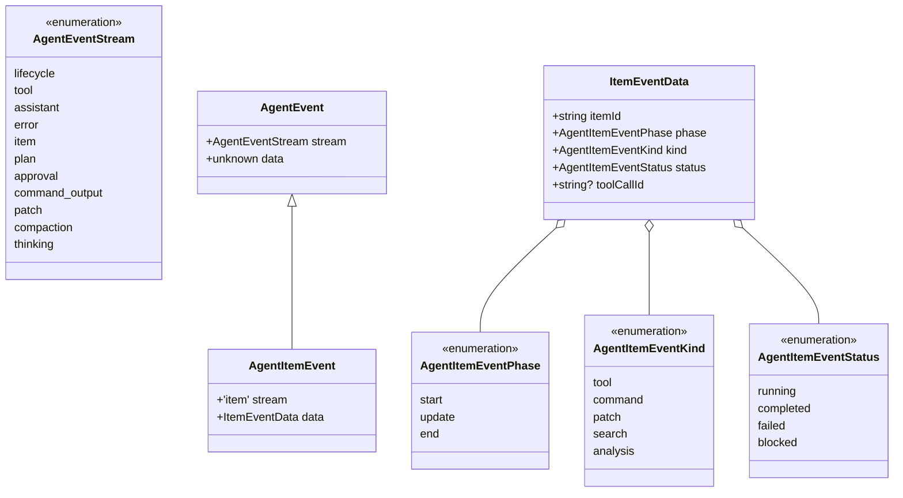
```mermaid
classDiagram
    class AgentEventStream {
        <<enumeration>>
        lifecycle
        tool
        assistant
        error
        item
        plan
        approval
        command_output
        patch
        compaction
        thinking
    }
    
    class AgentItemEventPhase {
        <<enumeration>>
        start
        update
        end
    }
    
    class AgentItemEventStatus {
        <<enumeration>>
        running
        completed
        failed
        blocked
    }
    
    class AgentItemEventKind {
        <<enumeration>>
        tool
        command
        patch
        search
        analysis
    }
    
    class AgentEvent {
        +AgentEventStream stream
        +unknown data
    }
    
    class AgentItemEvent {
        +'item' stream
        +ItemEventData data
    }
    
    class ItemEventData {
        +string itemId
        +AgentItemEventPhase phase
        +AgentItemEventKind kind
        +AgentItemEventStatus status
        +string? toolCallId
    }
    
    AgentEvent <|-- AgentItemEvent
    ItemEventData o-- AgentItemEventPhase
    ItemEventData o-- AgentItemEventKind
    ItemEventData o-- AgentItemEventStatus
```

---

## 12. Failover Error Hierarchy

`src/agents/failover-error.ts`

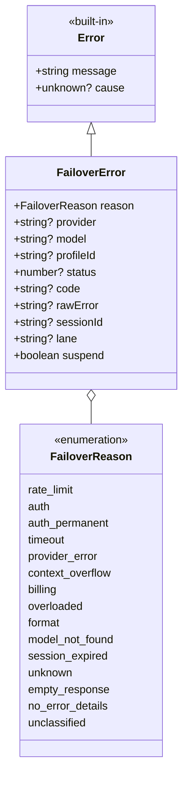
```mermaid
classDiagram
    class Error {
        <<built-in>>
        +string message
        +unknown? cause
    }
    
    class FailoverError {
        +FailoverReason reason
        +string? provider
        +string? model
        +string? profileId
        +number? status
        +string? code
        +string? rawError
        +string? sessionId
        +string? lane
        +boolean suspend
    }
    
    class FailoverReason {
        <<enumeration>>
        rate_limit
        auth
        auth_permanent
        timeout
        provider_error
        context_overflow
        billing
        overloaded
        format
        model_not_found
        session_expired
        unknown
        empty_response
        no_error_details
        unclassified
    }
    
    Error <|-- FailoverError
    FailoverError o-- FailoverReason
```

---

## 13. Approval System

`src/gateway/exec-approval-manager.ts`

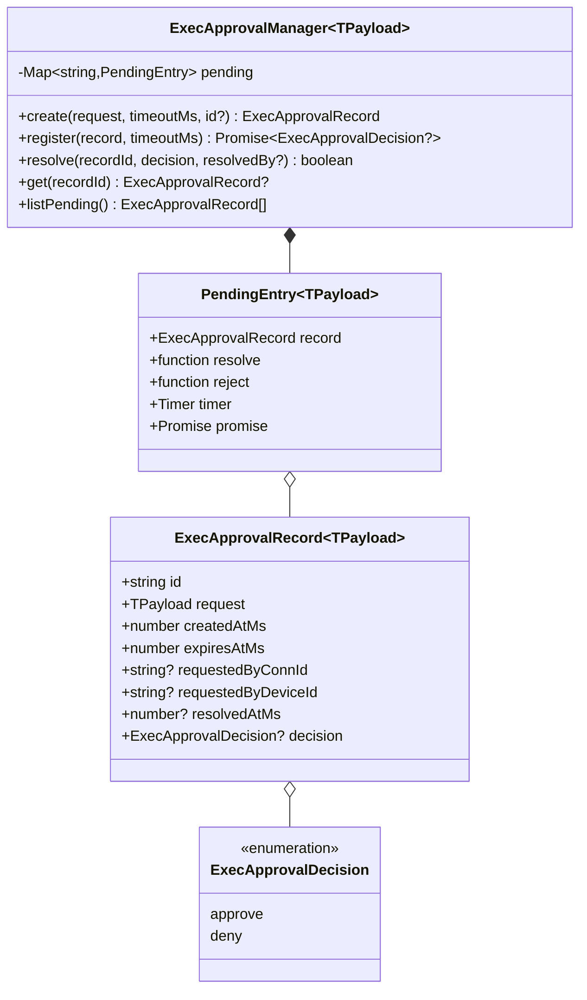
```mermaid
classDiagram
    class ExecApprovalManager~TPayload~ {
        -Map~string,PendingEntry~ pending
        +create(request, timeoutMs, id?) ExecApprovalRecord
        +register(record, timeoutMs) Promise~ExecApprovalDecision?~
        +resolve(recordId, decision, resolvedBy?) boolean
        +get(recordId) ExecApprovalRecord?
        +listPending() ExecApprovalRecord[]
    }
    
    class ExecApprovalRecord~TPayload~ {
        +string id
        +TPayload request
        +number createdAtMs
        +number expiresAtMs
        +string? requestedByConnId
        +string? requestedByDeviceId
        +number? resolvedAtMs
        +ExecApprovalDecision? decision
    }
    
    class ExecApprovalDecision {
        <<enumeration>>
        approve
        deny
    }
    
    class PendingEntry~TPayload~ {
        +ExecApprovalRecord record
        +function resolve
        +function reject
        +Timer timer
        +Promise promise
    }
    
    ExecApprovalManager *-- PendingEntry
    PendingEntry o-- ExecApprovalRecord
    ExecApprovalRecord o-- ExecApprovalDecision
```

---

## 14. Conversation Resolution

`src/channels/conversation-resolution.ts:21-58`

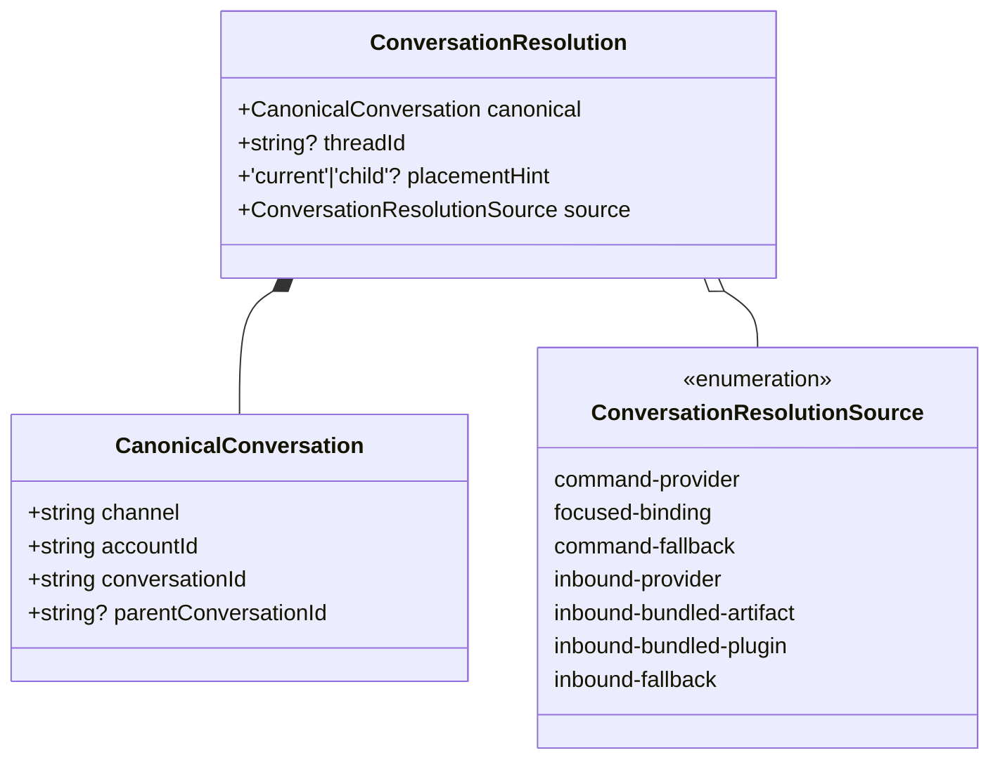
```mermaid
classDiagram
    class ConversationResolution {
        +CanonicalConversation canonical
        +string? threadId
        +'current'|'child'? placementHint
        +ConversationResolutionSource source
    }
    
    class CanonicalConversation {
        +string channel
        +string accountId
        +string conversationId
        +string? parentConversationId
    }
    
    class ConversationResolutionSource {
        <<enumeration>>
        command-provider
        focused-binding
        command-fallback
        inbound-provider
        inbound-bundled-artifact
        inbound-bundled-plugin
        inbound-fallback
    }
    
    ConversationResolution *-- CanonicalConversation
    ConversationResolution o-- ConversationResolutionSource
```

---

## 15. 종합 — 핵심 도메인 모델

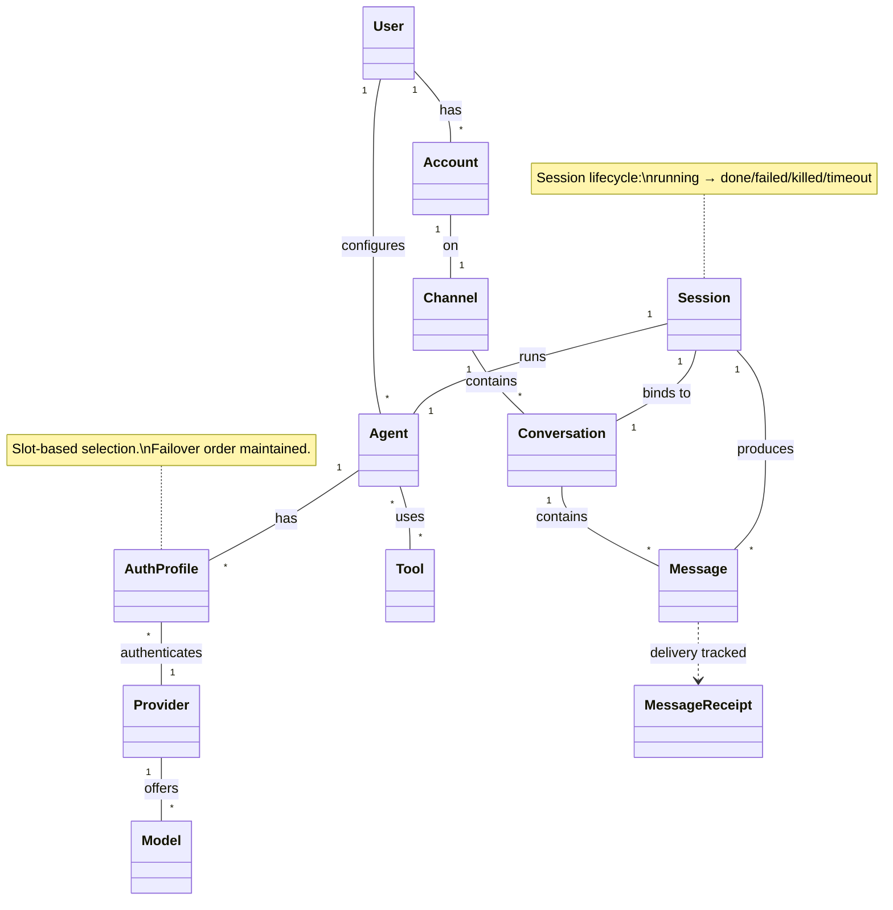
```mermaid
classDiagram
    class User
    class Channel
    class Account
    class Agent
    class Session
    class Conversation
    class Message
    class Tool
    class AuthProfile
    class Provider
    class Model
    
    User "1" -- "*" Account : has
    Account "1" -- "1" Channel : on
    Channel "1" -- "*" Conversation : contains
    Conversation "1" -- "*" Message : contains
    
    User "1" -- "*" Agent : configures
    Agent "*" -- "*" Tool : uses
    Agent "1" -- "*" AuthProfile : has
    AuthProfile "*" -- "1" Provider : authenticates
    Provider "1" -- "*" Model : offers
    
    Session "1" -- "1" Agent : runs
    Session "1" -- "1" Conversation : binds to
    Session "1" -- "*" Message : produces
    
    Message ..> MessageReceipt : delivery tracked
    
    note for Session "Session lifecycle:\nrunning → done/failed/killed/timeout"
    note for AuthProfile "Slot-based selection.\nFailover order maintained."
```

---

## 핵심 클래스 매핑 표

| UML 개념 | TypeScript 위치 | 라인 |
|---------|----------------|------|
| `AgentRuntimePlan` | `src/agents/runtime-plan/types.ts` | 342-368 |
| `MessageReceipt` | `src/channels/message/types.ts` | 61-71 |
| `MessageSendContext` | `src/channels/message/types.ts` | 118-136 |
| `LiveMessageState` | `src/channels/message/types.ts` | 109+ |
| `SessionEntry` | `src/config/sessions/types.ts` | 174-362 |
| `SessionRunStatus` | `src/gateway/session-utils.types.ts` | 26 |
| `AuthProfileCredential` | `src/agents/auth-profiles/types.ts` | - |
| `RequestFrame`, etc. | `src/gateway/protocol/schema/frames.ts` | - |
| `GatewayAuthResult` | `src/gateway/auth.ts` | 35-51 |
| `PluginManifest` | `src/plugins/manifest.ts` | 54+ |
| `PluginActivationDecision` | `src/plugins/config-activation-shared.ts` | 8-39 |
| `CommandLane` | `src/process/lanes.ts` | - |
| `LaneState` | `src/process/command-queue.ts` | - |
| `ChatAbortControllerEntry` | `src/gateway/chat-abort.ts` | 70-108 |
| `FailoverError` | `src/agents/failover-error.ts` | 16-61 |
| `ExecApprovalManager` | `src/gateway/exec-approval-manager.ts` | 54-141 |
| `ConversationResolution` | `src/channels/conversation-resolution.ts` | 21-58 |
| `AgentEventStream` | `src/infra/agent-events.ts` | 5-27 |
| `CronJob` | `src/cron/store.ts` | - |
