# 03. Data Flow & Sequence Diagrams

OpenClaw의 핵심 데이터 흐름을 UML Sequence Diagram으로 표현.

## 1. 메시지 처리 End-to-End (Telegram 예시)

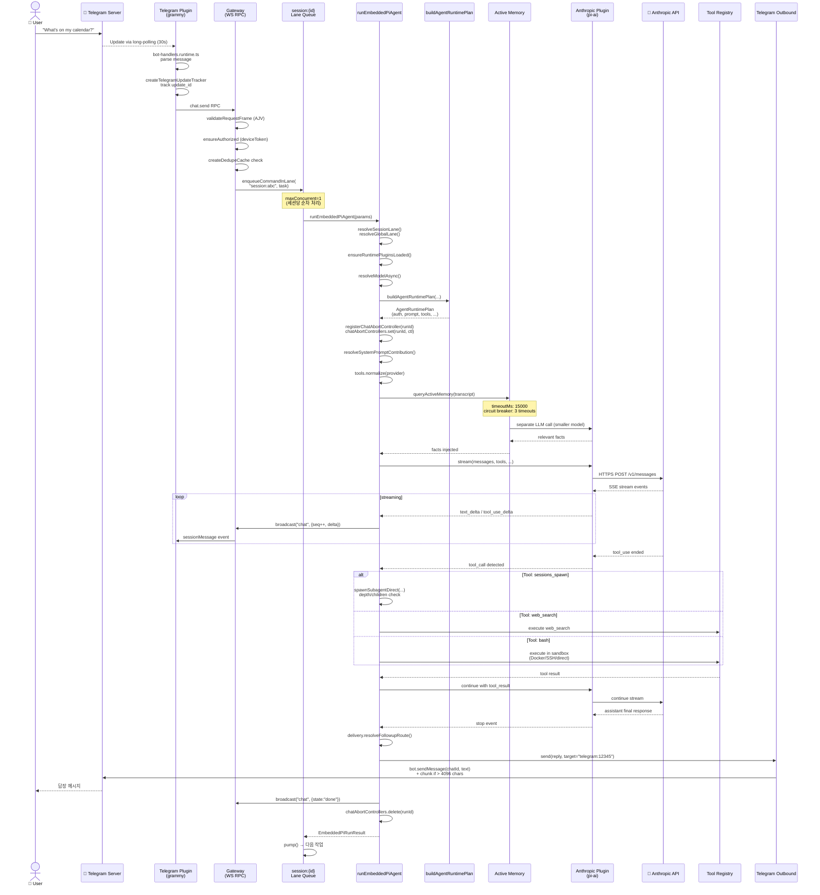

---

## 2. WebSocket 핸드셰이크

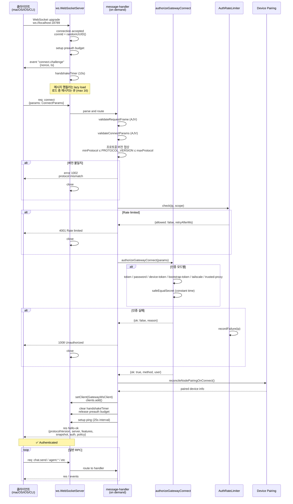

---

## 3. Subagent Spawn 시퀀스

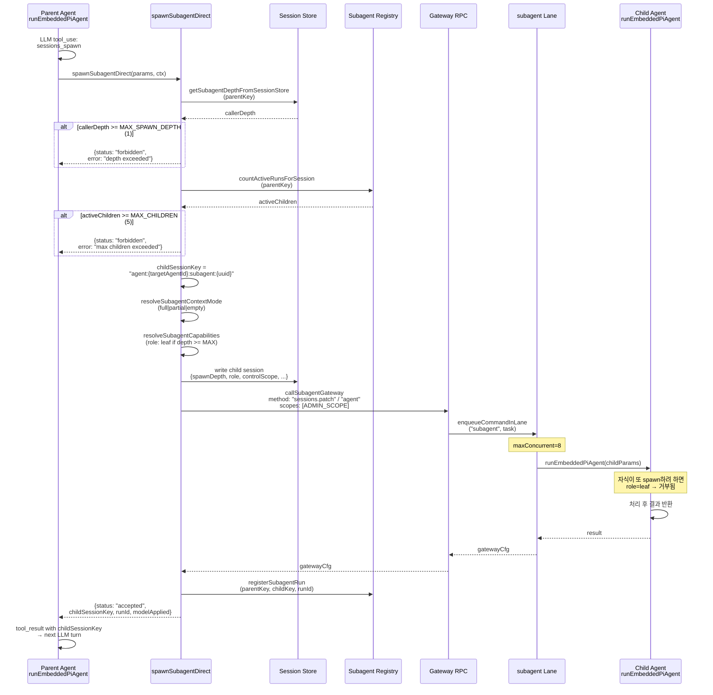

---

## 4. OAuth Token Refresh

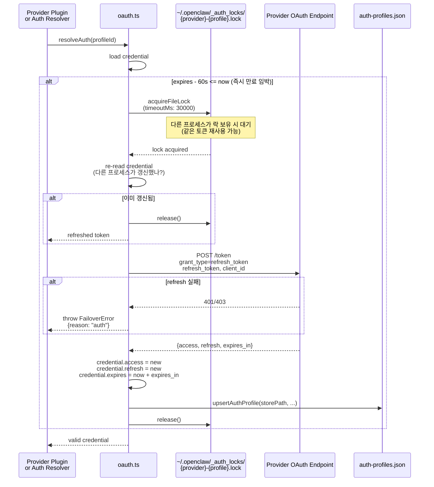

---

## 5. Active Memory Recall

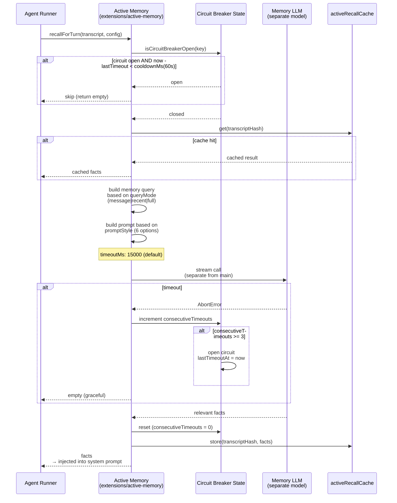

---

## 6. Compaction Flow

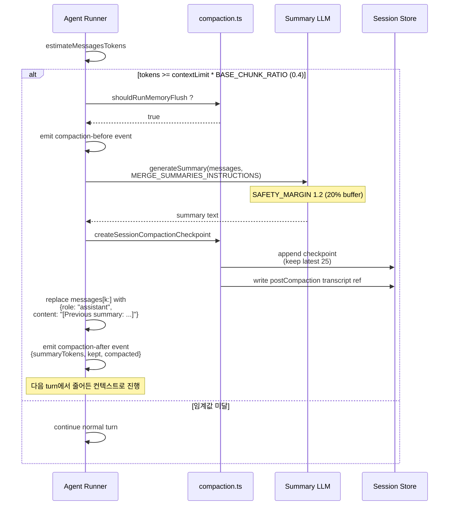

---

## 7. Session Lifecycle Event 처리

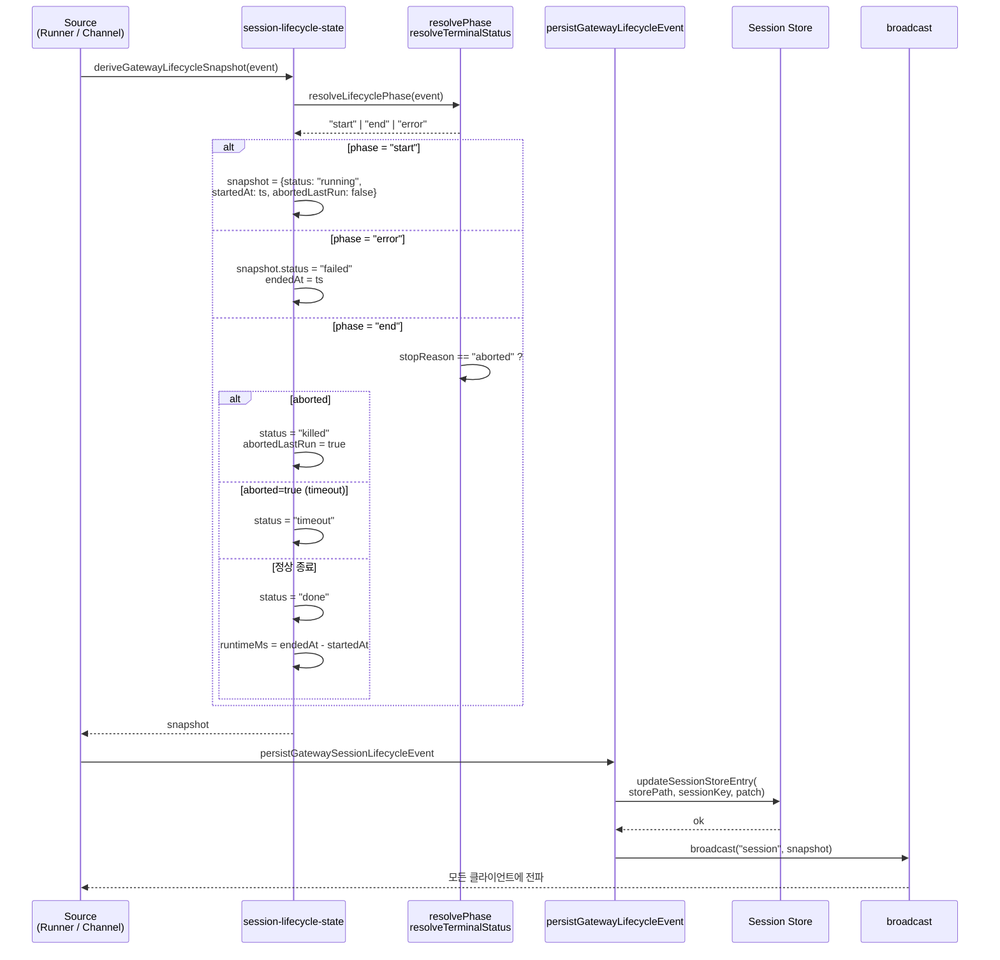

---

## 8. Plugin Discovery & Activation

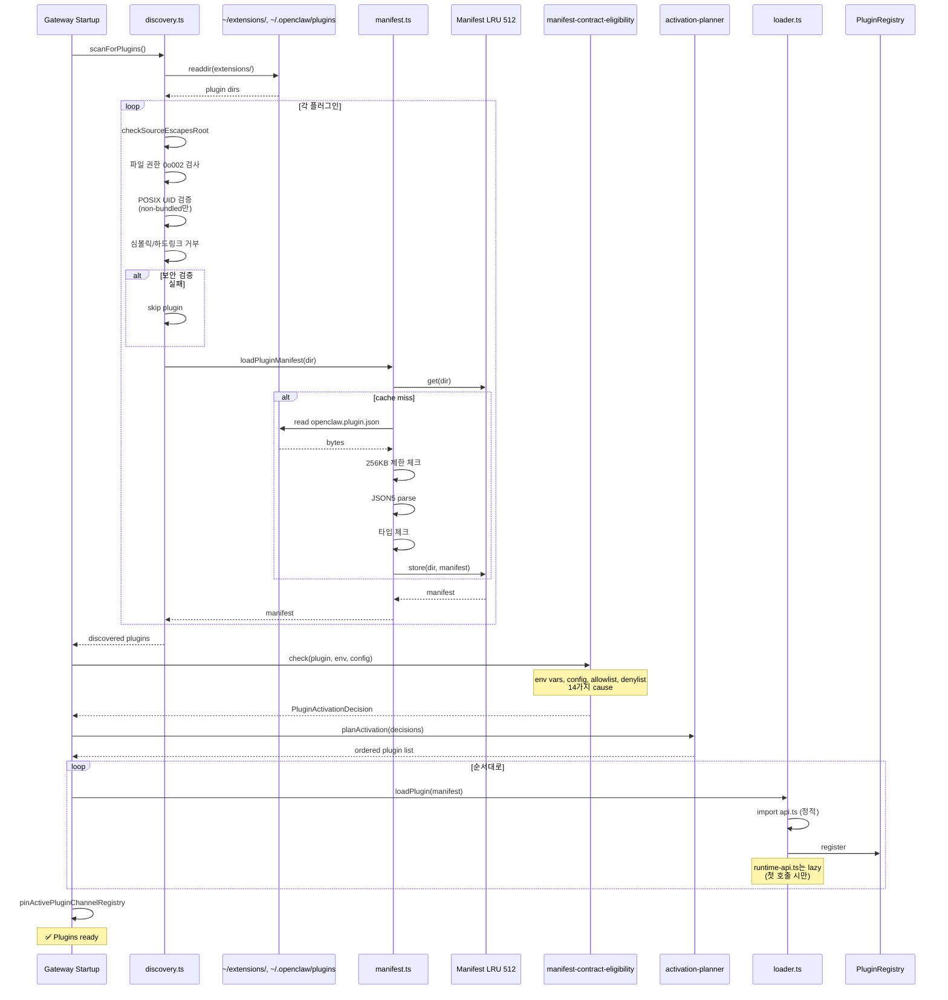

---

## 9. Cron Job Execution

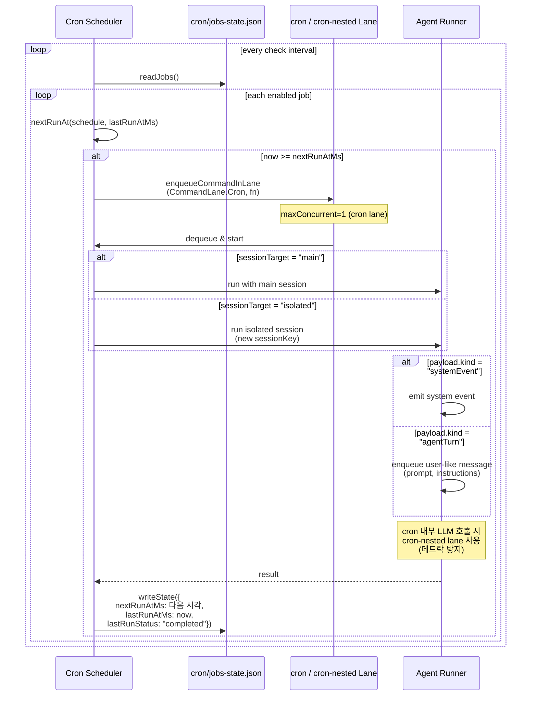

---

## 10. Approval Request

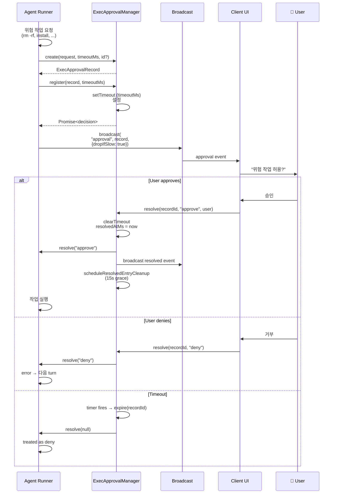

---

## 11. Memory Slot 전환

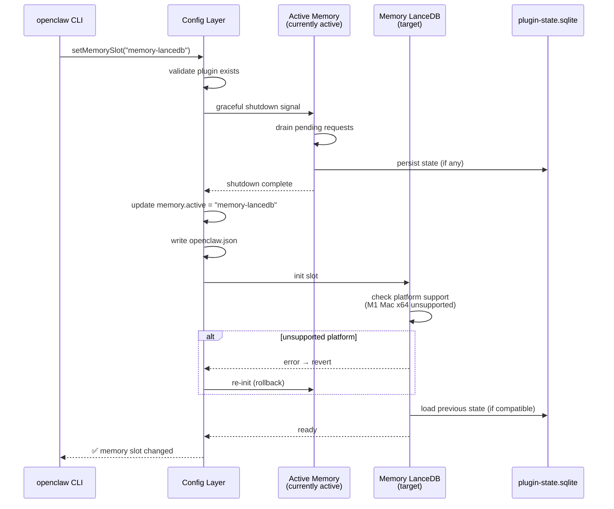

---

## 12. CLI command 흐름

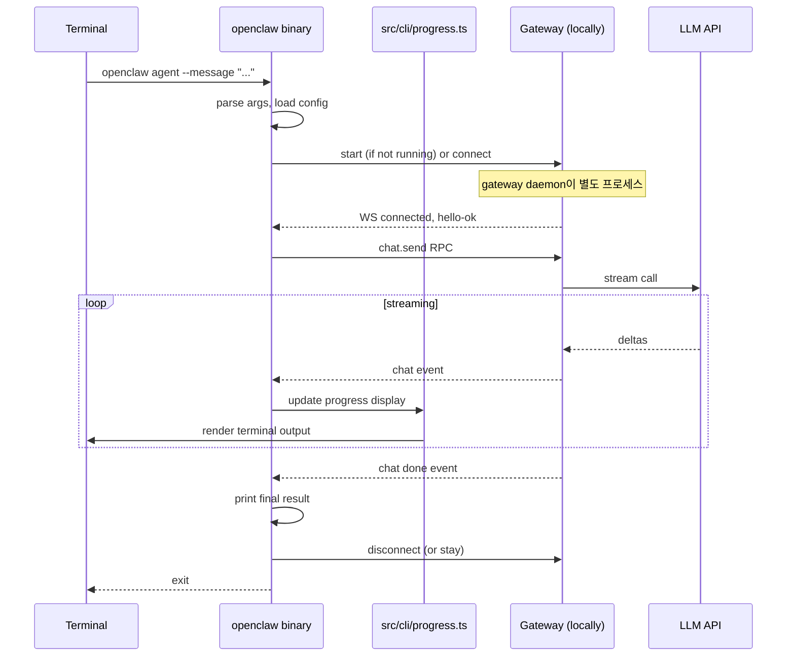

---

## 데이터 흐름 요약

| 흐름 | 시작점 | 주요 경유 | 종착점 | 핵심 변환 |
|------|-------|----------|--------|----------|
| 인바운드 메시지 | 외부 채널 | Channel Plugin → Gateway → Lane → Runner | LLM API | InboundMessage normalization |
| 응답 메시지 | LLM stream | Runner → Outbound Adapter | 외부 채널 | text chunking, durability |
| Tool 호출 | LLM tool_use | Runner → Tool Registry / Subagent / Sandbox | Tool result back to LLM | schema normalization |
| 메모리 회상 | Runner | Active Memory → Separate LLM | System prompt | facts injection |
| OAuth refresh | Provider | OAuth → File lock → Provider API | Updated credentials | token rotation |
| WS handshake | Client | WSS → Auth → Pairing | Authenticated client | session establishment |
| Compaction | Runner | LLM (summary) → Store | Trimmed context | message replacement |
| Cron job | Scheduler | Lane → Runner | Side effects | scheduled trigger |
