# 04. State Machines

OpenClaw에서 발견된 8개 주요 상태 머신을 UML stateDiagram-v2로 표현.

## 1. Session Lifecycle

`src/gateway/session-lifecycle-state.ts:6-130`

상태 정의: `type SessionRunStatus = "running" | "done" | "failed" | "killed" | "timeout"`

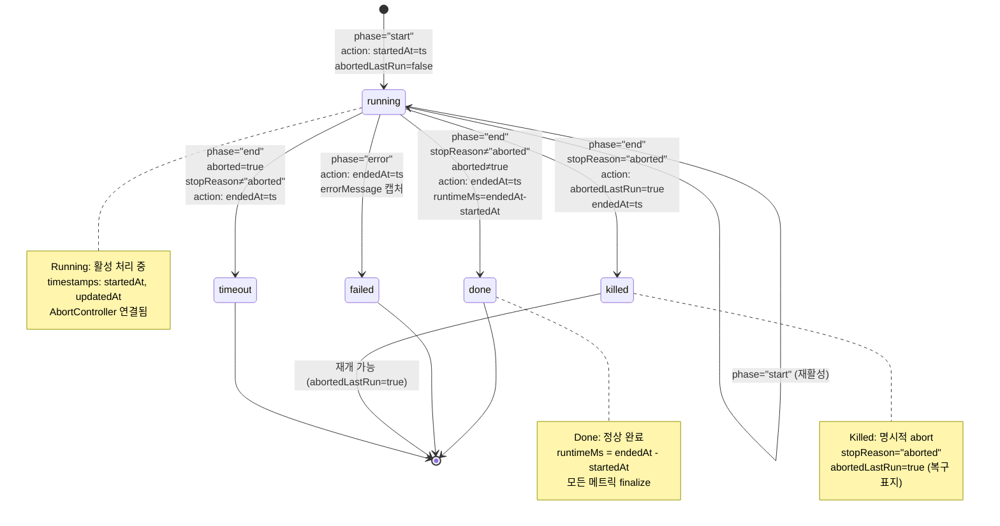
```mermaid
stateDiagram-v2
    [*] --> running: phase="start"<br/>action: startedAt=ts<br/>abortedLastRun=false
    
    running --> running: phase="start" (재활성)
    
    running --> done: phase="end"<br/>stopReason≠"aborted"<br/>aborted≠true<br/>action: endedAt=ts<br/>runtimeMs=endedAt-startedAt
    
    running --> failed: phase="error"<br/>action: endedAt=ts<br/>errorMessage 캡처
    
    running --> killed: phase="end"<br/>stopReason="aborted"<br/>action: abortedLastRun=true<br/>endedAt=ts
    
    running --> timeout: phase="end"<br/>aborted=true<br/>stopReason≠"aborted"<br/>action: endedAt=ts
    
    done --> [*]
    failed --> [*]
    killed --> [*]: 재개 가능 (abortedLastRun=true)
    timeout --> [*]
    
    note right of running
        Running: 활성 처리 중
        timestamps: startedAt, updatedAt
        AbortController 연결됨
    end note
    
    note right of done
        Done: 정상 완료
        runtimeMs = endedAt - startedAt
        모든 메트릭 finalize
    end note
    
    note right of killed
        Killed: 명시적 abort
        stopReason="aborted"
        abortedLastRun=true (복구 표지)
    end note
```

### 결정 로직 (실제 코드)

```typescript
// src/gateway/session-lifecycle-state.ts:39-51
function resolveTerminalStatus(event: LifecycleEventLike): SessionRunStatus {
  const phase = resolveLifecyclePhase(event);
  if (phase === "error") return "failed";
  
  const stopReason = typeof event.data?.stopReason === "string" ? event.data.stopReason : "";
  if (stopReason === "aborted") return "killed";
  
  return event.data?.aborted === true ? "timeout" : "done";
}
```

---

## 2. Live Message Phase

`src/channels/message/types.ts:109+`

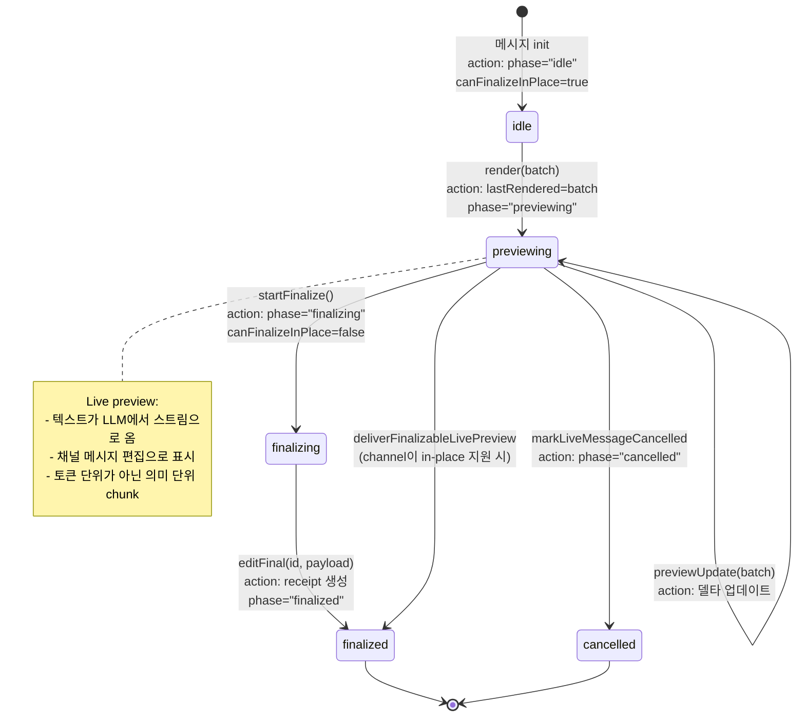
```mermaid
stateDiagram-v2
    [*] --> idle: 메시지 init<br/>action: phase="idle"<br/>canFinalizeInPlace=true
    
    idle --> previewing: render(batch)<br/>action: lastRendered=batch<br/>phase="previewing"
    
    previewing --> previewing: previewUpdate(batch)<br/>action: 델타 업데이트
    
    previewing --> finalizing: startFinalize()<br/>action: phase="finalizing"<br/>canFinalizeInPlace=false
    
    finalizing --> finalized: editFinal(id, payload)<br/>action: receipt 생성<br/>phase="finalized"
    
    previewing --> finalized: deliverFinalizableLivePreview<br/>(channel이 in-place 지원 시)
    
    previewing --> cancelled: markLiveMessageCancelled<br/>action: phase="cancelled"
    
    finalized --> [*]
    cancelled --> [*]
    
    note right of previewing
        Live preview:
        - 텍스트가 LLM에서 스트림으로 옴
        - 채널 메시지 편집으로 표시
        - 토큰 단위가 아닌 의미 단위 chunk
    end note
```

---

## 3. Durable Message Send State

`src/channels/message/state.ts`

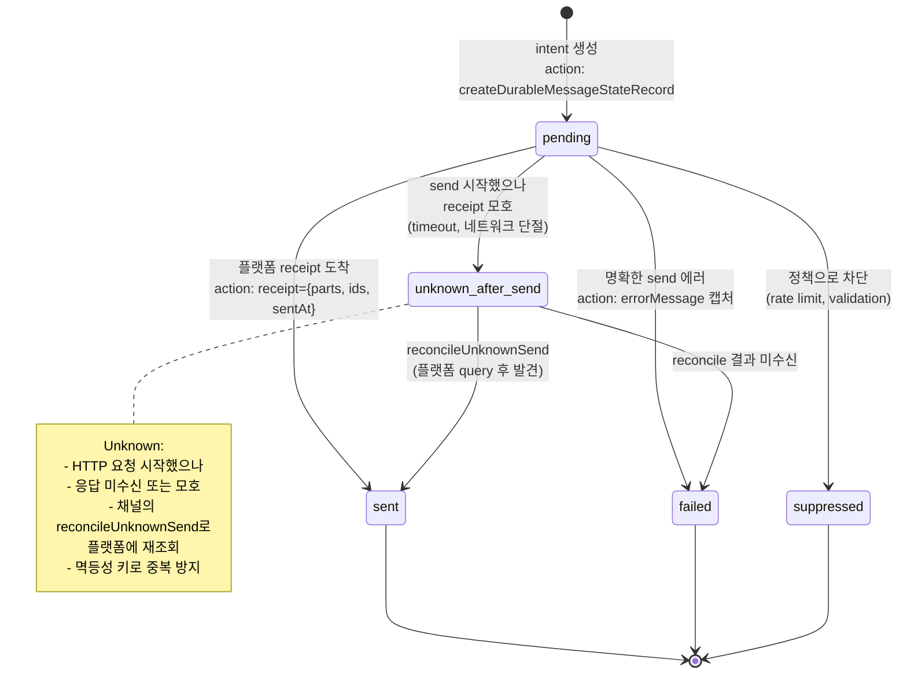
```mermaid
stateDiagram-v2
    [*] --> pending: intent 생성<br/>action: createDurableMessageStateRecord
    
    pending --> sent: 플랫폼 receipt 도착<br/>action: receipt={parts, ids, sentAt}
    
    pending --> unknown_after_send: send 시작했으나<br/>receipt 모호<br/>(timeout, 네트워크 단절)
    
    pending --> failed: 명확한 send 에러<br/>action: errorMessage 캡처
    
    pending --> suppressed: 정책으로 차단<br/>(rate limit, validation)
    
    unknown_after_send --> sent: reconcileUnknownSend<br/>(플랫폼 query 후 발견)
    unknown_after_send --> failed: reconcile 결과 미수신
    
    sent --> [*]
    failed --> [*]
    suppressed --> [*]
    
    note right of unknown_after_send
        Unknown:
        - HTTP 요청 시작했으나
        - 응답 미수신 또는 모호
        - 채널의 reconcileUnknownSend로
          플랫폼에 재조회
        - 멱등성 키로 중복 방지
    end note
```

### Durability 정책

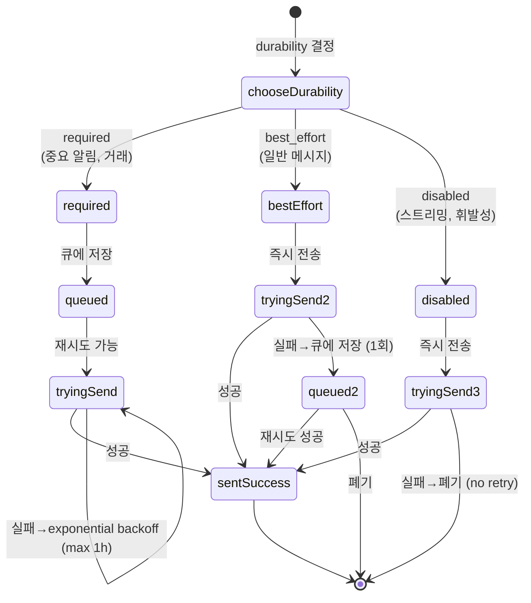
```mermaid
stateDiagram-v2
    [*] --> chooseDurability: durability 결정
    
    chooseDurability --> required: required<br/>(중요 알림, 거래)
    chooseDurability --> bestEffort: best_effort<br/>(일반 메시지)
    chooseDurability --> disabled: disabled<br/>(스트리밍, 휘발성)
    
    required --> queued: 큐에 저장
    queued --> tryingSend: 재시도 가능
    tryingSend --> sentSuccess: 성공
    tryingSend --> tryingSend: 실패→exponential backoff (max 1h)
    
    bestEffort --> tryingSend2: 즉시 전송
    tryingSend2 --> sentSuccess: 성공
    tryingSend2 --> queued2: 실패→큐에 저장 (1회)
    queued2 --> sentSuccess: 재시도 성공
    queued2 --> [*]: 폐기
    
    disabled --> tryingSend3: 즉시 전송
    tryingSend3 --> sentSuccess: 성공
    tryingSend3 --> [*]: 실패→폐기 (no retry)
    
    sentSuccess --> [*]
```

---

## 4. WebSocket Connection

`src/gateway/server/ws-connection.ts`

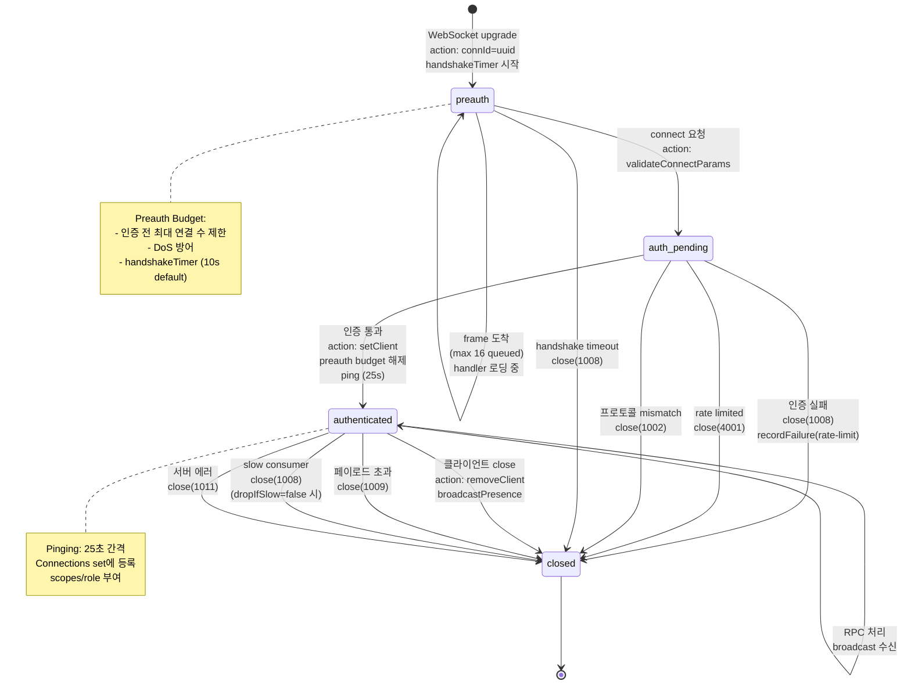
```mermaid
stateDiagram-v2
    [*] --> preauth: WebSocket upgrade<br/>action: connId=uuid<br/>handshakeTimer 시작
    
    preauth --> preauth: frame 도착<br/>(max 16 queued)<br/>handler 로딩 중
    
    preauth --> auth_pending: connect 요청<br/>action: validateConnectParams
    
    auth_pending --> authenticated: 인증 통과<br/>action: setClient<br/>preauth budget 해제<br/>ping (25s)
    
    auth_pending --> closed: 인증 실패<br/>close(1008)<br/>recordFailure(rate-limit)
    
    auth_pending --> closed: rate limited<br/>close(4001)
    
    auth_pending --> closed: 프로토콜 mismatch<br/>close(1002)
    
    preauth --> closed: handshake timeout<br/>close(1008)
    
    authenticated --> authenticated: RPC 처리<br/>broadcast 수신
    
    authenticated --> closed: 클라이언트 close<br/>action: removeClient<br/>broadcastPresence
    
    authenticated --> closed: 페이로드 초과<br/>close(1009)
    
    authenticated --> closed: slow consumer<br/>close(1008)<br/>(dropIfSlow=false 시)
    
    authenticated --> closed: 서버 에러<br/>close(1011)
    
    closed --> [*]
    
    note right of preauth
        Preauth Budget:
        - 인증 전 최대 연결 수 제한
        - DoS 방어
        - handshakeTimer (10s default)
    end note
    
    note right of authenticated
        Pinging: 25초 간격
        Connections set에 등록
        scopes/role 부여
    end note
```

### Close Code 의미

| Code | 의미 | OpenClaw 사용 |
|------|------|--------------|
| 1000 | Normal closure | 정상 종료 |
| 1002 | Protocol error | 프로토콜 mismatch |
| 1008 | Policy violation | 인증 실패, slow consumer, handshake timeout |
| 1009 | Message too big | MAX_PAYLOAD 초과 |
| 1011 | Server error | 내부 에러 |
| 4001 | Custom: Rate limited | 인증 시도 과다 |

---

## 5. Device Pairing

`src/infra/device-pairing.ts`

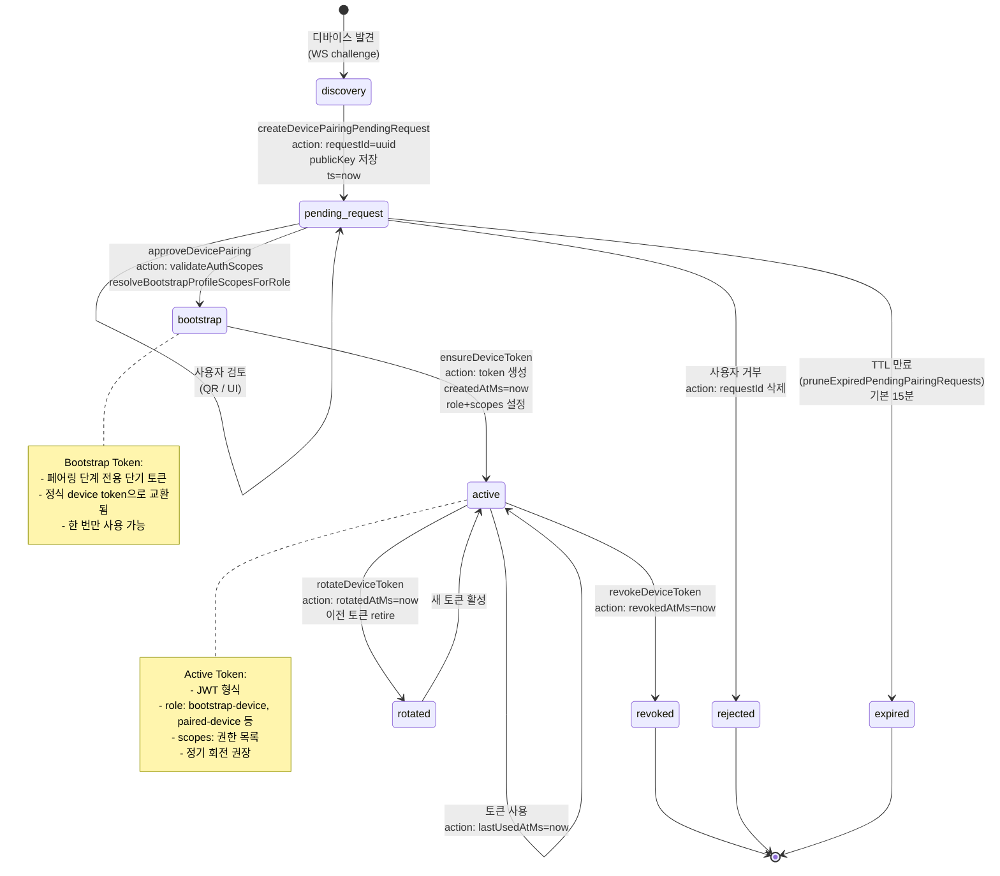
```mermaid
stateDiagram-v2
    [*] --> discovery: 디바이스 발견<br/>(WS challenge)
    
    discovery --> pending_request: createDevicePairingPendingRequest<br/>action: requestId=uuid<br/>publicKey 저장<br/>ts=now
    
    pending_request --> pending_request: 사용자 검토<br/>(QR / UI)
    
    pending_request --> bootstrap: approveDevicePairing<br/>action: validateAuthScopes<br/>resolveBootstrapProfileScopesForRole
    
    pending_request --> rejected: 사용자 거부<br/>action: requestId 삭제
    
    pending_request --> expired: TTL 만료<br/>(pruneExpiredPendingPairingRequests)<br/>기본 15분
    
    bootstrap --> active: ensureDeviceToken<br/>action: token 생성<br/>createdAtMs=now<br/>role+scopes 설정
    
    active --> active: 토큰 사용<br/>action: lastUsedAtMs=now
    
    active --> rotated: rotateDeviceToken<br/>action: rotatedAtMs=now<br/>이전 토큰 retire
    
    rotated --> active: 새 토큰 활성
    
    active --> revoked: revokeDeviceToken<br/>action: revokedAtMs=now
    
    revoked --> [*]
    rejected --> [*]
    expired --> [*]
    
    note right of bootstrap
        Bootstrap Token:
        - 페어링 단계 전용 단기 토큰
        - 정식 device token으로 교환됨
        - 한 번만 사용 가능
    end note
    
    note right of active
        Active Token:
        - JWT 형식
        - role: bootstrap-device, paired-device 등
        - scopes: 권한 목록
        - 정기 회전 권장
    end note
```

---

## 6. Plugin Activation

`src/plugins/config-activation-shared.ts:8-94`

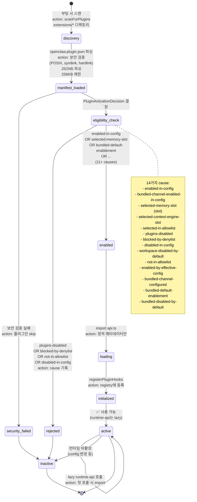
```mermaid
stateDiagram-v2
    [*] --> discovery: 부팅 시 스캔<br/>action: scanForPlugins<br/>extensions/* 디렉토리
    
    discovery --> manifest_loaded: openclaw.plugin.json 파싱<br/>action: 보안 검증<br/>(POSIX, symlink, hardlink)<br/>JSON5 파싱<br/>256KB 제한
    
    manifest_loaded --> security_failed: 보안 검증 실패<br/>action: 플러그인 skip
    
    manifest_loaded --> eligibility_check: PluginActivationDecision 결정
    
    eligibility_check --> rejected: plugins-disabled<br/>OR blocked-by-denylist<br/>OR not-in-allowlist<br/>OR disabled-in-config<br/>action: cause 기록
    
    eligibility_check --> enabled: enabled-in-config<br/>OR selected-memory-slot<br/>OR bundled-default-enablement<br/>OR ...<br/>(11+ causes)
    
    enabled --> loading: import api.ts<br/>action: 정적 메타데이터만
    
    loading --> initialized: registerPluginHooks<br/>action: registry에 등록
    
    initialized --> active: ✅ 사용 가능<br/>(runtime-api는 lazy)
    
    active --> active: lazy runtime-api 호출<br/>action: 첫 호출 시 import
    
    active --> inactive: 런타임 비활성<br/>(config 변경 등)
    
    rejected --> inactive
    security_failed --> inactive
    
    inactive --> [*]
    active --> [*]
    
    note right of eligibility_check
        14가지 cause:
        - enabled-in-config
        - bundled-channel-enabled-in-config
        - selected-memory-slot (slot)
        - selected-context-engine-slot
        - selected-in-allowlist
        - plugins-disabled
        - blocked-by-denylist
        - disabled-in-config
        - workspace-disabled-by-default
        - not-in-allowlist
        - enabled-by-effective-config
        - bundled-channel-configured
        - bundled-default-enablement
        - bundled-disabled-by-default
    end note
```

---

## 7. Memory Recall + Circuit Breaker

`extensions/active-memory/index.ts:43-44, 318-349`

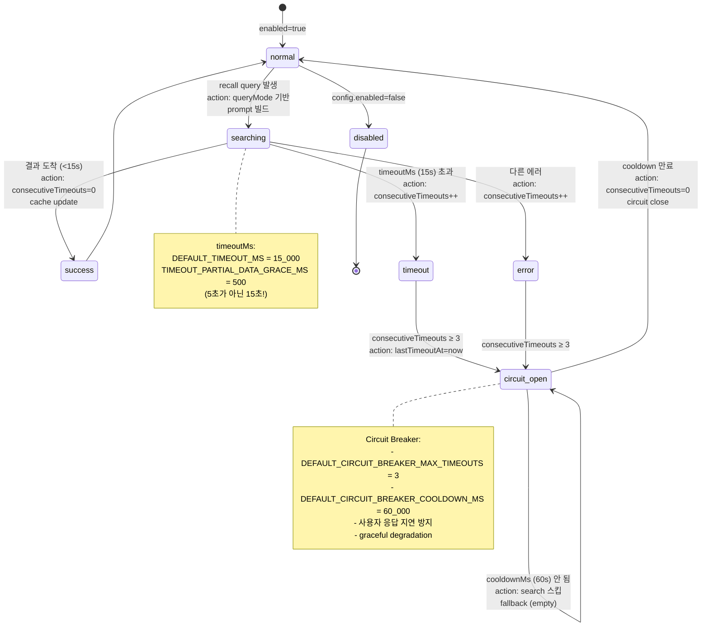
```mermaid
stateDiagram-v2
    [*] --> normal: enabled=true
    
    normal --> searching: recall query 발생<br/>action: queryMode 기반<br/>prompt 빌드
    
    searching --> success: 결과 도착 (<15s)<br/>action: consecutiveTimeouts=0<br/>cache update
    
    searching --> timeout: timeoutMs (15s) 초과<br/>action: consecutiveTimeouts++
    
    searching --> error: 다른 에러<br/>action: consecutiveTimeouts++
    
    timeout --> circuit_open: consecutiveTimeouts ≥ 3<br/>action: lastTimeoutAt=now
    error --> circuit_open: consecutiveTimeouts ≥ 3
    
    circuit_open --> circuit_open: cooldownMs (60s) 안 됨<br/>action: search 스킵<br/>fallback (empty)
    
    circuit_open --> normal: cooldown 만료<br/>action: consecutiveTimeouts=0<br/>circuit close
    
    success --> normal
    
    normal --> disabled: config.enabled=false
    disabled --> [*]
    
    note right of circuit_open
        Circuit Breaker:
        - DEFAULT_CIRCUIT_BREAKER_MAX_TIMEOUTS = 3
        - DEFAULT_CIRCUIT_BREAKER_COOLDOWN_MS = 60_000
        - 사용자 응답 지연 방지
        - graceful degradation
    end note
    
    note right of searching
        timeoutMs:
        DEFAULT_TIMEOUT_MS = 15_000
        TIMEOUT_PARTIAL_DATA_GRACE_MS = 500
        (5초가 아닌 15초!)
    end note
```

---

## 8. Compaction

`src/agents/compaction.ts`

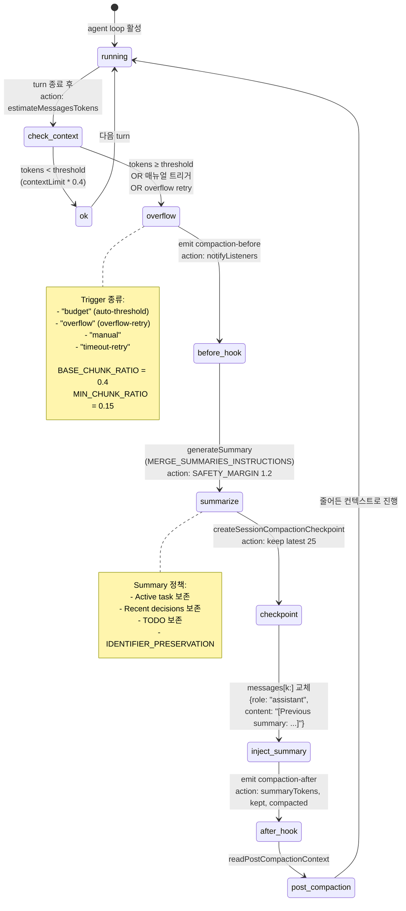
```mermaid
stateDiagram-v2
    [*] --> running: agent loop 활성
    
    running --> check_context: turn 종료 후<br/>action: estimateMessagesTokens
    
    check_context --> ok: tokens < threshold<br/>(contextLimit * 0.4)
    
    check_context --> overflow: tokens ≥ threshold<br/>OR 매뉴얼 트리거<br/>OR overflow retry
    
    ok --> running: 다음 turn
    
    overflow --> before_hook: emit compaction-before<br/>action: notifyListeners
    
    before_hook --> summarize: generateSummary<br/>(MERGE_SUMMARIES_INSTRUCTIONS)<br/>action: SAFETY_MARGIN 1.2
    
    summarize --> checkpoint: createSessionCompactionCheckpoint<br/>action: keep latest 25
    
    checkpoint --> inject_summary: messages[k:] 교체<br/>{role: "assistant",<br/>content: "[Previous summary: ...]"}
    
    inject_summary --> after_hook: emit compaction-after<br/>action: summaryTokens, kept, compacted
    
    after_hook --> post_compaction: readPostCompactionContext
    
    post_compaction --> running: 줄어든 컨텍스트로 진행
    
    note right of overflow
        Trigger 종류:
        - "budget" (auto-threshold)
        - "overflow" (overflow-retry)
        - "manual"
        - "timeout-retry"
        
        BASE_CHUNK_RATIO = 0.4
        MIN_CHUNK_RATIO = 0.15
    end note
    
    note right of summarize
        Summary 정책:
        - Active task 보존
        - Recent decisions 보존
        - TODO 보존
        - IDENTIFIER_PRESERVATION
    end note
```

---

## 9. Approval Lifecycle

`src/gateway/exec-approval-manager.ts:54-141`

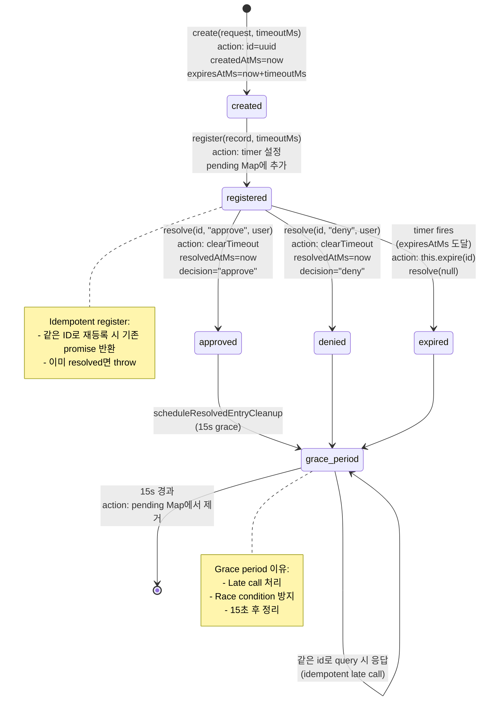
```mermaid
stateDiagram-v2
    [*] --> created: create(request, timeoutMs)<br/>action: id=uuid<br/>createdAtMs=now<br/>expiresAtMs=now+timeoutMs
    
    created --> registered: register(record, timeoutMs)<br/>action: timer 설정<br/>pending Map에 추가
    
    registered --> approved: resolve(id, "approve", user)<br/>action: clearTimeout<br/>resolvedAtMs=now<br/>decision="approve"
    
    registered --> denied: resolve(id, "deny", user)<br/>action: clearTimeout<br/>resolvedAtMs=now<br/>decision="deny"
    
    registered --> expired: timer fires<br/>(expiresAtMs 도달)<br/>action: this.expire(id)<br/>resolve(null)
    
    approved --> grace_period: scheduleResolvedEntryCleanup<br/>(15s grace)
    denied --> grace_period
    expired --> grace_period
    
    grace_period --> grace_period: 같은 id로 query 시 응답<br/>(idempotent late call)
    
    grace_period --> [*]: 15s 경과<br/>action: pending Map에서 제거
    
    note right of registered
        Idempotent register:
        - 같은 ID로 재등록 시 기존 promise 반환
        - 이미 resolved면 throw
    end note
    
    note right of grace_period
        Grace period 이유:
        - Late call 처리
        - Race condition 방지
        - 15초 후 정리
    end note
```

---

## 10. Lane Queue Drain

`src/process/command-queue.ts`

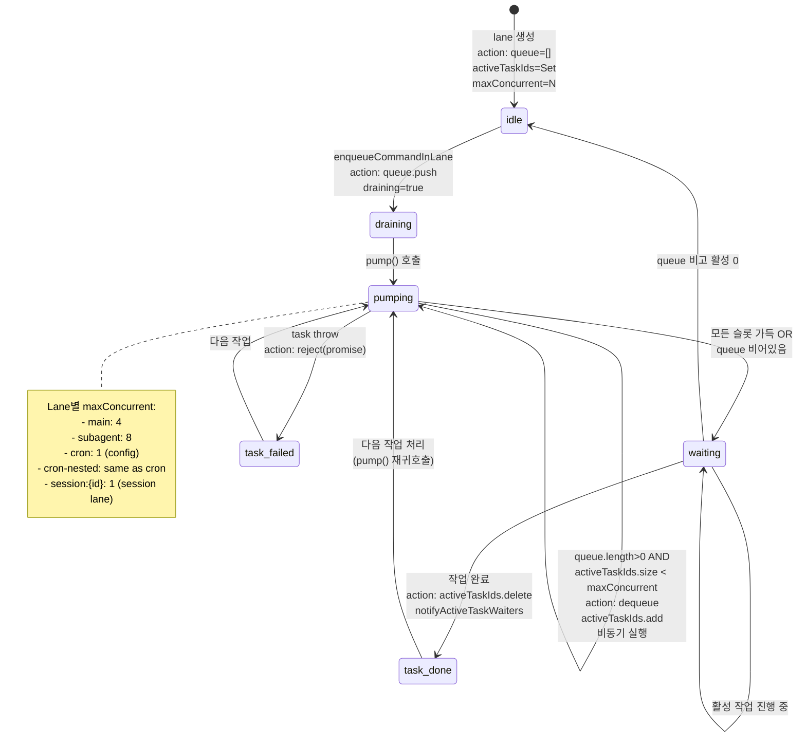
```mermaid
stateDiagram-v2
    [*] --> idle: lane 생성<br/>action: queue=[]<br/>activeTaskIds=Set<br/>maxConcurrent=N
    
    idle --> draining: enqueueCommandInLane<br/>action: queue.push<br/>draining=true
    
    draining --> pumping: pump() 호출
    
    pumping --> pumping: queue.length>0 AND<br/>activeTaskIds.size < maxConcurrent<br/>action: dequeue<br/>activeTaskIds.add<br/>비동기 실행
    
    pumping --> waiting: 모든 슬롯 가득 OR<br/>queue 비어있음
    
    waiting --> waiting: 활성 작업 진행 중
    
    waiting --> task_done: 작업 완료<br/>action: activeTaskIds.delete<br/>notifyActiveTaskWaiters
    
    task_done --> pumping: 다음 작업 처리<br/>(pump() 재귀호출)
    
    waiting --> idle: queue 비고 활성 0
    
    pumping --> task_failed: task throw<br/>action: reject(promise)
    task_failed --> pumping: 다음 작업
    
    note right of pumping
        Lane별 maxConcurrent:
        - main: 4
        - subagent: 8
        - cron: 1 (config)
        - cron-nested: same as cron
        - session:{id}: 1 (session lane)
    end note
```

---

## 11. AbortController Lifecycle

`src/gateway/chat-abort.ts`

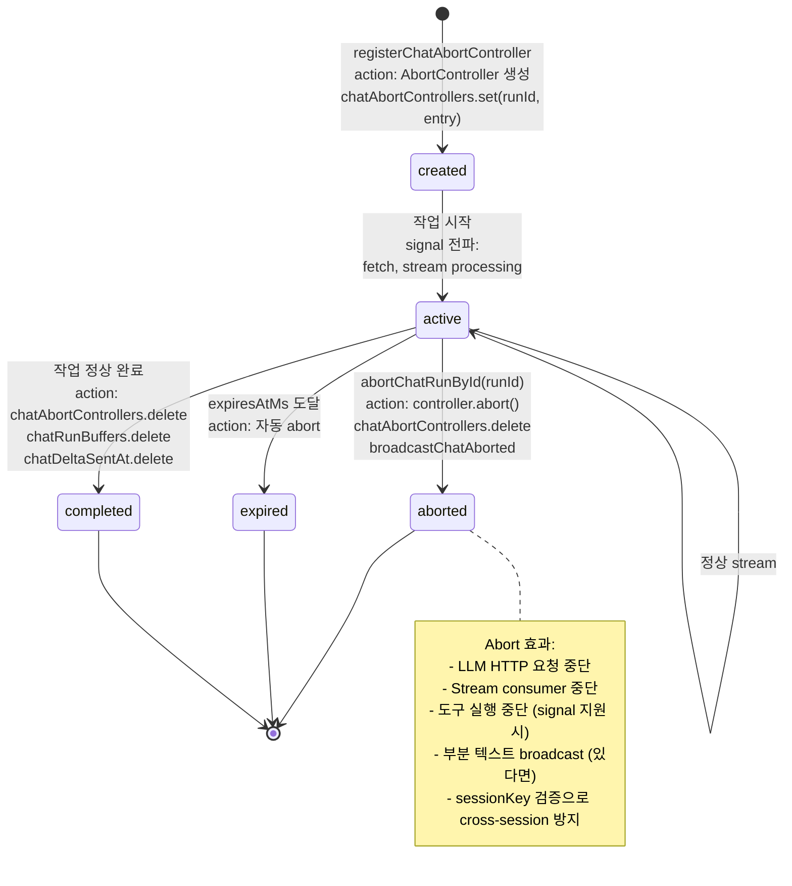
```mermaid
stateDiagram-v2
    [*] --> created: registerChatAbortController<br/>action: AbortController 생성<br/>chatAbortControllers.set(runId, entry)
    
    created --> active: 작업 시작<br/>signal 전파:<br/>fetch, stream processing
    
    active --> active: 정상 stream
    
    active --> aborted: abortChatRunById(runId)<br/>action: controller.abort()<br/>chatAbortControllers.delete<br/>broadcastChatAborted
    
    active --> expired: expiresAtMs 도달<br/>action: 자동 abort
    
    active --> completed: 작업 정상 완료<br/>action: chatAbortControllers.delete<br/>chatRunBuffers.delete<br/>chatDeltaSentAt.delete
    
    aborted --> [*]
    expired --> [*]
    completed --> [*]
    
    note right of aborted
        Abort 효과:
        - LLM HTTP 요청 중단
        - Stream consumer 중단
        - 도구 실행 중단 (signal 지원 시)
        - 부분 텍스트 broadcast (있다면)
        - sessionKey 검증으로 cross-session 방지
    end note
```

---

## 12. Plugin Memory Slot 전환

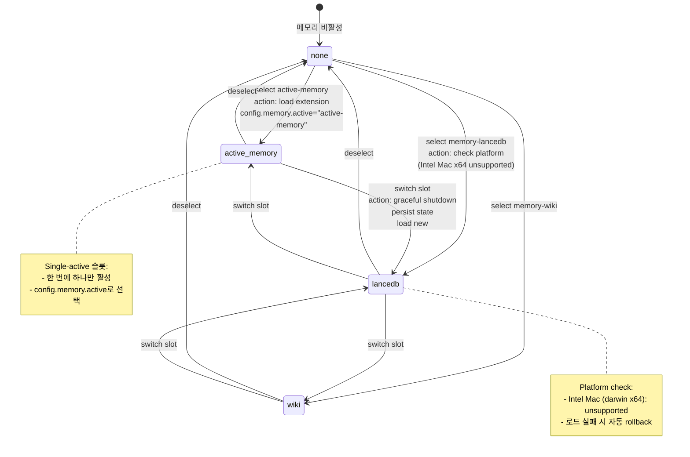
```mermaid
stateDiagram-v2
    [*] --> none: 메모리 비활성
    
    none --> active_memory: select active-memory<br/>action: load extension<br/>config.memory.active="active-memory"
    none --> lancedb: select memory-lancedb<br/>action: check platform<br/>(Intel Mac x64 unsupported)
    none --> wiki: select memory-wiki
    
    active_memory --> none: deselect
    lancedb --> none: deselect
    wiki --> none: deselect
    
    active_memory --> lancedb: switch slot<br/>action: graceful shutdown<br/>persist state<br/>load new
    
    lancedb --> active_memory: switch slot
    
    lancedb --> wiki: switch slot
    wiki --> lancedb: switch slot
    
    note right of lancedb
        Platform check:
        - Intel Mac (darwin x64): unsupported
        - 로드 실패 시 자동 rollback
    end note
    
    note right of active_memory
        Single-active 슬롯:
        - 한 번에 하나만 활성
        - config.memory.active로 선택
    end note
```

---

## 13. Telegram Update Tracking

`extensions/telegram/src/bot-update-tracker.ts:43-100`

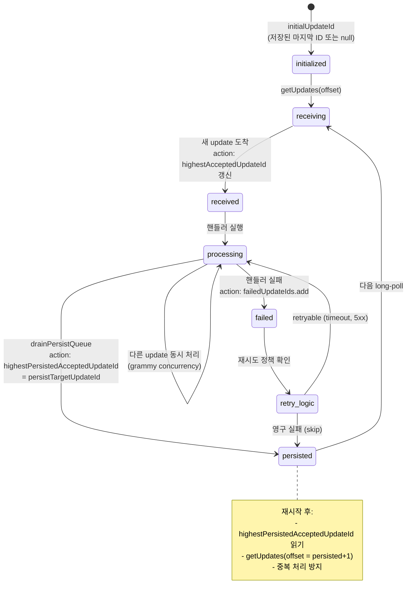
```mermaid
stateDiagram-v2
    [*] --> initialized: initialUpdateId<br/>(저장된 마지막 ID 또는 null)
    
    initialized --> receiving: getUpdates(offset)
    
    receiving --> received: 새 update 도착<br/>action: highestAcceptedUpdateId 갱신
    
    received --> processing: 핸들러 실행
    
    processing --> processing: 다른 update 동시 처리<br/>(grammy concurrency)
    
    processing --> persisted: drainPersistQueue<br/>action: highestPersistedAcceptedUpdateId<br/>= persistTargetUpdateId
    
    persisted --> receiving: 다음 long-poll
    
    processing --> failed: 핸들러 실패<br/>action: failedUpdateIds.add
    
    failed --> retry_logic: 재시도 정책 확인
    
    retry_logic --> processing: retryable (timeout, 5xx)
    retry_logic --> persisted: 영구 실패 (skip)
    
    note right of persisted
        재시작 후:
        - highestPersistedAcceptedUpdateId 읽기
        - getUpdates(offset = persisted+1)
        - 중복 처리 방지
    end note
```

---

## 14. Auth Profile 사용 통계 (Cooldown / Disable)

`src/agents/auth-profiles/types.ts` `ProfileUsageStats`

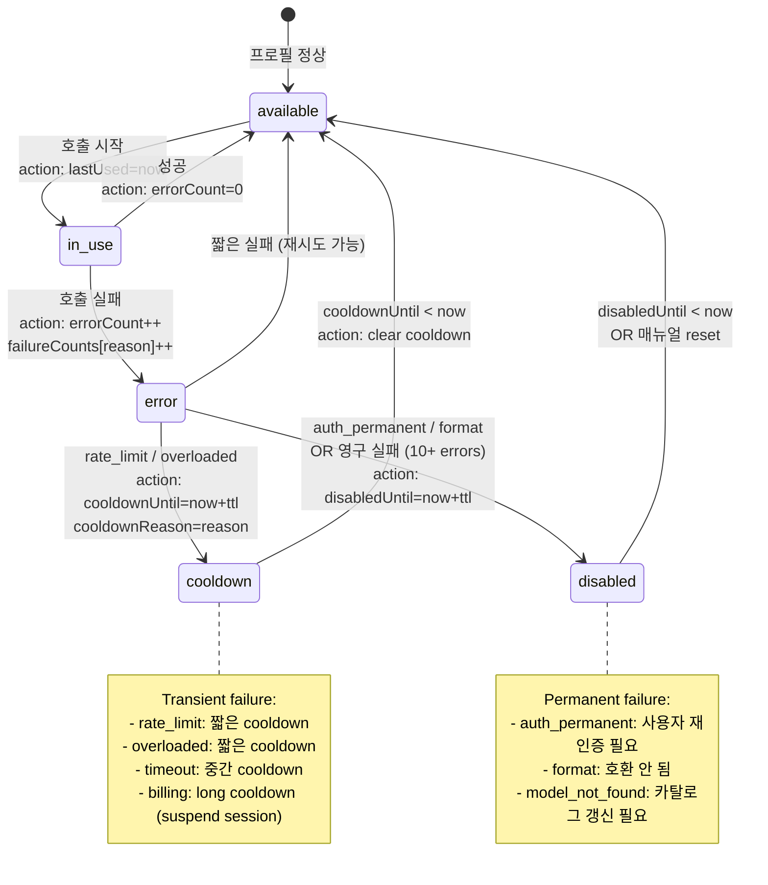
```mermaid
stateDiagram-v2
    [*] --> available: 프로필 정상
    
    available --> in_use: 호출 시작<br/>action: lastUsed=now
    
    in_use --> available: 성공<br/>action: errorCount=0
    
    in_use --> error: 호출 실패<br/>action: errorCount++<br/>failureCounts[reason]++
    
    error --> available: 짧은 실패 (재시도 가능)
    
    error --> cooldown: rate_limit / overloaded<br/>action: cooldownUntil=now+ttl<br/>cooldownReason=reason
    
    cooldown --> available: cooldownUntil < now<br/>action: clear cooldown
    
    error --> disabled: auth_permanent / format<br/>OR 영구 실패 (10+ errors)<br/>action: disabledUntil=now+ttl
    
    disabled --> available: disabledUntil < now<br/>OR 매뉴얼 reset
    
    note right of cooldown
        Transient failure:
        - rate_limit: 짧은 cooldown
        - overloaded: 짧은 cooldown
        - timeout: 중간 cooldown
        - billing: long cooldown (suspend session)
    end note
    
    note right of disabled
        Permanent failure:
        - auth_permanent: 사용자 재인증 필요
        - format: 호환 안 됨
        - model_not_found: 카탈로그 갱신 필요
    end note
```

---

## 종합 표

| 상태 머신 | 상태 수 | 트리거 | 부수 효과 | 복구 |
|----------|--------|-------|----------|------|
| **Session** | 5 | phase event, stopReason, aborted | timestamps, runtimeMs | abortedLastRun=true 표지 |
| **Live Message** | 5 | render, finalize, edit, cancel | LiveMessageState patch | 폐기 후 재시도 |
| **Durable Send** | 5 | platform receipt, error, suppress | record persist | reconcileUnknownSend |
| **WebSocket** | 6 | connect, auth, payload, close | client set, presence broadcast | 재연결 (지수 백오프) |
| **Pairing** | 7 | approve, reject, expire, rotate, revoke | token entries 관리 | 매뉴얼 재페어링 |
| **Plugin Activation** | 4 (+ 14 causes) | config 변경, slot 선택, allowlist | registry update | doctor --fix |
| **Memory Circuit** | 4 | timeout, error count, cooldown 만료 | consecutiveTimeouts, lastTimeoutAt | cooldown 후 자동 reset |
| **Compaction** | 6 | token overflow, manual | checkpoint append, summary inject | retry with MIN_CHUNK_RATIO |
| **Approval** | 5 | resolve, expire, register, grace | timer, pending Map | re-request |
| **Lane Queue** | 4 | enqueue, complete, fail | activeTaskIds Set | 다음 작업 진행 |
| **AbortController** | 4 | register, abort, expire, complete | Map entry | 새 runId로 재시도 |
| **Memory Slot** | 4 (+ slot N) | select, deselect, switch | shutdown/load 전환 | rollback (platform 미지원) |
| **Telegram Update** | 5 | receive, persist, fail, retry | offset 추적 | restart로 동기화 |
| **Auth Profile** | 4 | success, error, cooldown, disable | usageStats update | TTL 만료 또는 manual |
