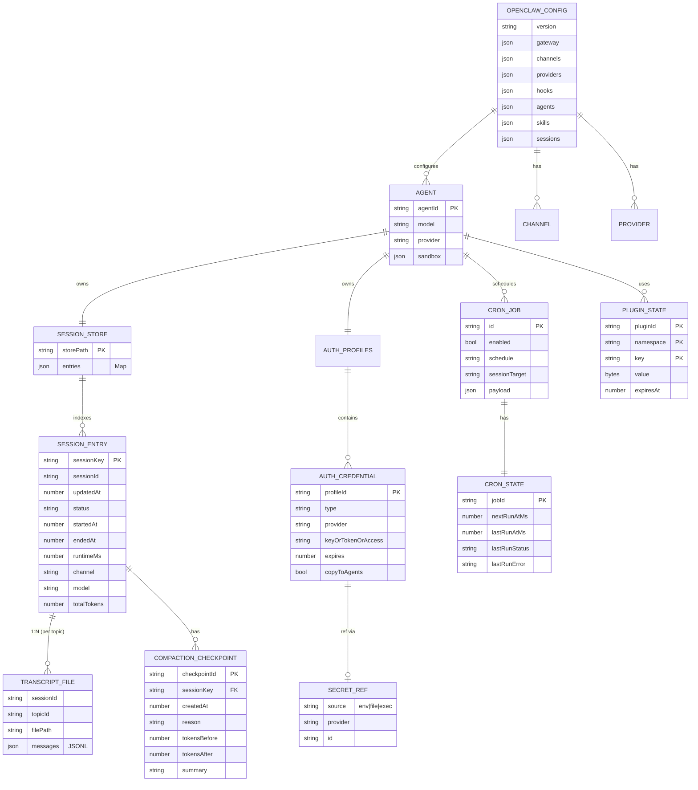
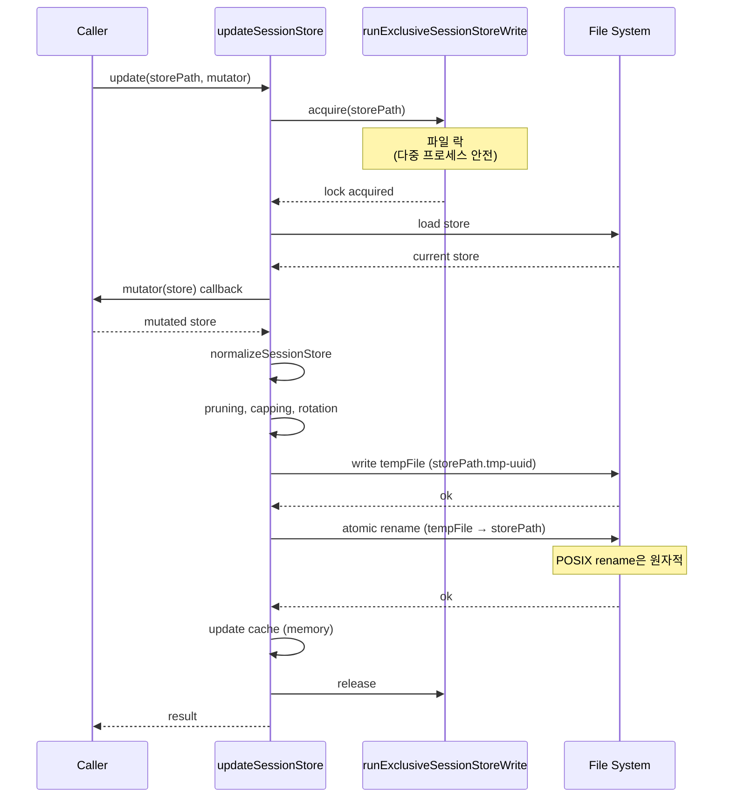
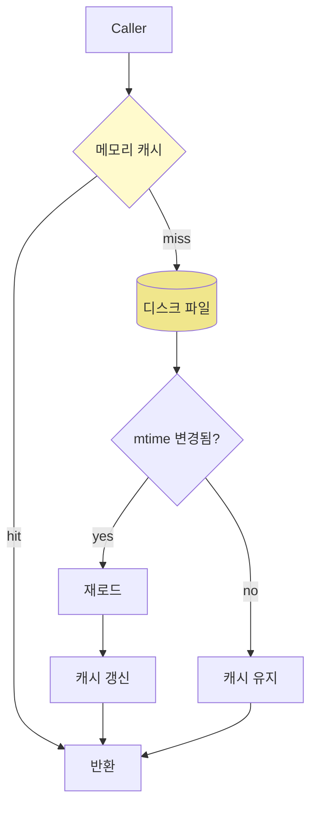
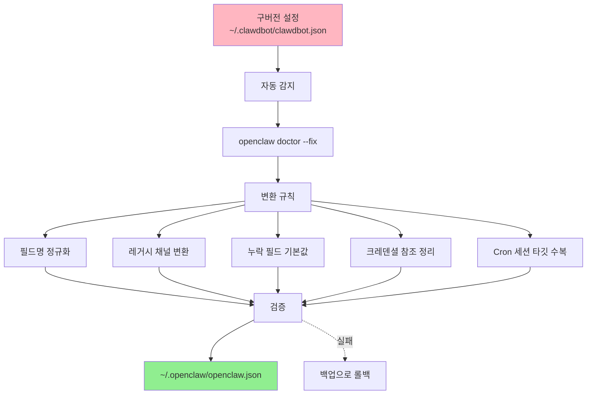

# 05. Storage & Persistence Layer

OpenClaw의 저장 레이어 — 디렉토리 구조, 파일 포맷, ER 다이어그램.

## 1. Top-level 디렉토리 구조

```
~/.openclaw/                              # 상태 디렉토리 (또는 OPENCLAW_STATE_DIR)
├── openclaw.json                         # 메인 설정 (JSON5)
├── openclaw.json.bak                     # 백업 (3개 rotate)
├── openclaw.json.bak.1
├── openclaw.json.bak.2
├── config-health.json                    # 설정 진단 결과
│
├── agents/                               # 에이전트별 데이터
│   ├── main/                             # 기본 에이전트
│   │   ├── sessions/
│   │   │   ├── sessions.json             # 세션 메타데이터 (모든 세션 인덱스)
│   │   │   ├── {sessionId}.jsonl         # 트랜스크립트 (JSONL)
│   │   │   ├── {sessionId}-topic-{tid}.jsonl  # 스레드별 트랜스크립트
│   │   │   ├── _archived/                # 아카이브 (만료된 세션)
│   │   │   └── .lock                     # 쓰기 락
│   │   └── agent/
│   │       ├── auth-profiles.json        # 인증 프로필
│   │       └── auth-profiles-state.json  # 사용 통계, cooldown
│   └── {agentId}/                        # 다른 에이전트
│       └── ...
│
├── _auth_locks/                          # OAuth refresh 락 (다중 프로세스 안전)
│   ├── openai-main.lock
│   ├── github-oauth.lock
│   └── ...
│
├── credentials/                          # 레거시 (마이그레이션 대상)
│   └── oauth.json
│
├── cron/
│   ├── jobs.json                         # cron 작업 정의 (사용자 편집)
│   ├── jobs.json.bak                     # 백업
│   └── jobs-state.json                   # 런타임 상태 (자동 갱신)
│
├── plugin-state/
│   └── state.sqlite                      # 플러그인 상태 (SQLite)
│
├── plugins/
│   ├── installed-index.json              # 설치된 플러그인 인덱스
│   ├── {pluginId}/                       # 외부 설치 플러그인
│   │   └── plugin.json                   # 매니페스트
│   └── ...
│
├── memory/
│   ├── wiki.md                           # 전역 wiki (Obsidian 호환)
│   ├── {sessionId}-memory.md             # 세션 메모리 markdown
│   └── {pluginId}/{namespace}/
│       └── state.db                      # 플러그인 메모리 DB
│
└── logs/
    └── ...
```

---

## 2. 디렉토리 결정 우선순위

`src/config/paths.ts:146-220`

```mermaid
flowchart TD
    Start[Config 위치 결정 시작]
    Start --> Env{OPENCLAW_CONFIG_PATH<br/>설정?}
    Env -->|yes| UseEnv[환경변수 경로 사용]
    Env -->|no| State{OPENCLAW_STATE_DIR<br/>설정?}
    State -->|yes| ConfigInState[(STATE_DIR)/openclaw.json]
    State -->|no| Default
    Default --> Try1["~/.openclaw/openclaw.json<br/>(신규 표준)"]
    Try1 -->|있음| UseDefault
    Try1 -->|없음| Try2["~/.openclaw/clawdbot.json<br/>(레거시 파일명)"]
    Try2 -->|있음| MigrateLeg
    Try2 -->|없음| Try3["~/.clawdbot/openclaw.json<br/>(레거시 디렉토리)"]
    Try3 -->|있음| MigrateLegDir
    Try3 -->|없음| Try4["~/.clawdbot/clawdbot.json<br/>(레거시 모두)"]
    Try4 -->|있음| MigrateLegBoth
    Try4 -->|없음| CreateNew[새 파일 생성<br/>~/.openclaw/openclaw.json]
    
    UseEnv --> Done[Done]
    ConfigInState --> Done
    UseDefault --> Done
    MigrateLeg --> Done
    MigrateLegDir --> Done
    MigrateLegBoth --> Done
    CreateNew --> Done
```

### 환경변수 오버라이드

| 변수 | 기본값 | 설명 |
|------|-------|------|
| `OPENCLAW_HOME` | `$HOME` | 홈 디렉토리 |
| `OPENCLAW_STATE_DIR` | `~/.openclaw` | 상태 디렉토리 |
| `OPENCLAW_CONFIG_PATH` | `~/.openclaw/openclaw.json` | 설정 파일 |
| `OPENCLAW_OAUTH_DIR` | `~/.openclaw/credentials` | OAuth 저장 |
| `OPENCLAW_INCLUDE_ROOTS` | _(없음)_ | $include 허용 디렉토리 |
| `OPENCLAW_NIX_MODE` | `0` | Nix 모드 (읽기 전용) |
| `OPENCLAW_TEST_FAST` | `0` | 테스트 모드 |

---

## 3. ER 다이어그램 (개념적 모델)



---

## 4. 파일 포맷

### 4.1 Session Store (`sessions.json`)

```json
{
  "session-key-1": {
    "sessionId": "550e8400-e29b-41d4-a716-446655440000",
    "updatedAt": 1704067200000,
    "sessionFile": "550e8400-e29b-41d4-a716-446655440000.jsonl",
    "sessionStartedAt": 1704067180000,
    "lastInteractionAt": 1704067195000,
    "model": "claude-3-5-sonnet-20241022",
    "modelProvider": "anthropic",
    "channel": "discord",
    "lastChannel": "discord",
    "lastTo": "user-id-12345",
    "totalTokens": 5234,
    "status": "running",
    "compactionCount": 2,
    "compactionCheckpoints": [
      {
        "checkpointId": "chkpt-1",
        "sessionKey": "session-key-1",
        "sessionId": "550e8400-e29b-41d4-a716-446655440000",
        "createdAt": 1704066900000,
        "reason": "auto-threshold",
        "tokensBefore": 8234,
        "tokensAfter": 5234,
        "summary": "Summarized previous context...",
        "preCompaction": {
          "sessionId": "550e8400-...",
          "sessionFile": "550e8400-....jsonl",
          "leafId": "leaf-1"
        },
        "postCompaction": {
          "sessionId": "550e8400-...",
          "sessionFile": "550e8400-....jsonl",
          "leafId": "leaf-2"
        }
      }
    ]
  }
}
```

### 4.2 Transcript JSONL (`{sessionId}.jsonl`)

**헤더 (첫 줄)**:
```json
{"type":"session","version":9,"id":"550e8400-...","timestamp":"2024-01-01T12:00:00.000Z","cwd":"/Users/username"}
```

**메시지 (이후 줄들, 각각 1줄)**:
```json
{"id":"msg-123","message":{"role":"user","content":"What is 2+2?","timestamp":1704067200000}}
{"id":"msg-124","message":{"role":"assistant","content":"2+2 equals 4.","timestamp":1704067205000}}
{"id":"msg-125","message":{"role":"assistant","content":[{"type":"tool_use","id":"toolu_abc","name":"calculator","input":{"a":2,"b":2}}],"timestamp":1704067210000}}
{"id":"msg-126","message":{"role":"tool","tool_use_id":"toolu_abc","content":"4","timestamp":1704067211000}}
```

**JSONL 장점**:
- 추가만 (append-only) — 동시성 안전
- 파일 끝에서 역순 읽기 (최근 메시지)
- 라인별 파싱 (전체 파일 로드 불필요)

### 4.3 Auth Profiles (`auth-profiles.json`)

```json
{
  "version": 1,
  "profiles": {
    "openai-main": {
      "type": "api_key",
      "provider": "openai",
      "key": "sk-proj-...",
      "copyToAgents": true,
      "email": "user@example.com",
      "displayName": "OpenAI API"
    },
    "openai-work": {
      "type": "api_key",
      "provider": "openai",
      "keyRef": {
        "source": "env",
        "provider": "default",
        "id": "OPENAI_API_KEY"
      },
      "copyToAgents": false
    },
    "anthropic-vault": {
      "type": "api_key",
      "provider": "anthropic",
      "keyRef": {
        "source": "exec",
        "provider": "vault",
        "id": "anthropic/api-key"
      }
    },
    "github-oauth": {
      "type": "oauth",
      "provider": "github",
      "access": "gho_...",
      "refresh": "ghr_...",
      "expires": 1735689600000,
      "clientId": "Ov23liXxyz123...",
      "email": "user@github.com"
    }
  }
}
```

### 4.4 Auth Profile State (`auth-profiles-state.json`)

```json
{
  "order": {
    "claude-opus-4-7": ["anthropic-personal", "anthropic-work", "openai-main"]
  },
  "lastGood": {
    "claude-opus-4-7": "anthropic-personal"
  },
  "usageStats": {
    "anthropic-personal": {
      "lastUsed": 1704067200000,
      "errorCount": 0,
      "failureCounts": {}
    },
    "openai-main": {
      "lastUsed": 1704067100000,
      "cooldownUntil": 1704070800000,
      "cooldownReason": "rate_limit",
      "errorCount": 5,
      "failureCounts": { "rate_limit": 5 }
    }
  }
}
```

### 4.5 Cron Jobs (`jobs.json`)

```json
{
  "version": 1,
  "jobs": [
    {
      "id": "daily-digest",
      "enabled": true,
      "schedule": "0 9 * * *",
      "sessionTarget": "main",
      "payload": {
        "kind": "systemEvent",
        "eventType": "daily_summary"
      }
    },
    {
      "id": "hourly-check",
      "enabled": true,
      "schedule": "0 * * * *",
      "sessionTarget": "isolated",
      "payload": {
        "kind": "agentTurn",
        "prompt": "Check for new GitHub issues"
      }
    }
  ]
}
```

### 4.6 Cron State (`jobs-state.json`)

```json
{
  "version": 1,
  "jobs": {
    "daily-digest": {
      "updatedAtMs": 1704067200000,
      "scheduleIdentity": "0 9 * * *",
      "state": {
        "nextRunAtMs": 1704110400000,
        "lastRunAtMs": 1704024000000,
        "lastRunStatus": "completed",
        "lastRunError": null
      }
    }
  }
}
```

### 4.7 OpenClaw Config (`openclaw.json`)

JSON5 형식 (주석 + unquoted key 허용):

```json5
{
  // OpenClaw 메인 설정
  version: "1.2.3",
  
  $include: ["./providers.json5", "./channels.json5"],
  
  gateway: {
    port: 18789,
    auth: {
      mode: "device-token",
      sharedSecret: "${OPENCLAW_SHARED_SECRET}"
    },
    tls: {
      enabled: false
    }
  },
  
  channels: {
    telegram: {
      accounts: {
        default: {
          enabled: true,
          tokenRef: {
            source: "env",
            id: "TELEGRAM_BOT_TOKEN"
          }
        }
      }
    }
  },
  
  agents: {
    defaults: {
      maxConcurrent: 4,
      subagents: {
        maxConcurrent: 8
      }
    },
    main: {
      model: "claude-opus-4-7",
      sandbox: { mode: "main" }
    }
  },
  
  memory: {
    active: "active-memory"  // slot 선택
  },
  
  cron: {
    maxConcurrentRuns: 1
  }
}
```

---

## 5. Plugin State SQLite 스키마

`src/plugin-state/plugin-state-store.sqlite.ts`

```sql
CREATE TABLE plugin_state_entries (
  pluginId TEXT NOT NULL,
  namespace TEXT NOT NULL,
  key TEXT NOT NULL,
  value BLOB NOT NULL,           -- JSON, 최대 64KB
  expiresAt INTEGER,             -- ms, NULL이면 영구
  createdAt INTEGER NOT NULL,
  updatedAt INTEGER NOT NULL,
  PRIMARY KEY (pluginId, namespace, key)
);

CREATE INDEX idx_expires ON plugin_state_entries(expiresAt) WHERE expiresAt IS NOT NULL;
```

### 제한

| 제한 | 값 |
|------|-----|
| value 최대 | 64 KB (`MAX_PLUGIN_STATE_VALUE_BYTES`) |
| 네임스페이스 길이 | 128 bytes |
| 키 길이 | 512 bytes |
| JSON 깊이 | 64 levels |
| 엔트리 per (plugin, namespace) | 설정 가능 (기본 1000) |
| TTL | 옵션 (`defaultTtlMs`) |

---

## 6. 원자적 쓰기 패턴

`src/config/sessions/store.ts:427-435`



### 적용 영역

- 세션 store 갱신
- 설정 파일 쓰기 (백업 3개 rotate)
- Cron jobs.json 갱신
- Auth profiles 갱신

---

## 7. 캐싱 레이어



### 캐시 종류

| 캐시 | 위치 | 항목 수 | 정책 |
|------|------|--------|------|
| **Manifest cache** | `src/plugins/manifest.ts` | LRU 512 | mtime 기반 무효화 |
| **Session store** | `src/config/sessions/store-cache.ts` | 모든 store | mtime + sizeBytes 검증 |
| **Serialized JSON** | 같은 파일 | 모든 store | 쓰기 시 즉시 갱신 |
| **Runtime config** | `src/config/runtime.ts` | 1개 (active) | reload 시 무효화 |
| **Plugin metadata** | `src/plugins/plugin-metadata-snapshot.ts` | 모든 플러그인 | 로드 시 |
| **Active recall** | `extensions/active-memory` | Map | TTL + LRU |
| **Dedup cache** | `src/infra/dedupe.ts` | maxSize | TTL 기반 |

---

## 8. Volume Persistence (Cloud 배포)

Fly.io / Render의 경우 영속 볼륨에 마운트:

```
[Fly.io machine]
├── /data/                                # mount point
│   └── .openclaw/                        # OPENCLAW_STATE_DIR
│       ├── openclaw.json
│       ├── agents/...
│       └── ...
└── /app/                                 # 런타임 (휘발성)
    ├── dist/
    └── node_modules/
```

`fly.toml`:
```toml
[mounts]
  source = "openclaw_data"
  destination = "/data"

[env]
  OPENCLAW_STATE_DIR = "/data/.openclaw"
```

---

## 9. 보안 고려사항

### 파일 권한

| 파일 | mode |
|------|------|
| 설정 파일 | `0o600` (소유자만) |
| Credentials | `0o600` |
| 세션 store | `0o600` |
| Plugin state | `0o600` |
| Cron jobs | `0o600` |

### 비밀 처리

```mermaid
flowchart LR
    Inline[인라인 비밀<br/>(key: 'sk-...')] -.->|❌ 거부| Error[검증 에러]
    EnvRef[envRef: ENV_VAR] -->|✅| Resolve[runtime 해석]
    FileRef[fileRef: path#pointer] -->|✅| Resolve
    ExecRef[execRef: vault cmd] -->|✅| Resolve
    
    Resolve --> Mem[메모리에서 사용]
    Mem -.->|❌| Log[로그/응답 노출]
    
    style Error fill:#FFB6C1
    style Resolve fill:#90EE90
    style Log fill:#FFB6C1
```

- **인라인 비밀 거부**: 설정 검증에서 막힘
- **외부 참조 권장**: env / file / exec
- **로그 마스킹**: 자동
- **메모리 노출 위험**: 프로세스 덤프 불가능 영역 권장

---

## 10. 마이그레이션 / Upgrade Path



### 핵심 원칙

`AGENTS.md:34`:
> No legacy compatibility in core/runtime paths. When old config/store shapes need support, add an `openclaw doctor --fix` rewrite/repair rule.

- runtime은 **canonical contract**만 알기
- 마이그레이션은 명시적 doctor 단계
- 매 요청마다 마이그레이션 비용 X
