# 06. Concurrency Model

OpenClaw의 동시성 / 큐잉 / 디스패처 / 백프레셔 모델.

## 1. 전체 동시성 토폴로지

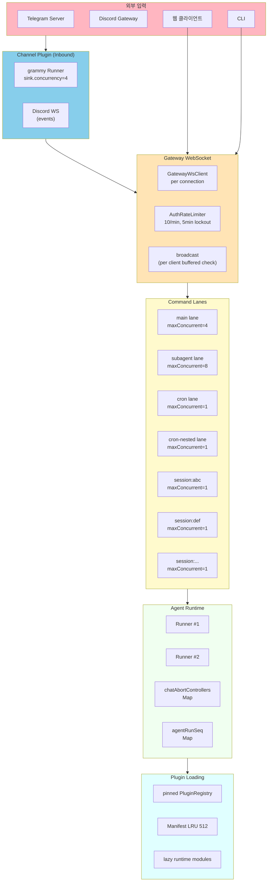

---

## 2. Lane 시스템 — 핵심 추상화

### 2.1 Lane Enum

`src/process/lanes.ts`:
```typescript
export const enum CommandLane {
  Main = "main",
  Cron = "cron",
  CronNested = "cron-nested",
  Subagent = "subagent",
  Nested = "nested",
}
```

### 2.2 Lane 종류와 maxConcurrent

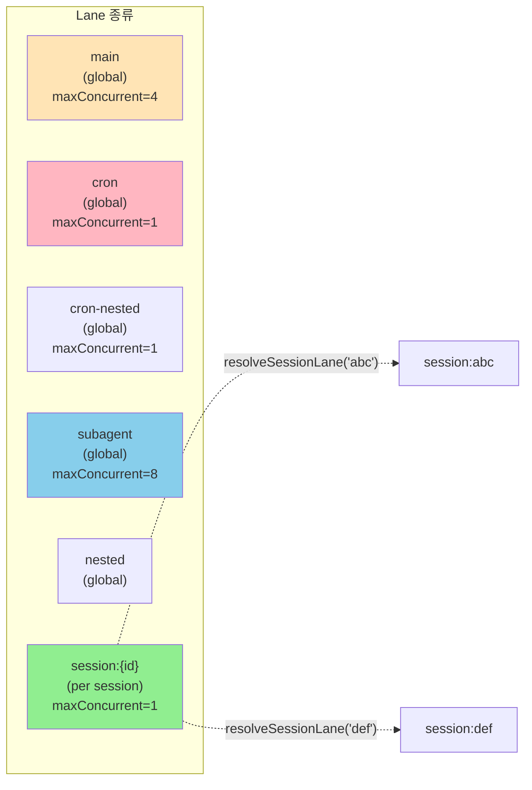

### 2.3 Lane 결정 로직

`src/agents/pi-embedded-runner/lanes.ts`:

```typescript
export function resolveSessionLane(key: string) {
  const cleaned = key.trim() || CommandLane.Main;
  return cleaned.startsWith("session:") ? cleaned : `session:${cleaned}`;
}

export function resolveGlobalLane(lane?: string) {
  const cleaned = lane?.trim();
  // 크론 작업은 cron-nested로 리매핑 (데드락 방지)
  if (cleaned === CommandLane.Cron) {
    return CommandLane.CronNested;
  }
  return cleaned ? cleaned : CommandLane.Main;
}
```

### 2.4 Cron 데드락 회피

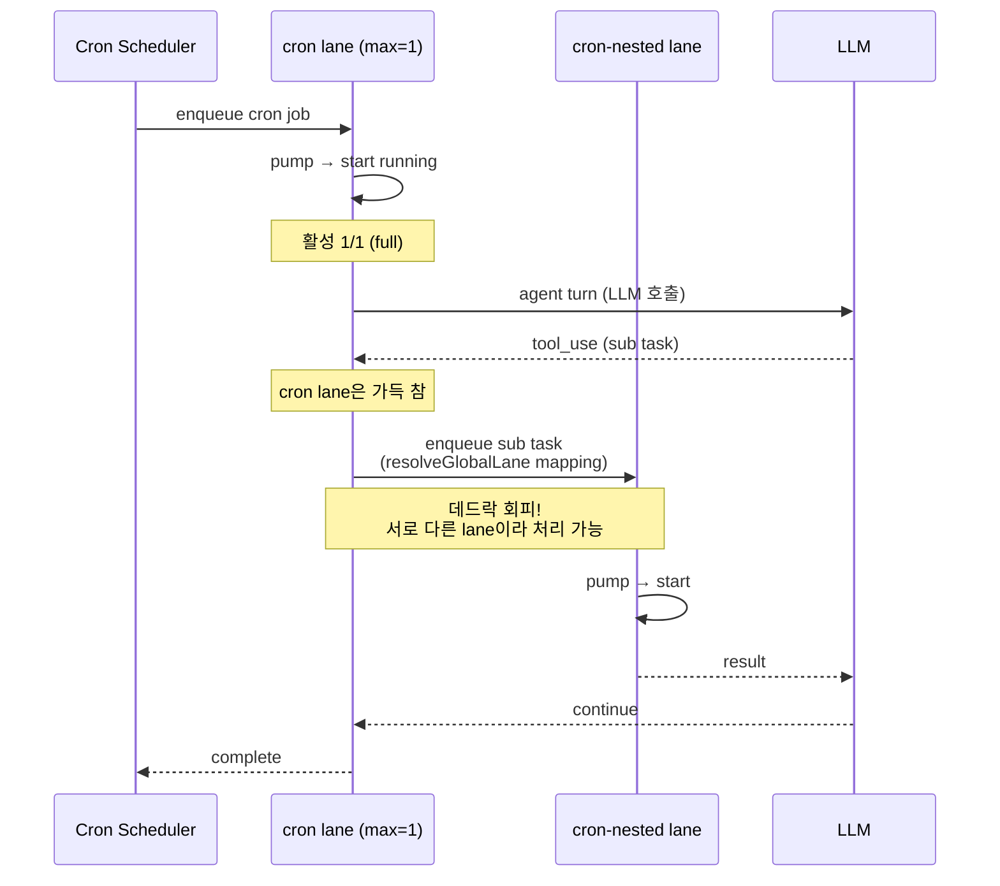

---

## 3. Command Queue 동작

### 3.1 Lane State 구조

`src/process/command-queue.ts`:

```typescript
type LaneState = {
  lane: string;
  queue: QueueEntry[];
  activeTaskIds: Set<number>;
  maxConcurrent: number;
  draining: boolean;
  generation: number;          // lane 초기화 감지
};

type QueueEntry = {
  task: () => Promise<unknown>;
  resolve: (v: unknown) => void;
  reject: (e: unknown) => void;
  opts?: EnqueueOpts;
};
```

### 3.2 Drain 알고리즘

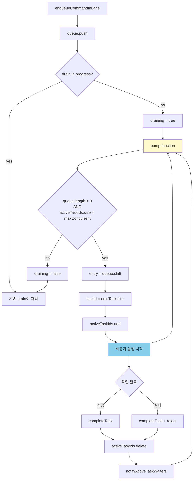

### 3.3 enqueue API

```typescript
export function enqueueCommandInLane<T>(
  lane: string,
  task: () => Promise<T>,
  opts?: {
    warnAfterMs?: number;       // 대기 시간 경고 임계값
    taskTimeoutMs?: number;     // 작업 타임아웃
    onWait?: (waitMs: number, queuedAhead: number) => void;
  },
): Promise<T>
```

---

## 4. 세션별 순차성 보장

### 4.1 왜 session lane?

- 한 사용자 메시지의 응답이 끝나기 전에 다음 메시지 도착
- 동시에 처리하면 race condition (transcript 충돌, 컨텍스트 오염)
- `session:{id}` lane은 maxConcurrent=1 → 자동 직렬화

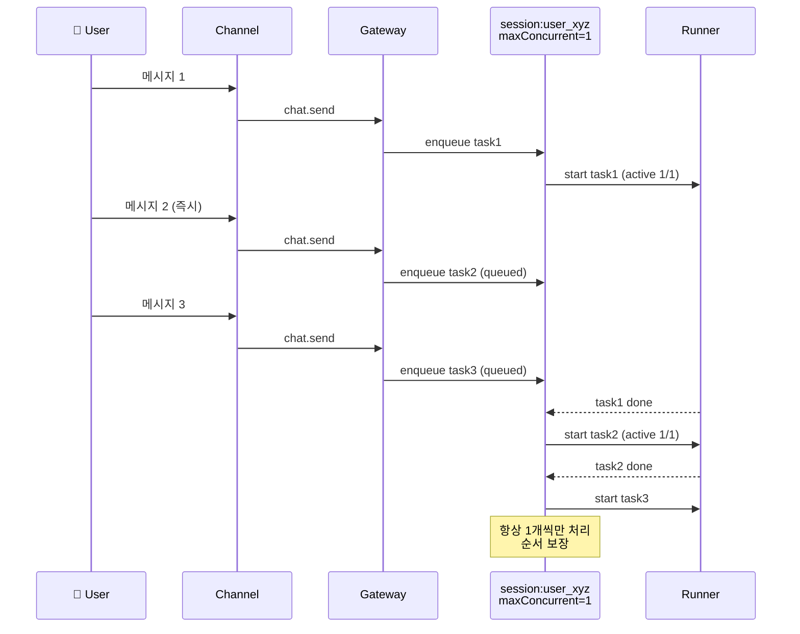

### 4.2 AgentRunSeq — broadcast 순서

`agentRunSeq: Map<string, number>`는 **broadcast 이벤트의 순서**를 추적:

```typescript
// chat-abort.ts:139 (개념)
broadcast("chat", {
  runId,
  sessionKey,
  seq: (ops.agentRunSeq.get(runId) ?? 0) + 1,
  state: "running",
  // ...
});
```

→ 클라이언트는 `seq` 단조증가로 stale event 무시 가능.

---

## 5. AbortController 시스템

### 5.1 등록과 추적

`src/gateway/chat-abort.ts:70-108`:

```typescript
export type ChatAbortControllerEntry = {
  controller: AbortController;
  sessionId: string;
  sessionKey: string;
  startedAtMs: number;
  expiresAtMs: number;
  ownerConnId?: string;
  ownerDeviceId?: string;
  kind?: "chat-send" | "agent";
};

// chatAbortControllers: Map<runId, ChatAbortControllerEntry>
```

### 5.2 Abort 흐름

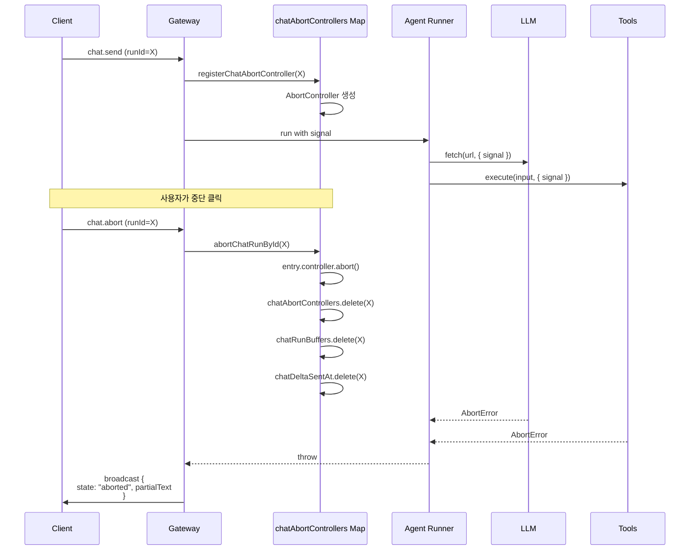

### 5.3 Cross-session 보호

```typescript
// chat-abort.ts (개념)
export function abortChatRunById(ops, params) {
  const active = ops.chatAbortControllers.get(runId);
  if (!active) return { aborted: false };
  if (active.sessionKey !== sessionKey) {
    return { aborted: false };  // 다른 세션의 abort 거부
  }
  active.controller.abort();
  // ...
}
```

---

## 6. Subagent 동시성 제한

### 6.1 두 가지 제약

```mermaid
flowchart TB
    Spawn[spawnSubagentDirect] --> Check1{depth >= MAX_SPAWN_DEPTH?}
    Check1 -->|yes (1)| Reject1[forbidden: depth exceeded]
    Check1 -->|no| Check2{children >= MAX_CHILDREN?}
    Check2 -->|yes (5)| Reject2[forbidden: max children]
    Check2 -->|no| Allowed[허용]
    
    Allowed --> CalcRole[role calculation]
    CalcRole --> Leaf{depth >= MAX-1?}
    Leaf -->|yes| LeafRole[role=leaf<br/>controlScope=none]
    Leaf -->|no| Orchestrator[role=orchestrator<br/>controlScope=children]
    
    LeafRole --> Done
    Orchestrator --> Done
    
    style Reject1 fill:#FFB6C1
    style Reject2 fill:#FFB6C1
    style Done fill:#90EE90
```

### 6.2 트리 구조 제한

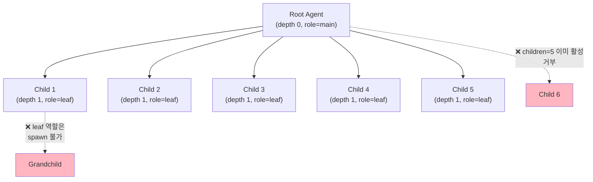

기본값:
- `DEFAULT_SUBAGENT_MAX_CHILDREN_PER_AGENT = 5`
- `DEFAULT_SUBAGENT_MAX_SPAWN_DEPTH = 1`

→ 1단계 분기, 5명까지. 무한 재귀 방어.

### 6.3 Subagent Registry 쿼리

```typescript
import {
  countActiveDescendantRunsFromRuns,
  countActiveRunsForSessionFromRuns,
  isSubagentSessionRunActiveFromRuns,
  // ...
} from "./subagent-registry-queries.js";
```

- `countActiveRunsForSession(parentSessionKey)` — 직계 자식 활성 수
- `countActiveDescendantRunsFromRuns(parentSessionKey)` — 모든 후손 활성 수
- `isSubagentSessionRunActiveFromRuns(runId)` — runId 활성 여부

---

## 7. Channel 동시성

### 7.1 Telegram (grammy)

`extensions/telegram/src/monitor.ts:28-48`:
```typescript
export function createTelegramRunnerOptions(cfg: OpenClawConfig) {
  return {
    sink: {
      concurrency: resolveAgentMaxConcurrent(cfg),  // = 4
    },
    runner: {
      fetch: { timeout: 30 },
      maxRetryTime: 60 * 60 * 1000,    // 1h
      retryInterval: "exponential",
    },
  };
}
```

→ Telegram 봇은 max 4개 메시지를 동시 처리 (gateway concurrency 상속).

### 7.2 인바운드 흐름

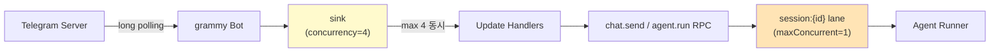

여러 사용자가 동시 메시지 → grammy sink에서 4개씩 받음 → 각 사용자별 session lane으로 분배 → 사용자별 1:1 직렬 처리.

---

## 8. Plugin Registry Pinning

### 8.1 Pin/Release 메커니즘

`src/plugins/runtime.ts:229-263`:

```typescript
type RegistrySurfaceState = {
  registry: PluginRegistry | null;
  pinned: boolean;
  version: number;
};

const state = {
  activeRegistry: null,
  activeVersion: 0,
  httpRoute: { registry: null, pinned: false, version: 0 },
  channel: { registry: null, pinned: false, version: 0 },
};

export function pinActivePluginChannelRegistry(registry: PluginRegistry) {
  installSurfaceRegistry(state.channel, registry, true);
}

export function releasePinnedPluginChannelRegistry(registry?: PluginRegistry) {
  if (registry && state.channel.registry !== registry) {
    return;
  }
  installSurfaceRegistry(state.channel, state.activeRegistry, false);
}
```

### 8.2 왜 pinning?

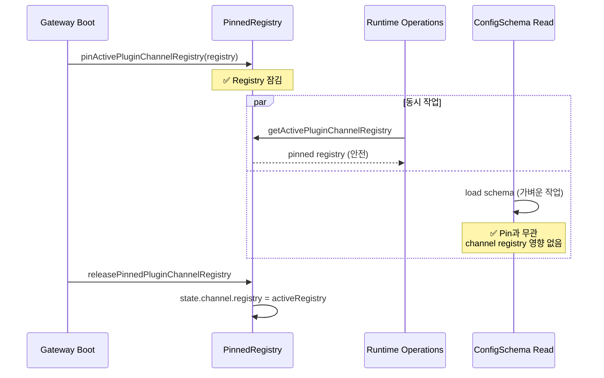

→ **config schema 읽기 같은 가벼운 작업이 channel plugin을 evict하지 않도록 보장.**

---

## 9. Backpressure & Slow Client

### 9.1 Buffered Amount 모니터링

`src/gateway/server-broadcast.ts:87-181`:

```typescript
const slow = c.socket.bufferedAmount > MAX_BUFFERED_BYTES;

if (slow && opts?.dropIfSlow) {
  // 메시지 드롭, 연결 유지
  continue;
}

if (slow) {
  // 연결 강제 종료
  c.socket.close(1008, "slow consumer");
  continue;
}

// 정상: send
c.socket.send(frame);
```

### 9.2 두 가지 정책

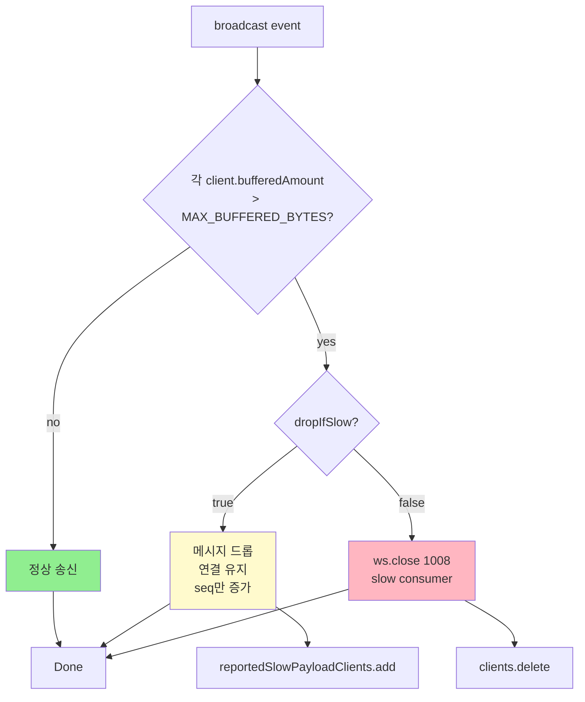

### 9.3 사용 예

```typescript
// 빈번 이벤트 (presence) — drop OK
broadcast("presence", { /* ... */ }, { dropIfSlow: true });

// 중요 이벤트 (chat done) — drop X, 연결 종료
broadcast("chat", { state: "done", /* ... */ });
// dropIfSlow 미설정 → false → 연결 종료
```

---

## 10. Auth Rate Limiter

### 10.1 슬라이딩 윈도우 + 잠금

`src/gateway/auth-rate-limit.ts:99-236`:

```typescript
// 기본값
const maxAttempts = 10;
const windowMs = 60_000;       // 1분 슬라이딩 윈도우
const lockoutMs = 300_000;     // 5분 잠금
```

### 10.2 동작

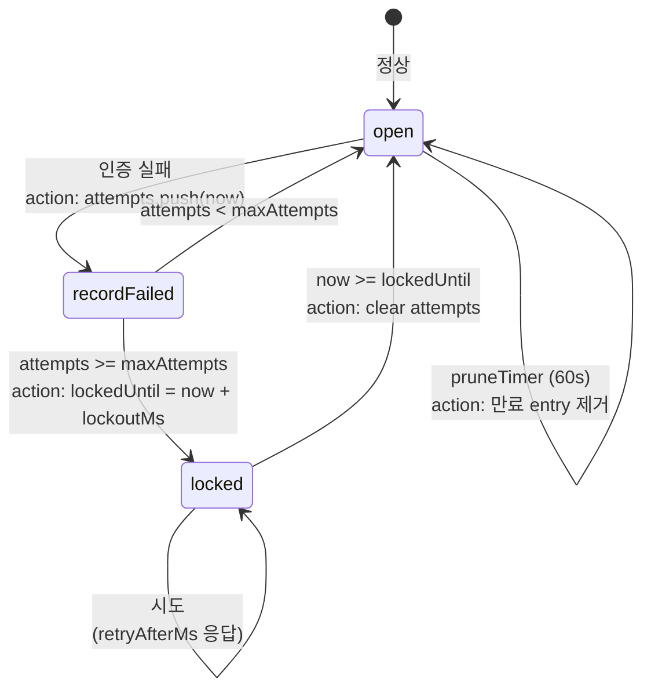

### 10.3 Scope별 분리

```typescript
export const AUTH_RATE_LIMIT_SCOPE_DEFAULT = "default";
export const AUTH_RATE_LIMIT_SCOPE_SHARED_SECRET = "shared-secret";
export const AUTH_RATE_LIMIT_SCOPE_DEVICE_TOKEN = "device-token";
export const AUTH_RATE_LIMIT_SCOPE_HOOK_AUTH = "hook-auth";
```

→ scope별 독립적 카운터. shared-secret 시도 한도가 device-token에 영향 없음.

### 10.4 Loopback 예외

```typescript
const exemptLoopback = config?.exemptLoopback ?? true;
// 127.0.0.1, ::1 등은 rate limit 면제 (CLI 사용 보호)
```

---

## 11. 외부 API Rate Limiting

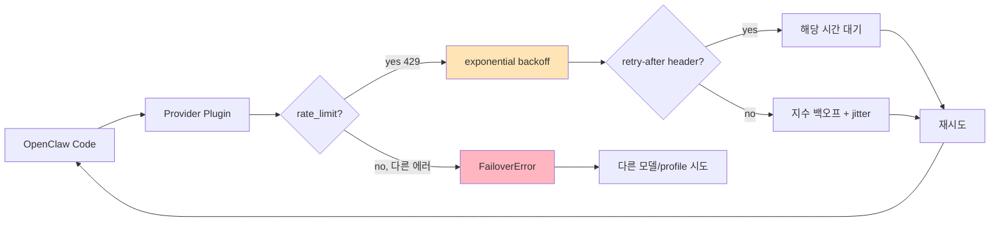

`src/infra/retry.ts:69-137`:
```typescript
const baseDelay = hasRetryAfter
  ? Math.max(retryAfterMs, minDelayMs)
  : minDelayMs * 2 ** (attempt - 1);  // exponential
let delay = Math.min(baseDelay, maxDelayMs);
delay = applyJitter(delay, jitter);    // thundering herd 방지
```

기본 정책: **3 attempts, 400ms-30s, 10% jitter**.

---

## 12. Test Parallelism 제어

### 12.1 Vitest 워커 결정

`test/vitest/vitest.shared.config.ts:75-116`:

```typescript
// 환경변수 우선
if (hasWorkerOverride(env)) {
  return { /* OPENCLAW_VITEST_MAX_WORKERS 사용 */ };
}

// CI
if (isCI) {
  return {
    fileParallelism: true,
    maxWorkers: isWindows ? 2 : 3,
  };
}

// 로컬: CPU-적응
return localScheduling;
```

### 12.2 Module Cache Race 방어

`test/vitest/vitest.performance-config.ts`:

```typescript
if (env.OPENCLAW_VITEST_FS_MODULE_CACHE_PATH?.trim()) {
  experimental.fsModuleCachePath = env.OPENCLAW_VITEST_FS_MODULE_CACHE_PATH;
}
```

여러 Vitest 프로세스가 같은 worktree에서 돌면 `node_modules/.experimental-vitest-cache`에서 race condition (`ENOTEMPTY`).

해결:
```bash
# 1. 단일 프로세스
OPENCLAW_VITEST_MAX_WORKERS=1 pnpm test

# 2. 분리된 캐시 (PID 기반)
OPENCLAW_VITEST_FS_MODULE_CACHE_PATH=/tmp/cache-${PID} pnpm test
```

---

## 13. 동시성 안전성 매트릭스

| 영역 | 메커니즘 | 동시성 모델 |
|------|---------|------------|
| 세션 메시지 | session:{id} lane (maxConcurrent=1) | 사용자별 직렬 |
| Subagent | subagent lane + tree 제약 | 5 children, depth 1 |
| Cron | cron + cron-nested lane | 1 job, 1 nested |
| 메인 처리 | main lane | 4 동시 |
| Channel inbound | grammy sink concurrency | 4 |
| LLM 호출 | retry policy (provider별) | 3 attempts, exp backoff |
| Auth 시도 | rate limiter (scope별) | 10/min, 5min lock |
| WebSocket | per-client buffered check | dropIfSlow / close |
| Plugin loading | pinned registry | snapshot 안정 |
| Manifest cache | LRU 512 | 비결정적 갱신 |
| OAuth refresh | file lock | 단일 갱신 보장 |
| Session store | exclusive write lock | atomic write |
| Plugin state | SQLite | DB 자체 트랜잭션 |
| Test workers | vitest config | CPU-adaptive |

---

## 14. 잠재적 병목

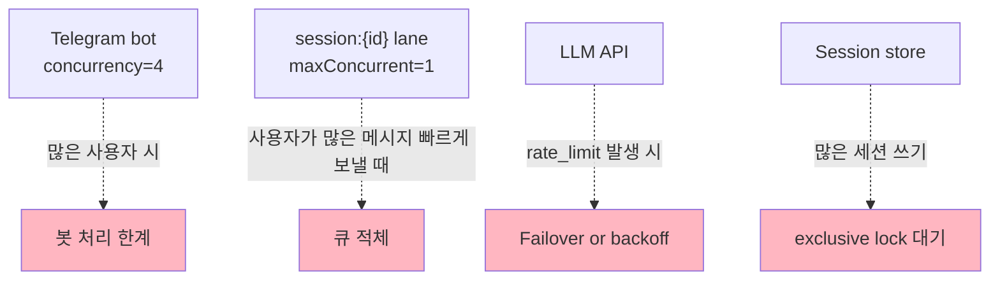

### 완화 방법

| 병목 | 완화 |
|------|------|
| Telegram concurrency=4 | 더 많은 동시성 가능하나 API rate limit 고려 |
| Session lane=1 | 사용자별 분산 (자연스러운 분할) |
| LLM rate_limit | 다중 auth profile + failover chain |
| Session store lock | LRU + serialized cache로 read 빠름 |

---

## 15. 모니터링 / 진단

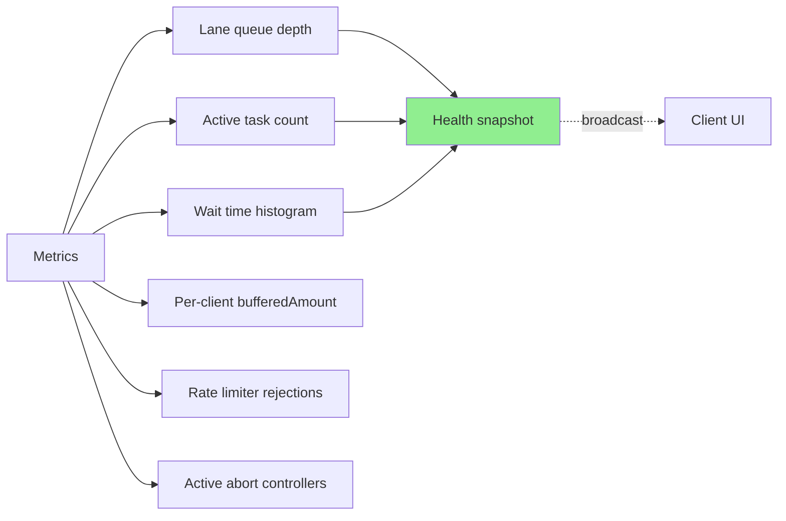

`OPENCLAW_GATEWAY_STARTUP_TRACE=1` 활성화 시 startup 단계별 P50/P95/P99 측정.
