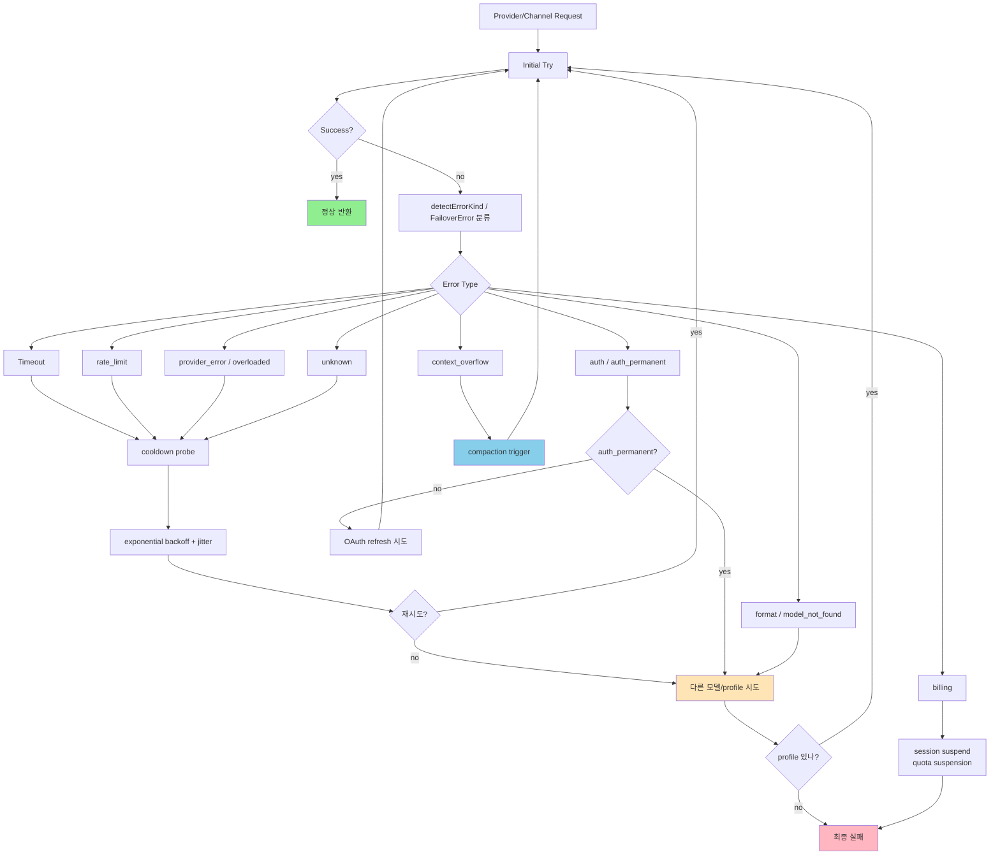
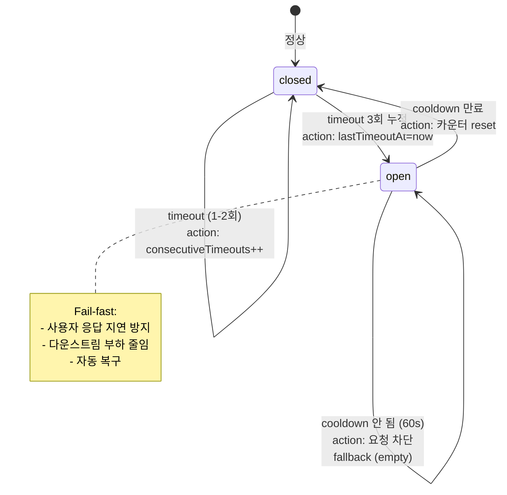
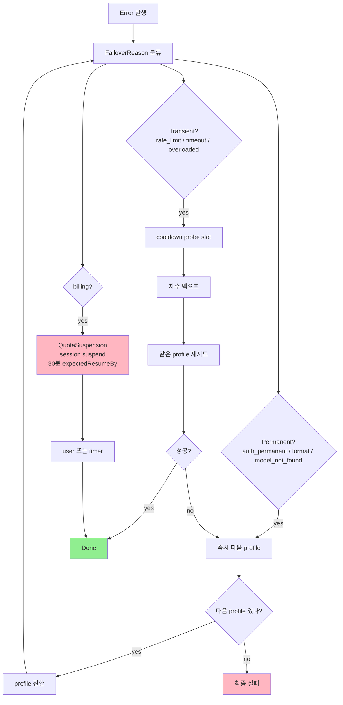
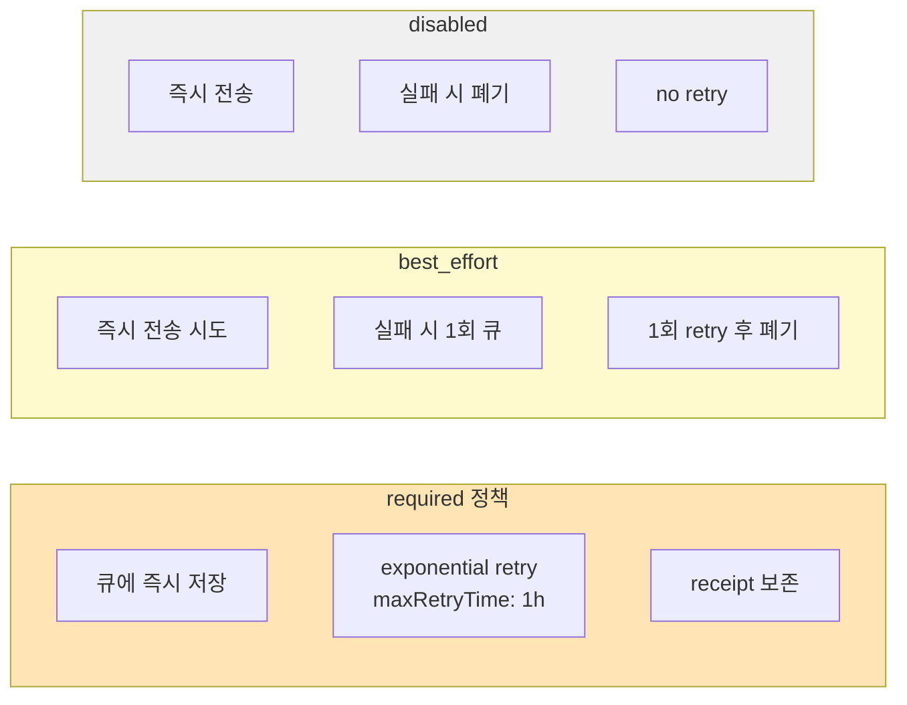
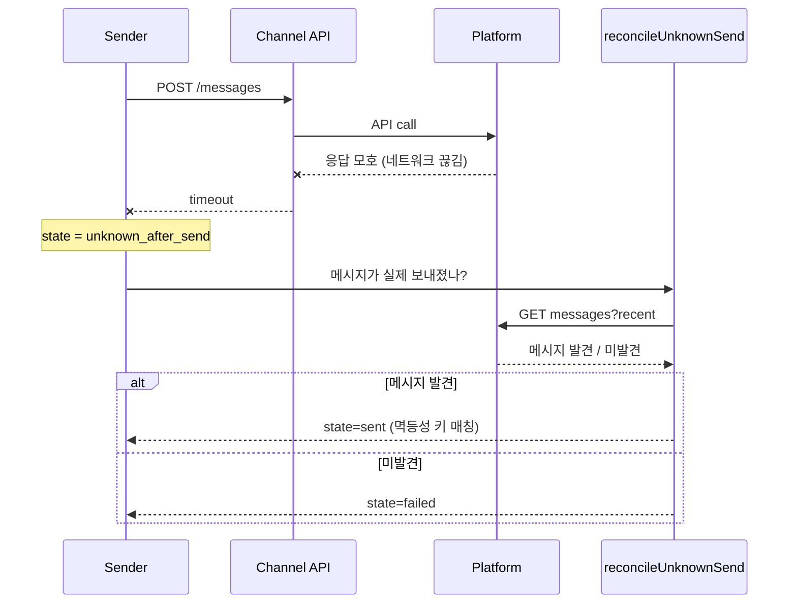
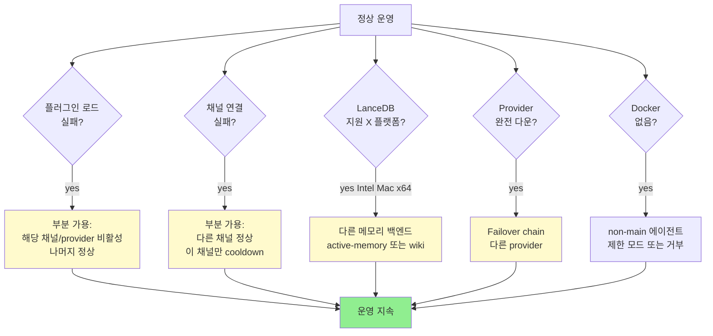
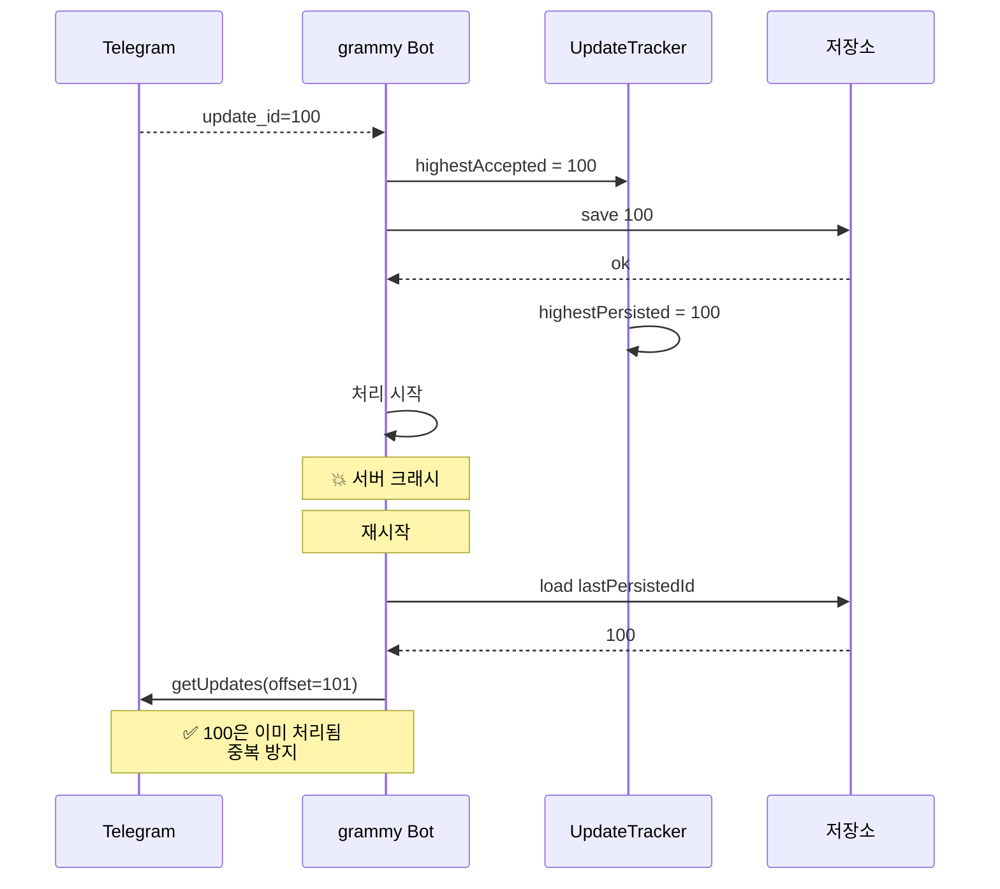
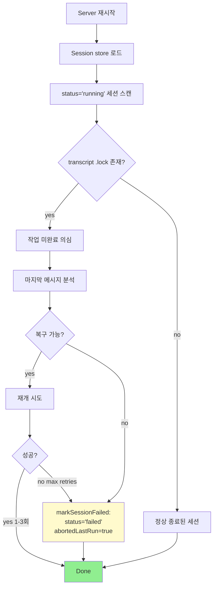
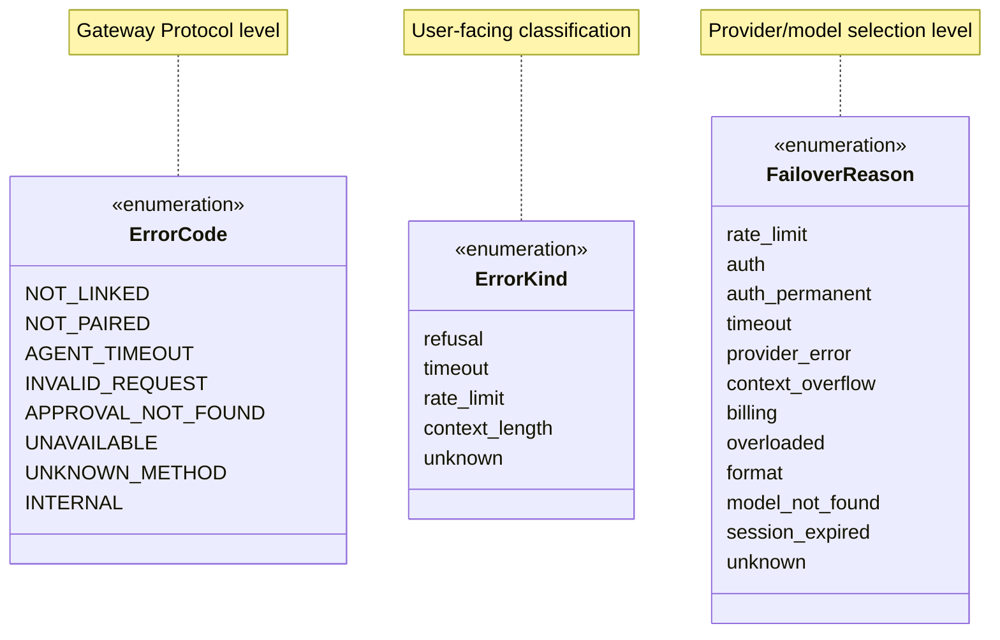

# 07. Error Handling & Resilience Patterns

OpenClaw의 에러/내결함성 패턴 — 계층적이고 결정적.

## 1. 종합 에러 처리 흐름



---

## 2. Retry Policy

### 2.1 기본 retry 함수

`src/infra/retry.ts:69-137`:

```typescript
export async function retryAsync<T>(
  fn: () => Promise<T>,
  attemptsOrOptions: number | RetryOptions = 3,
  initialDelayMs = 300,
): Promise<T> {
  for (let attempt = 1; attempt <= maxAttempts; attempt++) {
    try {
      return await fn();
    } catch (err) {
      lastErr = err;
      if (attempt >= maxAttempts || !shouldRetry(err, attempt)) {
        break;
      }
      
      const retryAfterMs = options.retryAfterMs?.(err);
      const baseDelay = hasRetryAfter
        ? Math.max(retryAfterMs, minDelayMs)
        : minDelayMs * 2 ** (attempt - 1);  // exponential
      
      let delay = Math.min(baseDelay, maxDelayMs);
      delay = applyJitter(delay, jitter);
      
      options.onRetry?.({ attempt, maxAttempts, delayMs: delay, err });
      await sleep(delay);
    }
  }
  throw lastErr;
}
```

### 2.2 Backoff 시각화

```mermaid
gantt
    title Exponential Backoff with Jitter (default: 300ms init, max 30s)
    dateFormat X
    axisFormat %s
    
    section Attempt
    Attempt 1 :a1, 0, 100
    Backoff 1 (~300ms) :b1, after a1, 300
    Attempt 2 :a2, after b1, 100
    Backoff 2 (~600ms) :b2, after a2, 600
    Attempt 3 :a3, after b2, 100
    Backoff 3 (~1200ms) :b3, after a3, 1200
    Attempt 4 :a4, after b3, 100
    Backoff 4 (~2400ms) :b4, after a4, 2400
```



### 2.3 Channel API Retry 기본값

`src/infra/retry-policy.ts:7-12`:
```typescript
export const CHANNEL_API_RETRY_DEFAULTS = {
  attempts: 3,
  minDelayMs: 400,
  maxDelayMs: 30_000,
  jitter: 0.1,         // 10%
};

const CHANNEL_API_RETRY_RE = /429|timeout|connect|reset|closed|unavailable|temporarily/i;
```

### 2.4 strictShouldRetry (멱등성 보호)

`src/infra/retry-policy.ts:84-118`:

```typescript
export function createChannelApiRetryRunner(params: {
  retry?: RetryConfig;
  shouldRetry?: (err: unknown) => boolean;
  /**
   * When true, the custom shouldRetry predicate is used exclusively —
   * the default channel API fallback regex is NOT OR'd in.
   * Use this for non-idempotent operations (e.g. sendMessage) where
   * the regex fallback would cause duplicate message delivery.
   */
  strictShouldRetry?: boolean;
}): RetryRunner
```

**사용 사례**:
- `sendMessage` (멱등 X): `strictShouldRetry: true` → 정확한 조건만 재시도
- `getUpdates` (멱등 O): regex 매칭으로 자동 재시도

---

## 3. Circuit Breaker Pattern

### 3.1 Active Memory의 Circuit Breaker

`extensions/active-memory/index.ts:43-44, 318-349`:

```typescript
const DEFAULT_CIRCUIT_BREAKER_MAX_TIMEOUTS = 3;
const DEFAULT_CIRCUIT_BREAKER_COOLDOWN_MS = 60_000;

function isCircuitBreakerOpen(key: string, maxTimeouts: number, cooldownMs: number): boolean {
  const entry = timeoutCircuitBreaker.get(key);
  if (!entry || entry.consecutiveTimeouts < maxTimeouts) {
    return false;  // 닫힘 (정상)
  }
  if (Date.now() - entry.lastTimeoutAt >= cooldownMs) {
    timeoutCircuitBreaker.delete(key);  // 쿨다운 만료 → reset
    return false;
  }
  return true;  // 열림 (요청 차단)
}
```

### 3.2 동작 시각화



---

## 4. Failover Pattern

### 4.1 FailoverReason 분류

`src/agents/failover-error.ts:75-98`:

```typescript
export function resolveFailoverStatus(reason: FailoverReason): number | undefined {
  switch (reason) {
    case "billing":           return 402;
    case "rate_limit":        return 429;
    case "overloaded":        return 503;
    case "auth":              return 401;
    case "auth_permanent":    return 403;
    case "timeout":           return 408;
    case "format":            return 400;
    case "model_not_found":   return 404;
    case "session_expired":   return 410;
    default:                  return undefined;
  }
}
```

### 4.2 Transient vs Permanent 분류

`src/agents/failover-policy.ts:3-42`:

```typescript
export function shouldAllowCooldownProbeForReason(reason): boolean {
  // Transient (cooldown 후 재시도 가능)
  return reason === "rate_limit" || reason === "overloaded" ||
         reason === "billing" || reason === "unknown" ||
         reason === "empty_response" || reason === "no_error_details" ||
         reason === "unclassified" || reason === "timeout";
}

export function shouldPreserveTransientCooldownProbeSlot(reason): boolean {
  // Permanent (즉시 다음 모델로)
  return reason === "model_not_found" || reason === "format" ||
         reason === "auth" || reason === "auth_permanent" ||
         reason === "session_expired";
}
```

### 4.3 Failover 결정 트리



### 4.4 FailoverError 클래스

```typescript
// src/agents/failover-error.ts:16-61
export class FailoverError extends Error {
  readonly reason: FailoverReason;
  readonly provider?: string;
  readonly model?: string;
  readonly profileId?: string;
  readonly status?: number;
  readonly code?: string;
  readonly rawError?: string;
  readonly sessionId?: string;
  readonly lane?: string;
  readonly suspend?: boolean;
}

// 자동 suspend
const shouldSuspend =
  Boolean(context?.sessionId) && (reason === "rate_limit" || reason === "billing");
```

### 4.5 Cause 체인 깊이 제한

`src/agents/failover-error.ts:100-140`:
```typescript
const MAX_FAILOVER_CAUSE_DEPTH = 25;

function findErrorProperty<T>(err, reader, seen = new Set()): T | undefined {
  if (seen.has(err)) return undefined;  // 순환 참조 방지
  seen.add(err);
  // ... err.error?.cause?.error?.cause... (최대 25 깊이)
}
```

---

## 5. Durability Policy

### 5.1 세 가지 정책

`src/channels/message/types.ts:7`:
```typescript
type MessageDurabilityPolicy = "required" | "best_effort" | "disabled";
```



### 5.2 14가지 Durable Capability

`src/channels/message/types.ts:9-22`:
```typescript
export const durableFinalDeliveryCapabilities = [
  "text", "media", "payload", "silent", "replyTo", "thread",
  "nativeQuote", "messageSendingHooks", "batch",
  "reconcileUnknownSend",       // ← 핵심: unknown_after_send 복구
  "afterSendSuccess",
  "afterCommit",
] as const;
```

### 5.3 reconcileUnknownSend

`unknown_after_send` 상태에서 호출 — 플랫폼에 재조회하여 실제 전송 여부 확인:



---

## 6. Timeout 정책

### 6.1 영역별 Timeout

| 영역 | 상수 | 값 |
|------|------|-----|
| Active Memory | `DEFAULT_TIMEOUT_MS` | 15,000ms |
| Active Memory min | `DEFAULT_MIN_TIMEOUT_MS` | 250ms |
| Active Memory grace | `TIMEOUT_PARTIAL_DATA_GRACE_MS` | 500ms |
| Circuit Breaker cooldown | `DEFAULT_CIRCUIT_BREAKER_COOLDOWN_MS` | 60,000ms |
| Slug Generator | `DEFAULT_SLUG_GENERATOR_TIMEOUT_MS` | 15,000ms |
| Input Files | `DEFAULT_INPUT_TIMEOUT_MS` | 10,000ms |
| Shell Env | `DEFAULT_TIMEOUT_MS` | 15,000ms |
| Realtime Connect | `DEFAULT_CONNECT_TIMEOUT_MS` | 10,000ms |
| Realtime Close | `DEFAULT_CLOSE_TIMEOUT_MS` | 5,000ms |
| Fire & Forget Hook | `DEFAULT_FIRE_AND_FORGET_HOOK_TIMEOUT_MS` | 2,000ms |
| Install Hook | - | 120,000ms |
| Media Understanding | - | 30,000ms |
| Telegram poll fetch | - | 30,000ms |
| Telegram retry max | `maxRetryTime` | 1시간 |
| Auth rate limit window | `windowMs` | 60,000ms |
| Auth rate limit lockout | `lockoutMs` | 300,000ms |
| Approval grace | `RESOLVED_ENTRY_GRACE_MS` | 15,000ms |

### 6.2 Timeout 감지

`src/agents/failover-error.ts:235-269`:
```typescript
const ABORT_TIMEOUT_RE = /request was aborted|request aborted/i;

export function isTimeoutError(err: unknown): boolean {
  if (hasTimeoutHint(err)) return true;
  if (readErrorName(err) !== "AbortError") return false;
  if (hasSessionWriteLockTimeout(err)) return false;  // 다른 종류
  const message = getErrorMessage(err);
  if (message && ABORT_TIMEOUT_RE.test(message)) return true;
  // cause 체인도 검사
  return hasTimeoutHint(err.cause) || hasTimeoutHint(err.reason);
}
```

---

## 7. Graceful Degradation



---

## 8. Crash Recovery

### 8.1 Telegram Update Tracking

`extensions/telegram/src/bot-update-tracker.ts:43-100`:

```typescript
export type TelegramUpdateTrackerState = {
  highestAcceptedUpdateId: number | null;
  highestPersistedAcceptedUpdateId: number | null;
  highestCompletedUpdateId: number | null;
  safeCompletedUpdateId: number | null;
  pendingUpdateIds: number[];
  failedUpdateIds: number[];
};
```



### 8.2 Session Restart Recovery

`src/agents/main-session-restart-recovery.ts:26-150`:

```typescript
const DEFAULT_RECOVERY_DELAY_MS = 5_000;
const MAX_RECOVERY_RETRIES = 3;
const RETRY_BACKOFF_MULTIPLIER = 2;
```



`markSessionFailed` 상세:
```typescript
async function markSessionFailed(params): Promise<void> {
  await updateSessionStore(storePath, (store) => {
    const entry = store[sessionKey];
    if (!entry || entry.status !== "running") return;
    
    entry.status = "failed";
    entry.abortedLastRun = true;
    entry.endedAt = Date.now();
    entry.updatedAt = entry.endedAt;
    entry.pendingFinalDelivery = undefined;
    // ... pending 작업 모두 정리
  });
}
```

---

## 9. Error Code Hierarchy



### detectErrorKind 패턴

`src/infra/errors.ts:115-150`:
```typescript
export function detectErrorKind(err: unknown): ErrorKind | undefined {
  const message = formatErrorMessage(err).toLowerCase();
  const code = extractErrorCode(err)?.toLowerCase();
  
  if (message.includes("refusal") || message.includes("content_filter")) {
    return "refusal";
  }
  if (message.includes("timeout") || code === "etimedout") {
    return "timeout";
  }
  if (message.includes("rate limit") || code === "429") {
    return "rate_limit";
  }
  if (message.includes("context length") || message.includes("token limit")) {
    return "context_length";
  }
  return "unknown";
}
```

---

## 10. Approval / Human-in-the-Loop

### 10.1 Approval Manager

`src/gateway/exec-approval-manager.ts:54-141`:

```typescript
export class ExecApprovalManager<TPayload> {
  private pending = new Map<string, PendingEntry<TPayload>>();
  
  create(request, timeoutMs, id?): ExecApprovalRecord {
    const resolvedId = id ?? randomUUID();
    return {
      id: resolvedId,
      request,
      createdAtMs: Date.now(),
      expiresAtMs: Date.now() + timeoutMs,
    };
  }
  
  register(record, timeoutMs): Promise<ExecApprovalDecision | null> {
    const existing = this.pending.get(record.id);
    if (existing) {
      if (existing.record.resolvedAtMs === undefined) return existing.promise;
      throw new Error("already resolved");
    }
    
    const promise = new Promise(...);
    const entry = { record, resolve, reject, timer, promise };
    entry.timer = setTimeout(() => this.expire(record.id), timeoutMs);
    this.pending.set(record.id, entry);
    return promise;
  }
  
  resolve(recordId, decision, resolvedBy?): boolean {
    // ...
    pending.resolve(decision);
    scheduleResolvedEntryCleanup(() => {
      this.pending.delete(recordId);
    }, RESOLVED_ENTRY_GRACE_MS);  // 15s grace
    return true;
  }
}
```

### 10.2 Idempotent Register

같은 ID로 재등록 시:
- 미해결: 기존 promise 반환 (idempotent)
- 해결됨: throw

```mermaid
flowchart TD
    Register[register(record, timeout)]
    Register --> CheckPending{pending Map에 있나?}
    
    CheckPending -->|no| NewEntry[새 entry 생성<br/>setTimeout 시작]
    CheckPending -->|yes| ResolvedCheck{이미 resolved?}
    
    ResolvedCheck -->|no| ReturnExisting[기존 promise 반환<br/>idempotent]
    ResolvedCheck -->|yes| Throw[Error throw]
    
    NewEntry --> Wait[promise wait]
    
    Wait --> Decision{사용자 결정?}
    Decision -->|approve| Approve
    Decision -->|deny| Deny
    Wait --> Timer{timer 만료?}
    Timer -->|yes| Expire[resolve null]
    
    Approve --> Cleanup[15s grace 후 cleanup]
    Deny --> Cleanup
    Expire --> Cleanup
    
    style ReturnExisting fill:#FFFACD
    style Throw fill:#FFB6C1
    style Cleanup fill:#90EE90
```

---

## 11. 종합 — Error Handling 패턴 매트릭스

| 패턴 | 위치 | 트리거 | 응답 |
|------|------|-------|------|
| **retryAsync** | `src/infra/retry.ts` | 일반 에러 | 3회, 300ms-30s, jitter |
| **CHANNEL_API_RETRY** | `src/infra/retry-policy.ts` | 채널 API 에러 | 3회, 400-30000ms, regex 매칭 |
| **strictShouldRetry** | 같음 | 멱등 X 작업 | regex 비활성, 정확한 조건만 |
| **Circuit Breaker (memory)** | `extensions/active-memory` | 3회 timeout | 60s cooldown |
| **FailoverError** | `src/agents/failover-error.ts` | classified error | 이유별 분기 (12 reason) |
| **Failover policy** | `src/agents/failover-policy.ts` | reason 기반 | transient = cooldown, permanent = next |
| **MAX_FAILOVER_CAUSE_DEPTH** | 같음 | error chain | 25 깊이 제한 |
| **Durability** | `src/channels/message/types.ts` | 정책 별 | required (큐) / best_effort / disabled |
| **reconcileUnknownSend** | `src/channels/turn/durable-delivery.ts` | unknown_after_send | 플랫폼 query → 멱등성 매칭 |
| **OAuth refresh + lock** | `src/agents/auth-profiles/oauth.ts` | expires - 60s | 파일 락으로 단일 갱신 |
| **Auth rate limiter** | `src/gateway/auth-rate-limit.ts` | 인증 시도 | 10/min, 5min lockout |
| **AbortController** | `src/gateway/chat-abort.ts` | 사용자 abort / timeout | 모든 in-flight signal 전파 |
| **Compaction** | `src/agents/compaction.ts` | context overflow | 요약 후 재시도 |
| **Telegram update tracking** | `extensions/telegram/src/bot-update-tracker.ts` | 메시지 처리 | offset 영속화 → 재시작 후 동기 |
| **Session recovery** | `src/agents/main-session-restart-recovery.ts` | 서버 재시작 | running 세션 검증 → resume / failed |
| **markSessionFailed** | 같음 | 복구 불가 | 명시적 failed 상태 + abortedLastRun |
| **ExecApprovalManager** | `src/gateway/exec-approval-manager.ts` | 위험 작업 | 사용자 승인 (timeout, idempotent, 15s grace) |
| **dropIfSlow** | `src/gateway/server-broadcast.ts` | bufferedAmount 초과 | 메시지 drop (ws 유지) |
| **slow consumer close** | 같음 | 같음 (dropIfSlow=false) | ws.close 1008 |
| **error cooldown (Telegram)** | `extensions/telegram/src/error-policy.ts` | 같은 에러 재발 | 4시간 (`DEFAULT_ERROR_COOLDOWN_MS`) |
| **QuotaSuspension** | `src/config/sessions/types.ts` | billing 에러 | session suspend, expectedResumeBy 30min |

---

## 12. 패턴 간 상호작용

```mermaid
flowchart TB
    Error[에러 발생]
    
    Error --> L1{Layer 1:<br/>네트워크/HTTP}
    L1 --> Retry[retryAsync<br/>(3 attempts, exp backoff)]
    Retry --> L1Success{성공?}
    L1Success -->|yes| Done
    L1Success -->|no| L2
    
    L2{Layer 2:<br/>의미 분류}
    L2 --> Classify[detectErrorKind / FailoverReason]
    Classify --> Auth[auth → refresh OAuth]
    Classify --> Timeout[timeout → circuit breaker]
    Classify --> Permanent[permanent → 다음 profile]
    
    Auth --> L1
    Timeout --> CB[Circuit Breaker open?]
    CB -->|open| Skip[skip + fallback]
    CB -->|closed| L1
    Permanent --> L3
    
    L3{Layer 3:<br/>Failover chain}
    L3 --> NextProfile[다음 profile]
    NextProfile --> L1
    L3 --> NoMore[더 없음]
    NoMore --> L4
    
    L4{Layer 4:<br/>Durability}
    L4 --> RequiredPolicy{required?}
    RequiredPolicy -->|yes| Queue[큐에 저장<br/>maxRetryTime=1h]
    RequiredPolicy -->|no| FinalFail[최종 실패 보고]
    Queue --> Retry
    
    L4 --> ApprovalReq{user approval?}
    ApprovalReq -->|yes| ApprovalMgr[ExecApprovalManager<br/>사용자 결정 대기]
    ApprovalMgr --> Decision
    
    Decision{Decision} -->|approve| Done
    Decision -->|deny / timeout| FinalFail
    
    Skip --> Done
    
    style Done fill:#90EE90
    style FinalFail fill:#FFB6C1
    style Skip fill:#FFFACD
```

---

## 13. Resilience 설계 원칙

1. **Classify before retry** — 에러 종류 파악 후 전략 결정 (블라인드 retry X)
2. **Idempotency 우선** — `strictShouldRetry`, `reconcileUnknownSend`, idempotency keys
3. **Permanent vs Transient** — 영구 실패는 즉시 다음 단계, transient는 cooldown
4. **Graceful degradation** — 부분 실패 시 전체 고장 회피 (플랫폼/플러그인 격리)
5. **Bounded retries** — 모든 재시도는 max attempts/time 제한
6. **Crash safety** — 영속 상태 (Telegram offset, session store) 모든 작업 후 동기
7. **Backpressure 인식** — 느린 consumer 감지 후 처리 (drop or close)
8. **Human escape hatch** — 위험 작업은 명시적 사용자 승인 (ExecApprovalManager)
9. **Determinism** — 캐시/cooldown은 결정적, 입력 순서가 결과 영향 X

---

## 14. 약점 / 개선 가능 영역

| 약점 | 현재 | 잠재 개선 |
|------|------|----------|
| RPC timeout (서버측) | 클라이언트 책임 | 서버측 default timeout 추가 |
| Plugin isolation | V8 isolate 공유 | worker_threads 또는 child process |
| Cross-machine 동기 | 없음 | (단일 사용자 단일 머신 모델 유지) |
| Connection backpressure | dropIfSlow / close | 더 미세한 정책 (slow lane?) |
| Cron preemption | maxConcurrent=1 | priority queue |
| Storage corruption | atomic write로 방어 | + checksum |
