# 08. Design Pattern Catalog

OpenClaw에서 사용된 GoF / 엔터프라이즈 / 도메인 패턴 카탈로그.

## 1. Creational Patterns

### 1.1 Factory Method — `definePluginEntry`

`src/plugin-sdk/plugin-entry.ts`:
```typescript
export function definePluginEntry(
  definition: OpenClawPluginDefinition
): OpenClawPluginModule {
  return {
    default: {
      id: definition.id,
      name: definition.name,
      description: definition.description,
      register: definition.register,
    },
  };
}
```

**의도**: 플러그인 작성자가 일관된 형식으로 플러그인을 정의하도록 강제.
**사용처**: 모든 `extensions/*/index.ts`.

### 1.2 Builder — `buildAgentRuntimePlan`

`src/agents/runtime-plan/build.ts:134`:
```typescript
export function buildAgentRuntimePlan(params): AgentRuntimePlan {
  // 1. config 정규화
  // 2. provider 핸들 해석
  // 3. auth plan 빌드
  // 4. resolved ref 구성
  // 5. text transforms
  // 6. tools plan
  // 7. transcript policy (lazy getter)
  // 8. delivery plan
  // 9. transport plan
  return { /* assembled plan */ };
}
```

**의도**: 복잡한 다단계 객체를 단계별 조립. lazy getter로 비싼 계산 지연.

### 1.3 Lazy Initialization — `createLazyRuntimeModule`

`src/shared/lazy-runtime.ts`:
```typescript
export function createLazyRuntimeModule<TModule>(
  importer: () => Promise<TModule>,
): () => Promise<TModule> {
  // 첫 호출 시 import, 이후 캐시
}
```

**의도**: 비싼 모듈 로드를 첫 사용 시점까지 미룸.

### 1.4 Object Pool — Manifest LRU 512

`src/plugins/manifest.ts`:
```typescript
const pluginManifestLoadCache = new PluginLruCache<PluginManifestLoadCacheEntry>(
  MAX_PLUGIN_MANIFEST_LOAD_CACHE_ENTRIES,  // 512
);
```

**의도**: 비싼 매니페스트 파싱 결과 재사용.

---

## 2. Structural Patterns

### 2.1 Adapter — Channel Adapters

`src/channels/plugins/types.adapters.ts`:
```typescript
export type ChannelOutboundAdapter = {
  sendText?: (ctx) => Promise<MessageReceipt>;
  sendMedia?: (ctx) => Promise<MessageReceipt>;
  // ...
};
```

각 채널 (Telegram/Discord/iMessage)이 자기 만의 어댑터 구현.

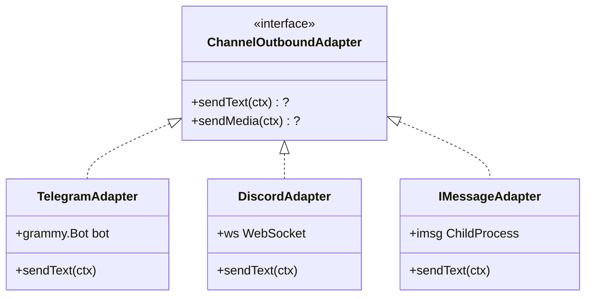

**의도**: 이질적인 채널 API를 통일된 인터페이스로 노출.

### 2.2 Facade — Plugin SDK

`packages/plugin-sdk/` (50+ subpath exports):
- `openclaw/plugin-sdk/plugin-entry`
- `openclaw/plugin-sdk/channel-core`
- `openclaw/plugin-sdk/provider-auth`
- ...

**의도**: Core 내부의 복잡한 구조를 단일 진입점으로 노출. 플러그인 작성자가 50+ 깊은 import 안 해도 됨.

### 2.3 Decorator — `@grammyjs/transformer-throttler`

```typescript
// extensions/telegram/package.json
"@grammyjs/transformer-throttler": "^1.2.1"

// 사용 (개념)
bot.api.config.use(transformerThrottler({
  global: { maxConcurrent: 30 },
  group: { maxConcurrent: 20 },
  out: { maxConcurrent: 1 },
}));
```

**의도**: API 호출에 rate limiting 자동 적용 (decorator로 wrapping).

### 2.4 Composite — Subagent Tree

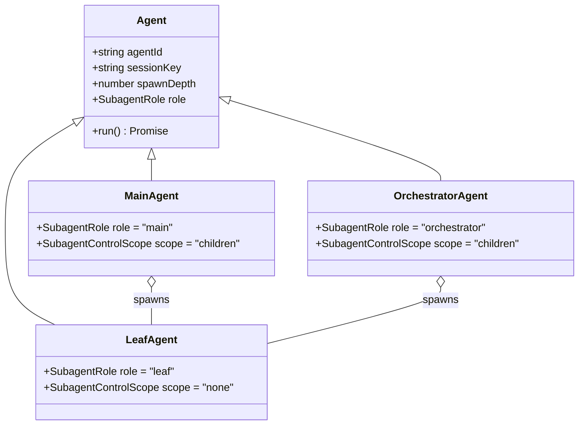

**의도**: 트리 구조에서 부모/자식 동일 인터페이스. Leaf는 더 spawn 못 함.

### 2.5 Proxy — Lazy Runtime Method Binder

```typescript
const tts = {
  textToSpeech: bindTtsRuntime((runtime) => runtime.textToSpeech),
};
// tts.textToSpeech(...) 호출 시
//   → 첫 호출: import 모듈 + 함수 추출
//   → 이후 호출: 캐시된 함수 직접 호출
```

**의도**: 무거운 모듈 로드를 메서드 호출 시점까지 지연.

---

## 3. Behavioral Patterns

### 3.1 Strategy — Failover Reason 분류

`src/agents/failover-policy.ts:3-42`:
```typescript
export function shouldAllowCooldownProbeForReason(reason): boolean {
  switch (reason) {
    case "rate_limit":
    case "overloaded":
    case "timeout":
      // ...
  }
}
```

여러 strategy가 reason에 따라 선택됨:
- Transient → cooldown probe
- Permanent → 다음 profile
- Billing → session suspend

**의도**: 에러 타입별 다른 전략을 캡슐화.

### 3.2 State — Session Lifecycle

`src/gateway/session-lifecycle-state.ts`:
```typescript
type SessionRunStatus = "running" | "done" | "failed" | "killed" | "timeout";
```

각 상태별로 가능한 전이만 허용.

**의도**: 도메인 객체의 가능한 상태와 전이를 명시.

### 3.3 Observer — broadcast / subscribeSessionEvents

`src/gateway/server-broadcast-types.ts`:
```typescript
export type GatewayBroadcastFn = (event, payload, opts?) => void;

// 클라이언트가 구독
subscribeSessionEvents(connId);
subscribeSessionMessageEvents(connId, sessionKey);
```

**의도**: 이벤트 publisher가 subscriber 목록을 알지 못해도 알림 가능.

### 3.4 Command — Command Lane Queue

`src/process/command-queue.ts`:
```typescript
type QueueEntry = {
  task: () => Promise<unknown>;
  resolve: (v) => void;
  reject: (e) => void;
  opts?: EnqueueOpts;
};

enqueueCommandInLane(lane, task, opts);
```

**의도**: 작업을 객체로 캡슐화 → 큐잉/스케줄링/취소 가능.

### 3.5 Chain of Responsibility — Auth 모드

`src/gateway/auth.ts:388-421` `authorizeGatewayConnect`:
```
1. Rate limit check
2. Tailscale auth (if configured)
3. Token/password auth
4. Device token auth
5. Bootstrap token auth
6. Trusted proxy (if X-Forwarded-*)
```

각 단계가 처리하거나 다음으로 넘김.

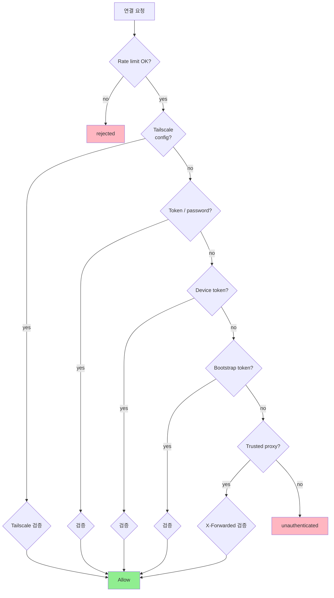

**의도**: 처리 가능한 첫 핸들러가 응답. 새 인증 모드 추가가 쉬움.

### 3.6 Template Method — Plugin api.ts / runtime-api.ts

```typescript
// Template
// extensions/<plugin>/api.ts: 정적 메타데이터, setup-entry
// extensions/<plugin>/runtime-api.ts: 런타임 함수 (lazy import)

// Telegram 구현
// telegram/api.ts: telegramPlugin, accounts, types (185 export)
// telegram/runtime-api.ts: sendMessageTelegram, probeTelegram (97 export)
```

**의도**: 각 플러그인이 공통 구조를 따르되 구체 구현 자유.

### 3.7 Mediator — Gateway

Gateway는 클라이언트, 채널, provider, 플러그인 사이의 mediator:

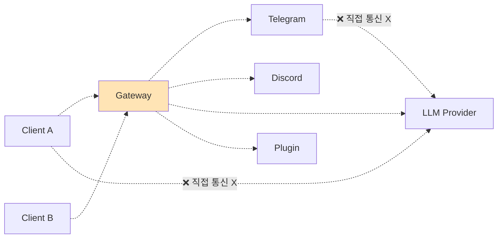

**의도**: 객체들이 서로를 직접 알 필요 없음. Gateway가 모든 통신을 라우팅.

### 3.8 Memento — Compaction Checkpoint

`src/gateway/session-compaction-checkpoints.ts`:
```typescript
type SessionCompactionCheckpoint = {
  checkpointId: string;
  createdAt: number;
  reason: SessionCompactionCheckpointReason;
  tokensBefore: number;
  tokensAfter: number;
  summary: string;
  preCompaction: TranscriptReference;
  postCompaction: TranscriptReference;
};
```

**의도**: 압축 전 상태를 저장하여 필요 시 복구.

### 3.9 Visitor — Tool Execution Dispatcher

```typescript
// LLM이 tool_use 응답 시
switch (toolCall.name) {
  case "sessions_spawn":
    return await spawnSubagentDirect(...);
  case "web_search":
    return await webSearch(...);
  case "bash":
    return await runInSandbox(...);
  // ...
}
```

각 tool 타입별 다른 처리.

**의도**: 도구 추가가 dispatcher에만 영향. tool 자체는 자기 로직만.

---

## 4. Concurrency Patterns

### 4.1 Producer-Consumer — Lane Queue

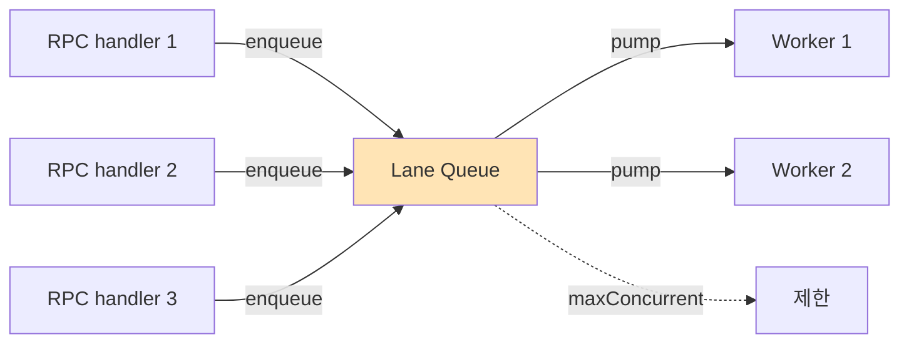

**의도**: 생산자/소비자 분리, 비동기 처리 가능.

### 4.2 Reader-Writer Lock — Session Store

`src/config/sessions/store-writer.ts`:
```typescript
runExclusiveSessionStoreWrite(storePath, async () => {
  // exclusive 작업
});
```

**의도**: 동시 read는 가능하되 write는 배타적.

### 4.3 Circuit Breaker — Memory Recall

이미 [07-error-resilience.md](./07-error-resilience.md) 참조.

### 4.4 Bulkhead — Lane Isolation

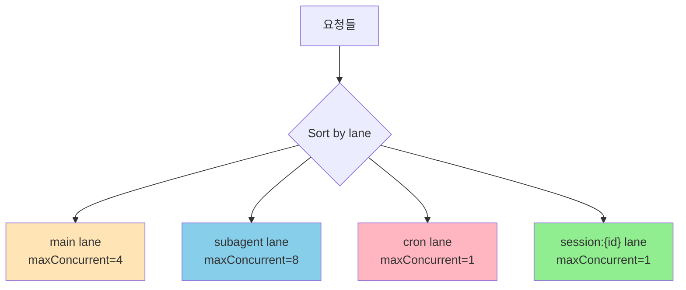

**의도**: 한 lane의 부하가 다른 lane을 막지 않게.

### 4.5 Future / Promise — AbortController

```typescript
const controller = new AbortController();
const promise = fetch(url, { signal: controller.signal });
// ... 나중에
controller.abort();
// promise reject with AbortError
```

**의도**: 비동기 작업의 취소 가능.

---

## 5. Architectural Patterns

### 5.1 Layered Architecture

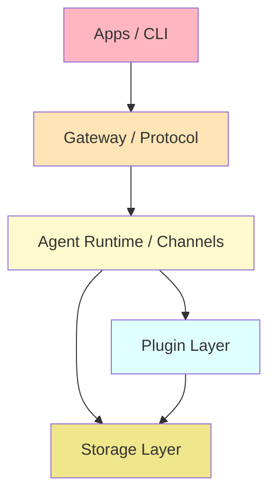

**의도**: 관심사 분리, 의존성 단방향.

### 5.2 Plugin Architecture (Microkernel)

Core (kernel) + Plugins (extensions) 모델:

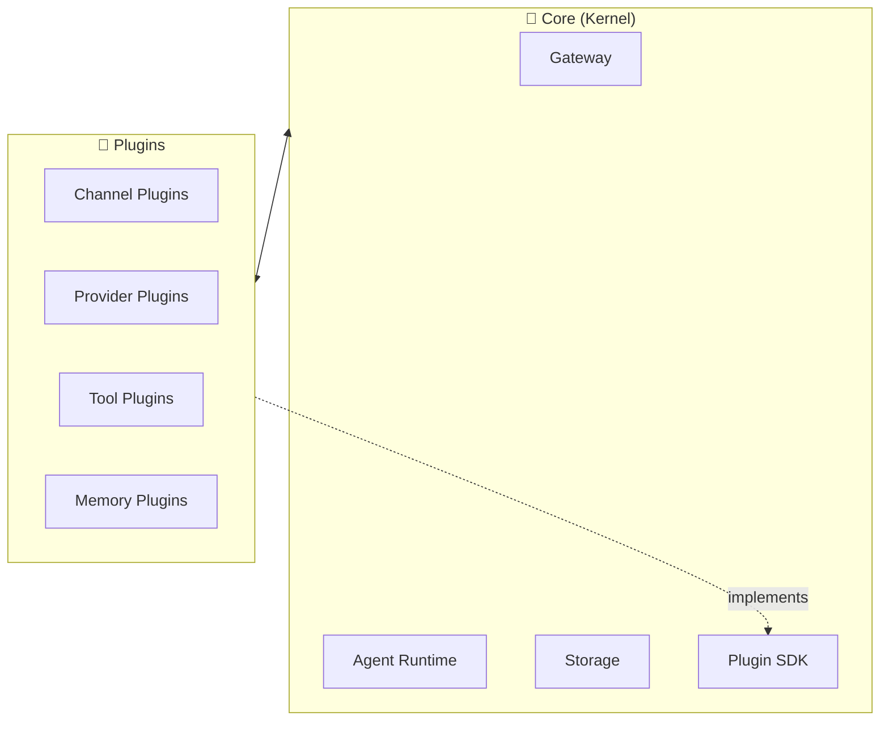

**의도**: Core는 안정적, 플러그인이 동적으로 기능 확장. 격리 통한 안정성.

### 5.3 Event-Driven Architecture

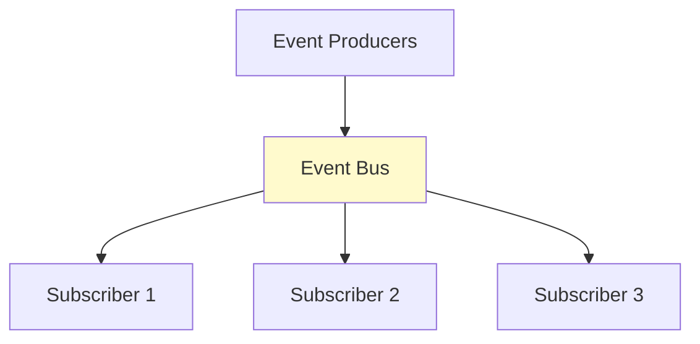

OpenClaw의 `AgentEventStream` (lifecycle, tool, assistant, ...) 11종.

**의도**: producer/subscriber 분리.

### 5.4 CQRS-lite — Config

```mermaid
flowchart LR
    Cmd[Command:<br/>config 변경] --> Doctor[doctor --fix]
    Doctor --> Mig[Migration]
    Mig --> Canon[Canonical config]
    
    Query[Query:<br/>config 조회] --> Runtime[Runtime snapshot<br/>(in-memory)]
    Runtime --> Canon
    
    style Canon fill:#FFFACD
```

쓰기 (migration via doctor) ≠ 읽기 (runtime snapshot).

**의도**: runtime은 깨끗한 contract만 알게.

### 5.5 Hexagonal / Ports & Adapters

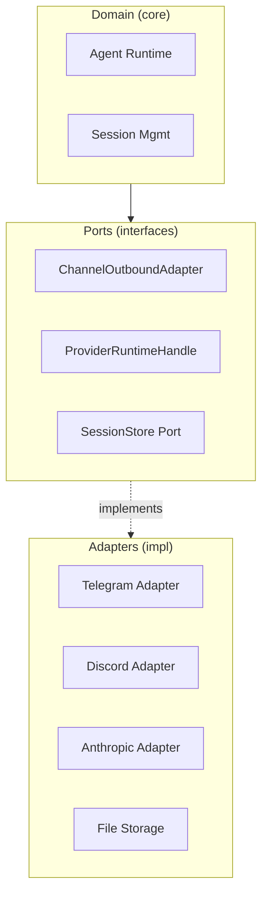

**의도**: 도메인은 외부 기술(채널, LLM API)을 모름. Port 인터페이스만 알기.

---

## 6. Domain-Specific Patterns

### 6.1 Specification — Plugin Manifest

`openclaw.plugin.json`:
```json
{
  "id": "telegram",
  "channels": ["telegram"],
  "channelEnvVars": { "telegram": ["TELEGRAM_BOT_TOKEN"] },
  "configSchema": { /* JSON Schema */ },
  "activation": { "onStartup": false }
}
```

플러그인이 자신의 능력/요구를 선언적으로 명시.

### 6.2 Saga / Process Manager — Subagent Spawn

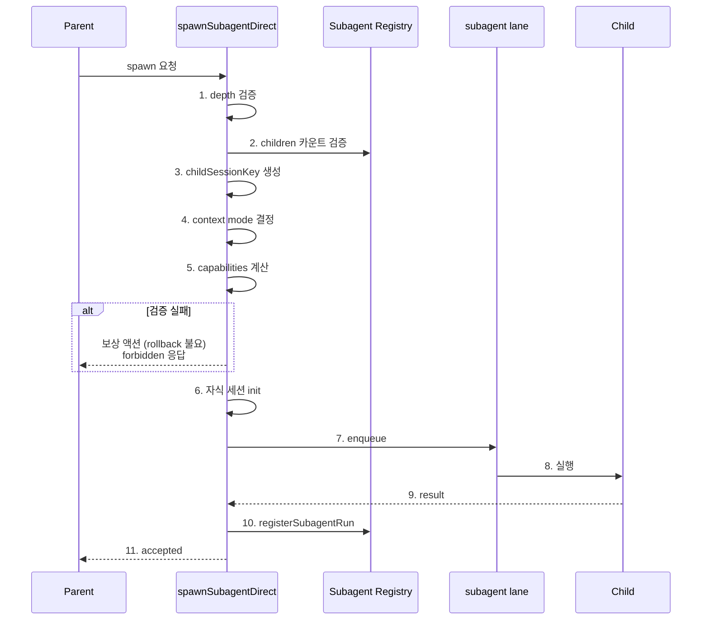

**의도**: 다단계 트랜잭션을 명시적 단계로 분해.

### 6.3 Event Sourcing-lite — Transcript JSONL

```jsonl
{"type":"session","version":9,"id":"...","timestamp":"..."}
{"id":"msg-1","message":{"role":"user","content":"..."}}
{"id":"msg-2","message":{"role":"assistant","content":"..."}}
{"id":"msg-3","message":{"role":"assistant","content":[{"type":"tool_use",...}]}}
```

세션 상태 = 모든 메시지의 누적.

**의도**: append-only로 동시성 안전. 과거 재구성 가능.

### 6.4 Compensating Transaction — Compaction

압축은 "이전 메시지를 요약으로 대체"하는 보상 트랜잭션:
- 토큰 예산 초과 → 압축
- 실패 시 checkpoint로 복구

### 6.5 Outbox Pattern — Durable Message Queue

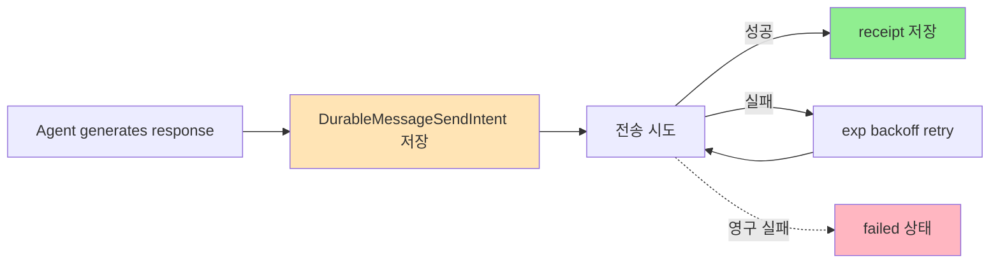

**의도**: 메시지 전송이 영속성 있게. 크래시 후 재시도 가능.

### 6.6 Capability-Based Security — Plugin Activation

`PluginActivationCause` 14가지:
- `enabled-in-config` (사용자 명시)
- `selected-memory-slot` (slot 선택)
- `selected-in-allowlist`
- `not-in-allowlist` (거부)
- ...

각 plugin은 자기 capability (channels, providers, contracts)를 manifest에 선언. 사용자가 activation 결정.

---

## 7. Test Patterns

### 7.1 Test Doubles — Mock at Boundary

`AGENTS.md:148`:
> Mock expensive seams directly: scanners, manifests, registries, fs crawls, provider SDKs, network/process launch.

**의도**: 깊이 mock하지 않고 경계에서만.

### 7.2 Co-located Tests

```
src/foo.ts
src/foo.test.ts          # 일반 단위
src/foo.e2e.test.ts      # E2E 시나리오
```

**의도**: 테스트와 코드 같은 폴더 → 관리 쉬움.

### 7.3 Architectural Test — `pnpm check:architecture`

import boundary 위반을 빌드 시 강제.

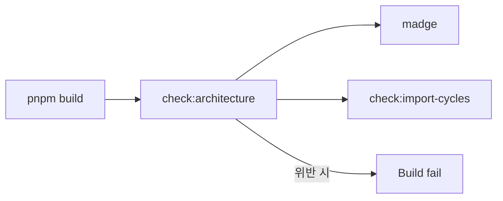

---

## 8. Naming / 컨벤션 패턴

| 컨벤션 | 의미 |
|--------|------|
| `*.runtime.ts` | Lazy 로드 모듈 |
| `*.types.ts` | 순수 타입 정의 |
| `*-shared.ts` | 양쪽에서 import 가능 |
| `define*Plugin` | 플러그인 entry 헬퍼 |
| `resolve*` | 우선순위/조건 기반 결정 함수 |
| `create*` | 객체 생성자 함수 |
| `build*` | 다단계 조립 함수 |
| `derive*` | 다른 데이터에서 파생 |
| `ensure*` | 조건 충족 보장 |
| `use*` (없음) | React hook 컨벤션 X |

---

## 9. Anti-patterns 회피

`AGENTS.md`에 명시된 회피 패턴:

| 회피해야 할 패턴 | 이유 | 대신 |
|----------------|------|------|
| Static + dynamic import 혼용 | 번들러 트리쉐이킹 실패 | `*.runtime.ts` lazy 분리 |
| Broad request-time discovery | 매 요청마다 비싼 작업 | Prepared facts (AgentRuntimePlan) |
| Scattered cache layers | 일관성 어려움 | Canonical fact를 위로 옮기기 |
| Legacy compat in runtime | runtime 복잡도 증가 | doctor --fix로 마이그레이션 |
| Owner-specific code in core | 결합도 증가 | Owner module로 |
| Bundled IDs in core | 확장에 의존 | Manifest/registry 사용 |
| Brittle workflow grep tests | 정책 변화에 취약 | Behavior 검증 |

---

## 10. 패턴 사용 빈도 표

| 패턴 카테고리 | 패턴 | OpenClaw 구현 위치 | 빈도 |
|--------------|------|------------------|------|
| Creational | Factory Method | `definePluginEntry`, `defineBundledChannelEntry` | 높음 |
| | Builder | `buildAgentRuntimePlan`, `buildAgentRuntimeAuthPlan` | 높음 |
| | Lazy Init | `createLazyRuntimeModule`, `createLazyRuntimeMethodBinder` | 매우 높음 |
| | Pool | LRU 매니페스트 캐시, dedupe 캐시 | 중간 |
| Structural | Adapter | `ChannelOutboundAdapter`, provider runtime handle | 매우 높음 |
| | Facade | Plugin SDK (50+ subpaths) | 높음 |
| | Decorator | grammy throttler | 낮음 |
| | Composite | Subagent tree | 중간 |
| | Proxy | Lazy method binder | 높음 |
| Behavioral | Strategy | Failover policy, retry policy | 높음 |
| | State | Session lifecycle, message phase | 매우 높음 |
| | Observer | broadcast, event subscription | 매우 높음 |
| | Command | Lane queue entries | 높음 |
| | Chain of Responsibility | Auth chain | 중간 |
| | Template Method | api.ts / runtime-api.ts | 매우 높음 |
| | Mediator | Gateway 자체 | 높음 |
| | Memento | Compaction checkpoint | 중간 |
| | Visitor | Tool execution dispatcher | 높음 |
| Concurrency | Producer-Consumer | Lane queue | 매우 높음 |
| | Reader-Writer Lock | Session store | 중간 |
| | Circuit Breaker | Memory recall | 낮음 |
| | Bulkhead | Lane isolation | 매우 높음 |
| | Future/Promise | AbortController | 매우 높음 |
| Architectural | Layered | Apps/Gateway/Domain/Plugins | 시스템 전체 |
| | Microkernel | Core + Plugins | 시스템 전체 |
| | Event-Driven | AgentEventStream | 매우 높음 |
| | CQRS-lite | Config (write via doctor, read via runtime) | 중간 |
| | Hexagonal | Ports (interfaces) + Adapters (plugins) | 시스템 전체 |
| Domain | Specification | Plugin manifest | 매우 높음 |
| | Saga | Subagent spawn | 중간 |
| | Event Sourcing-lite | Transcript JSONL | 높음 |
| | Compensating Transaction | Compaction | 중간 |
| | Outbox | Durable message queue | 중간 |
| | Capability Security | Plugin capability declarations | 높음 |

---

## 11. 패턴 간 상호 보완

```mermaid
flowchart LR
    Lazy[Lazy Loading] --> Builder[Builder]
    Builder --> Plan[Prepared Facts<br/>(AgentRuntimePlan)]
    Plan --> Strategy[Strategy<br/>(failover policy)]
    Strategy --> CB[Circuit Breaker]
    CB --> Bulkhead[Bulkhead<br/>(lanes)]
    Bulkhead --> Outbox[Outbox<br/>(durable msg)]
    
    Adapter[Adapter<br/>(channels/providers)] --> Hexagonal[Hexagonal]
    Hexagonal --> Microkernel[Microkernel<br/>(core+plugins)]
    
    State[State Machine] --> Memento[Memento<br/>(checkpoint)]
    Memento --> EventSrc[Event Sourcing-lite<br/>(JSONL)]
    
    style Plan fill:#FFFACD
    style Hexagonal fill:#FFE4B5
    style EventSrc fill:#E0FFFF
```

**핵심 통찰**: OpenClaw는 **단일 패턴 채택**보다 **여러 패턴의 조합**으로 강력함을 만듦.
