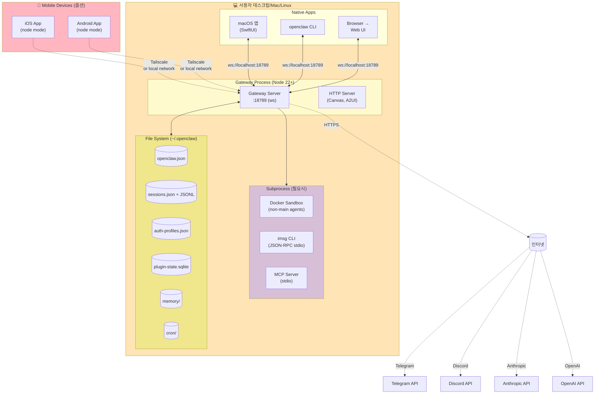
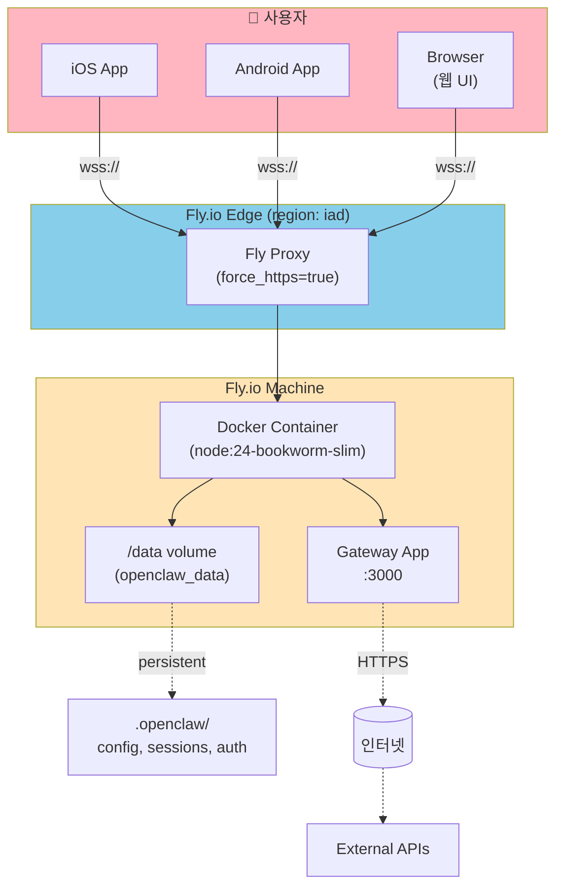
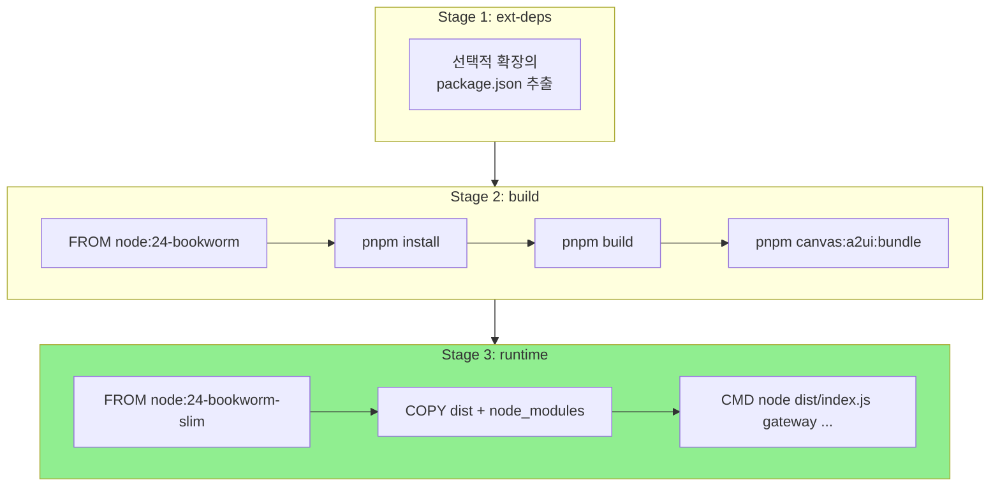
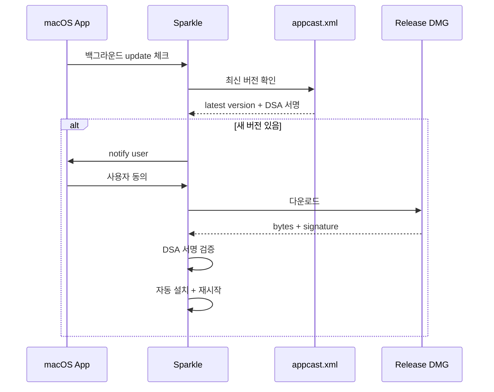
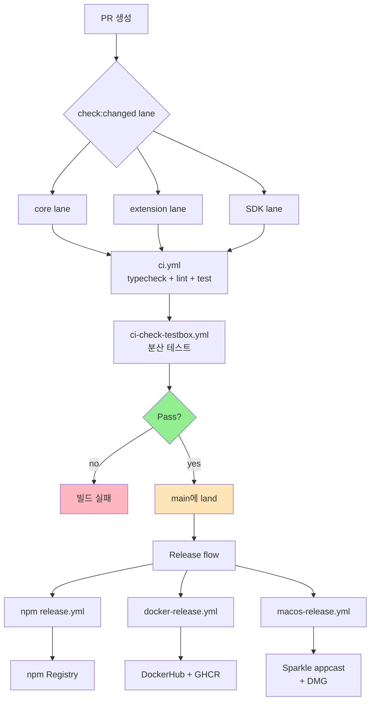
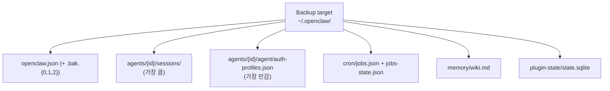
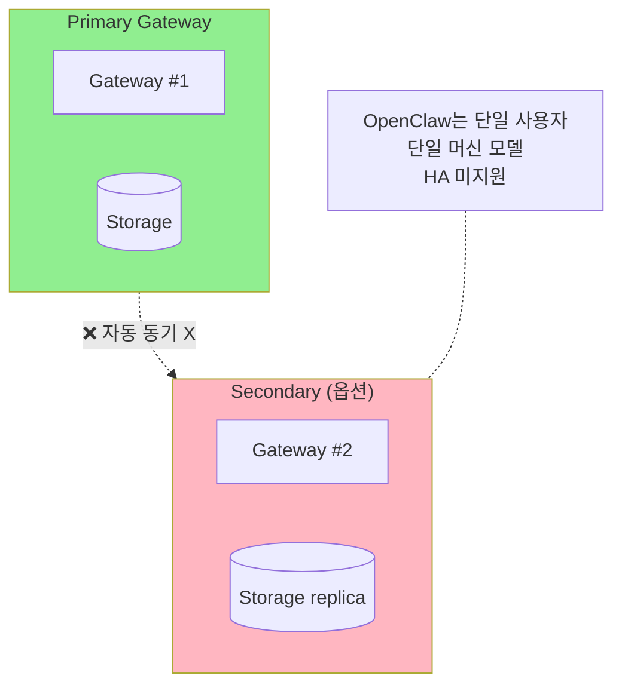
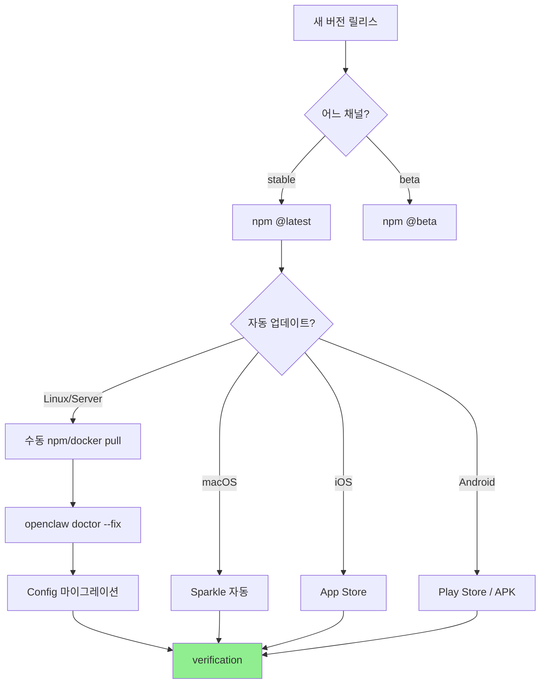
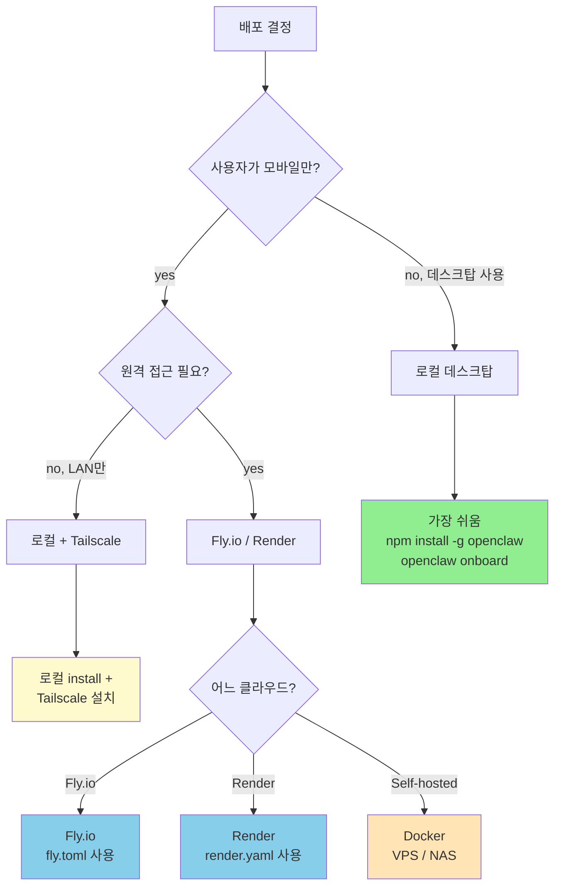

# 09. Deployment View

OpenClaw의 배포 토폴로지 — UML Deployment Diagram.

## 1. 기본 배포 시나리오 — 로컬 단일 머신

가장 일반적인 배포: 사용자 데스크탑에서 모든 컴포넌트 실행.



### 특징

- 모든 데이터 로컬 파일 시스템에 저장
- `ws://localhost:18789`은 loopback only → 인증 없이 사용 가능
- 모바일은 LAN 또는 Tailscale 통해 접근

---

## 2. 클라우드 배포 — Fly.io

원격 머신에서 Gateway 실행 (모바일 우선 시나리오).



### Fly.io 설정 (`fly.toml`)

```toml
app = "openclaw"
primary_region = "iad"

[http_service]
  internal_port = 3000
  force_https = true

[processes]
  app = "node dist/index.js gateway --allow-unconfigured --port 3000 --bind lan"

[mounts]
  source = "openclaw_data"
  destination = "/data"

[env]
  OPENCLAW_STATE_DIR = "/data/.openclaw"
```

### 보안 추가 사항

- **TLS** (`wss://`) 필수
- **Auth token** 필수 (loopback 아님)
- 페어링 코드로 모바일 등록
- Tailscale 옵션도 가능

---

## 3. 컨테이너화 (Docker)

`Dockerfile`은 다단계 빌드:



### 선택적 플러그인 빌드

```bash
docker build \
  --build-arg OPENCLAW_EXTENSIONS="telegram,discord,anthropic,openai" \
  -t openclaw .
```

→ 사용 안 하는 플러그인 제외 → 이미지 크기 ↓

### Docker Compose 예

```yaml
# docker-compose.yml
version: "3.8"
services:
  openclaw:
    image: openclaw:latest
    ports:
      - "3000:3000"
    volumes:
      - openclaw-data:/data
    environment:
      OPENCLAW_STATE_DIR: /data/.openclaw
      ANTHROPIC_API_KEY: ${ANTHROPIC_API_KEY}
      TELEGRAM_BOT_TOKEN: ${TELEGRAM_BOT_TOKEN}
    restart: unless-stopped

volumes:
  openclaw-data:
```

---

## 4. Render 배포

```yaml
# render.yaml
services:
  - type: web
    name: openclaw
    runtime: node
    plan: starter
    buildCommand: "pnpm install && pnpm build"
    startCommand: "node dist/index.js gateway --allow-unconfigured --port $PORT"
    envVars:
      - key: OPENCLAW_STATE_DIR
        value: /data/.openclaw
      - key: NODE_VERSION
        value: 22
    disk:
      name: data
      mountPath: /data
      sizeGB: 1
```

### 특징

- starter plan (저렴, 슬립 모드)
- 1GB 디스크 (제한적)
- 자동 HTTPS

---

## 5. 모바일 앱 배포

### 5.1 macOS — Sparkle 자동 업데이트



`appcast.xml` 위치: 레포 루트.

### 5.2 iOS — App Store

- TestFlight (베타)
- App Store (정식 릴리스)
- Watch App + Share Extension 동시 배포

### 5.3 Android — APK / Play Store

- APK direct (사이드로드)
- Play Store (정식)
- Foreground service 권한 필요

---

## 6. CI / CD Pipeline



### 주요 워크플로우

| 워크플로우 | 트리거 | 역할 |
|----------|--------|------|
| `ci.yml` | 모든 PR | 기본 CI |
| `ci-check-testbox.yml` | PR | Testbox 분산 |
| `docker-release.yml` | release tag | DockerHub + GHCR |
| `macos-release.yml` | release tag | macOS DMG + Sparkle |
| `npm-release.yml` | release tag | npm |
| `install-smoke.yml` | nightly | 설치 시나리오 |
| `full-release-validation.yml` | manual | 전체 검증 |
| `package-acceptance.yml` | PR | 설치 가능 패키지 검증 |
| `qa-lab.yml` | manual | 라이브 채널 QA |
| `parity-gate.yml` | PR | 변경 lane 일관성 |

### Wait Matrix (`AGENTS.md:115`)

```
- never: Auto response, Labeler, Stale, ...
- conditional: CI (exact SHA만), Docs (docs 변경 시), ...
- release/manual only: Docker Release, macOS Release, ...
- explicit/surface only: QA-Lab, CodeQL, ...
```

매 PR마다 모든 워크플로우 기다리지 않음 (선택적).

---

## 7. Crabbox / Testbox / Blacksmith

### 7.1 Crabbox (라이브 시나리오)

```mermaid
flowchart LR
    Dev[개발자] --> CrabboxCmd[crabbox user@scenario]
    CrabboxCmd --> Pool[Crabbox Pool<br/>(Linux/Windows/macOS)]
    Pool --> VM[가상 머신]
    VM --> WebVNC[WebVNC 화면]
    WebVNC --> Dev
    
    style Pool fill:#87CEEB
    style VM fill:#FFE4B5
```

OS별 시나리오 검증:
- Windows-only 버그
- macOS Voice Wake
- Linux Discord 통합 등

### 7.2 Testbox (분산 CI)

```bash
# Pre-warm
blacksmith testbox warmup ci-check-testbox.yml --ref main --idle-timeout 90

# Run
blacksmith testbox run --id tbx_xxx \
  "env NODE_OPTIONS=--max-old-space-size=4096 \
       OPENCLAW_TEST_PROJECTS_PARALLEL=6 \
       OPENCLAW_VITEST_MAX_WORKERS=1 \
       pnpm test"

# Download
blacksmith testbox download --id tbx_xxx
```

| Timeout | 시간 |
|---------|------|
| 기본 | 90분 |
| 멀티시간 | 240분 |
| All-day | 720분 |
| Overnight | 1440분 |

---

## 8. 환경별 배포 매트릭스

| 환경 | 위치 | TLS | Auth | 영속성 |
|------|------|-----|------|--------|
| **로컬 (loopback)** | localhost | ❌ | none/auto | 로컬 ~/.openclaw |
| **LAN (private)** | local network | ❌ | device-token + `OPENCLAW_ALLOW_INSECURE_PRIVATE_WS=1` | 로컬 |
| **Tailscale** | tailnet | ❌ (TS 자체 암호화) | device-token | 로컬 또는 Fly |
| **Fly.io** | edge | ✅ | device-token | Fly volume |
| **Render** | edge | ✅ | device-token | Render disk |
| **Self-hosted (VPS)** | 사용자 서버 | ✅ (사용자 설정) | device-token | 서버 디스크 |

---

## 9. 영속성 / 백업

### 9.1 백업 대상



### 9.2 백업 자동화 (사용자 책임)

OpenClaw는 자체 백업 메커니즘 없음. 사용자가 직접:
- `tar -czf openclaw-backup-$(date +%Y%m%d).tar.gz ~/.openclaw`
- Time Machine (macOS)
- rsync to NAS / cloud

### 9.3 Fly.io 자체 스냅샷

`fly volumes snapshots create openclaw_data` — Fly.io 인프라 레벨.

---

## 10. 모니터링 / 진단

### 10.1 Logs

```
~/.openclaw/logs/
└── ... (구체적 구조는 코드 베이스에서 확인 필요)
```

CLI:
```bash
openclaw doctor                # 진단
openclaw doctor --fix          # 자동 수정
openclaw gateway status --deep # Gateway 헬스체크
./scripts/clawlog.sh           # 로그 tail
```

### 10.2 Startup Trace

```bash
OPENCLAW_GATEWAY_STARTUP_TRACE=1 openclaw gateway start
```

각 단계 (config.snapshot, plugins.bootstrap, ...) timing 측정.

### 10.3 Diagnostics Timeline

```bash
OPENCLAW_DIAGNOSTICS_TIMELINE=1 openclaw gateway start
```

이벤트 루프 + function span을 JSON 형식으로 export.

### 10.4 Test Performance

```bash
pnpm test:perf:imports src/foo.test.ts
pnpm test:perf:hotspots --limit 10
```

---

## 11. 보안 배치 다이어그램

```mermaid
flowchart TB
    subgraph Trust["신뢰 영역 (사용자)"]
        DesktopOS[Desktop OS]
        DesktopOS --> Profile["~/.profile<br/>(API keys)"]
        DesktopOS --> StateDir["~/.openclaw<br/>(0o600)"]
        DesktopOS --> Keychain["macOS Keychain<br/>(device tokens)"]
    end
    
    subgraph Boundary["보안 경계"]
        WSAuth[WebSocket Auth]
        TLS_Ring[TLS Ring]
        SBox[Docker Sandbox]
    end
    
    subgraph Untrusted["비신뢰 영역"]
        ExtAPIs[External APIs]
        IncomingMsgs[Incoming messages<br/>(채널)]
    end
    
    Trust --> Boundary
    Boundary --> Untrusted
    
    Untrusted -.-> InboundCheck{Filter}
    InboundCheck -.->|allowFrom| Boundary
    InboundCheck -.->|deny| Drop[버림]
    
    style Trust fill:#90EE90
    style Boundary fill:#FFE4B5
    style Untrusted fill:#FFB6C1
```

### 보안 레이어

| 레이어 | 메커니즘 |
|--------|---------|
| **Network** | TLS, Tailscale, loopback 분리 |
| **Authentication** | 6가지 모드, `safeEqualSecret` constant-time |
| **Authorization** | scopes 기반, allowFrom |
| **Rate limiting** | scope별 (default, shared-secret, device-token, hook-auth) |
| **Sandbox** | Docker/SSH 격리 (non-main agents) |
| **File permissions** | 0o600 (소유자만) |
| **Secret refs** | env / file / exec (인라인 비밀 거부) |
| **DoS defense** | preauth budget, handshake timeout, payload size limit |

---

## 12. 다중 머신 / HA 시나리오



OpenClaw는 **단일 머신 단일 사용자**가 의도된 모델. HA / 멀티 노드 지원 없음.

대안:
- 사용자가 직접 백업 + 복원
- Fly.io의 단일 region 영속 볼륨
- (HA 필요 시 직접 인프라 구축)

---

## 13. 업그레이드 전략



### 다운그레이드

OpenClaw는 명시적 다운그레이드 지원 없음. 옛 버전 npm install 가능하나 config 호환성 보장 X.

---

## 14. 종합 — 배포 결정 트리


